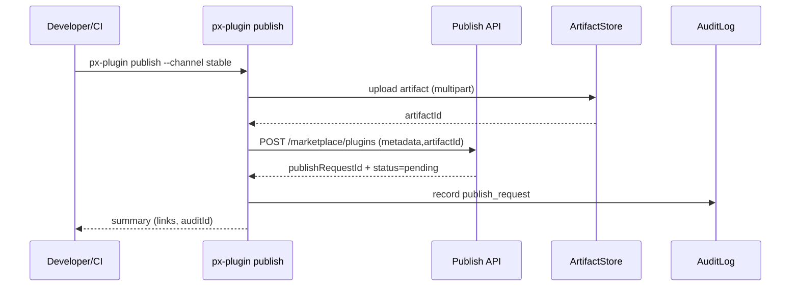

doc_id: PLG-PUBLISH-ONLINE-001
scn_id: SCN-PUBLISH-HUB-001
title: PLG-PUBLISH-ONLINE-001 - proto/publish
status: Draft
version: v0.1.0
repo_key: powerx-plugin
scope: powerx-plugin
layer: proto
domain: publish
scenario_title: "PowerX 插件开发与分发全链路"
owners:
  - name: Michael Hu
    role: Tech Steward
    contact: tech@artisan-cloud.com
  - name: Li Wei
    role: CLI Lead
    contact: li.wei@artisan-cloud.com
contributors: []
linked_requirements: []
code_refs:
  - path: cli/src/commands/publish.ts
  - path: cli/src/pkg/publish/manifest-uploader.ts
feature_flags:
  - PX_MARKETPLACE_SYNC
  - PX_CLI_SIGNING
last_reviewed_at: 2025-10-25

---

# Usecase Overview

- **业务目标**：通过 `px-plugin publish` 将插件提交至 Marketplace，实现包体上传、版本管理、合规信息收集、审核跟踪与回滚能力。
- **触发角色**：插件研发、产品运营、CI Bot（自动触发发布）。
- **成功度量**：发布命令成功率 ≥ 99%；上传耗时 ≤ 120s；审核提交延迟 ≤ 30s；失败重试成功率 ≥ 95%。
- **场景关联**：连接 `MKP-PUBLISH-ONLINE-001` 审核流程、`PX-PUBLISH-ONLINE-001` 目录同步、`PX-ADMIN-PUBLISH-ONLINE-001` 安装 UI。

# Context & Assumptions

- **Feature Flags**：`PX_MARKETPLACE_SYNC` 允许 CLI 调用 Marketplace；`PX_CLI_SIGNING` 确保签名校验。
- **依赖**：认证 `px auth login`（OAuth2 Device）；Marketplace API endpoint；KMS 或 PEM 签名；CI 凭据；Telemetry。
- **输入**：`plugin.yaml`、`manifest.json`、变更日志、release notes、`publish-config.json`。
- **输出**：发布请求、审核工单、`publishRequestId`、Telemetry、CLI 报告。
- **边界**：不负责 Marketplace 审核逻辑；不直接刷新租户目录；离线流程另行处理。

# Solution Blueprint

## 体系分解

| 模块 | 组件 | 责任 | 入口 |
|------|------|------|------|
| PublishCommand | `cli/src/commands/publish.ts` | CLI 入口、参数解析、流程 orchestrator | `packages/cli/src` |
| ArtifactUploader | `cli/src/pkg/publish/manifest-uploader.ts` | 上传包体、生成版本记录、断点续传 | `packages/cli/src/pkg/publish` |
| ApprovalClient | `cli/src/pkg/publish/approval-client.ts` | 提交审核表单、法规信息、截图 | 同上 |
| TelemetryReporter | `cli/src/telemetry/publish.ts` | 记录延迟、失败代码、输出报告 | `packages/cli/src/telemetry` |

## 流程与时序

# Contracts & Interfaces

- **CLI 参数**
  - `px-plugin publish --channel stable --notes ./CHANGELOG.md --visibility private`
  - 支持 `--ci`（非交互）、`--retry <id>`、`--dry-run`。
- **Marketplace API**
  - `POST /marketplace/plugins`：字段 `pluginId`、`version`、`artifactId`、`releaseNotes`、`compliance`。
  - `GET /marketplace/plugins/{id}/requests/{requestId}`：查询审核状态。
- **配置**
  - `publish-config.json`：渠道、定价、访达策略；`px-plugin.config.ts` reuse metadata。
- **Artifacts**
  - `publish-report.json`：CLI 输出 -> pipeline ingest。

# Implementation Checklist

| 项目 | 描述 | 完成状态 | 负责人 |
|------|------|----------|--------|
| 上传器 | 分片、断点续传、进度条、多渠道支持 | [ ] | Li Wei |
| 审核表单 | 法规字段校验、模板生成 | [ ] | Michael Hu |
| Telemetry | `publish.cli.duration_ms`、`publish.cli.error_total` | [ ] | Matrix-X |
| 重试机制 | `--retry <id>` 复用 artifact，避免重复上传 | [ ] | Li Wei |
| 文档 | `docs/guides/publish/online.md` 更新 | [ ] | Matrix-X |

# Testing Strategy

- **单元测试**：`publish.test.ts` 覆盖参数/错误；`manifest-uploader.test.ts` 覆盖断点续传；`approval-client.test.ts` 校验 payload。
- **集成测试**：Stub Marketplace API；CI 模式下自动发布；网络抖动情况下重试。
- **端到端**：完整走通 Marketplace 审核 → Backend 同步 → Admin 安装；记录指标。
- **非功能**：并发发布（多渠道）、大文件上传、CI 幂等性。

# Observability & Ops

- **指标**：`publish.cli.duration_ms`、`publish.cli.success_rate`、`publish.cli.retry_count`。
- **日志**：`publish.log`（`pluginId`、`version`、`channel`、`requestId`、`errorCode`）。
- **告警**：连续失败 3 次或审核提交卡住 >30min 通知 `#powerx-plugin-cli`。
- **Dashboards**：CLI 发布仪表板、CI 成功率趋势。

# Rollback & Failure Handling

- **回滚**：撤销 CLI 发布功能；`--rollback <requestId>` 触发 Marketplace 撤回；`px-plugin publish --cancel`。
- **补救措施**：提供 `publish resume`；生成失败报告供支持团队；支持 Snapshot 回滚。
- **数据修复**：更新发布记录 JSON；同步 Marketplace 请求 ID；在 GitHub Release 添加回滚说明。

# Follow-ups & Risks

| 风险/事项 | 影响 | 缓解方案 | 负责人 | ETA |
|-----------|------|----------|--------|-----|
| 审核字段频繁变化 | CLI 端无法及时更新 | 引入 Schema Pull、自动更新 CLI 模板 | Michael Hu | 2025-02-18 |
| CI 模式凭据过期 | 自动发布失败 | 提供 token 轮换提醒、故障自愈脚本 | Li Wei | 2025-02-05 |
| Artifact 过大 | 审核延迟 | 引导差分上传、设置上限并提示优化 | Matrix-X | 2025-02-12 |

# References & Links

- 场景：`docs/scenarios/publish/SCN-PUBLISH-ONLINE-001.md`
- 标准：`docs/standards/powerx-plugin/integration/01_plugin_lifecycle/Versioning_and_Publishing.md`
- 代码仓：`https://github.com/ArtisanCloud/PowerXPlugin/tree/dev/packages/cli`
- 设计：`ADR-2024-ONLINE-PUBLISHING.md`

> Seed 完成后，与 Marketplace/Backend 对齐接口字段，并运行 `npm run publish:usecases -- --scn-id SCN-PUBLISH-HUB-001 --validate-only`。
