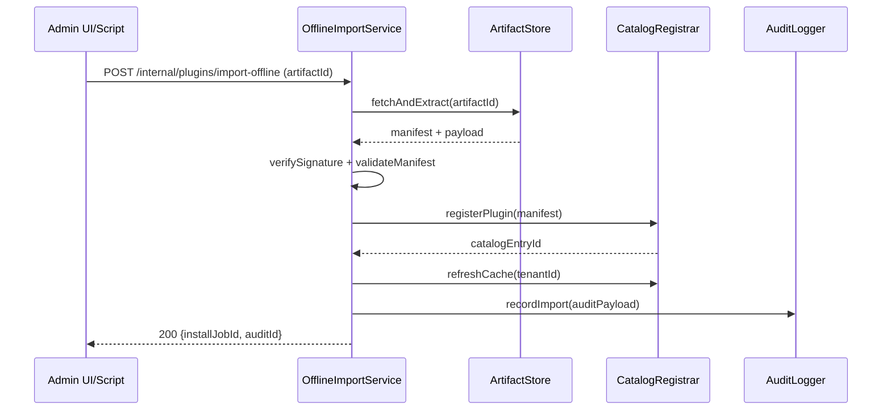

doc_id: PX-PUBLISH-OFFLINE-001
scn_id: SCN-PUBLISH-HUB-001
title: PX-PUBLISH-OFFLINE-001 - service/publish
status: Draft
version: v0.1.0
repo_key: powerx
scope: powerx
layer: service
domain: publish
scenario_title: "PowerX 插件开发与分发全链路"
owners:
  - name: Michael Hu
    role: Tech Steward
    contact: tech@artisan-cloud.com
  - name: Carol
    role: Platform Architect
    contact: carol@artisan-cloud.com
contributors: []
linked_requirements: []
code_refs:
  - path: services/offline_import/offline_import_service.go
  - path: api/offline_plugins.go
  - path: internal/catalog/catalog_refresher.go
feature_flags:
  - PX_OFFLINE_IMPORT
  - PX_CATALOG_CACHE_REFRESH
last_reviewed_at: 2025-10-25

---

# Usecase Overview

- **业务目标**：在无 Marketplace 环境中，通过 Backend 导入离线包，完成签名校验、资源解压、目录注册、缓存刷新及审计记录，保障插件可在目标租户内启用。
- **触发角色**：平台运维工程师、Admin 离线导入向导、自动化导入脚本。
- **成功度量**：导入完成率 ≥ 98%；平均导入时长 ≤ 3 分钟；缓存刷新延迟 ≤ 60s；失败场景 100% 生成 `auditId` 与补救指引。
- **场景关联**：与 `PLG-PUBLISH-OFFLINE-001` CLI、`MKP-PUBLISH-OFFLINE-001` Marketplace 登记、`PX-ADMIN-PUBLISH-OFFLINE-001` UI 协同。

# Context & Assumptions

- **Feature Flags**：`PX_OFFLINE_IMPORT`、`PX_CATALOG_CACHE_REFRESH`；如需自动回滚启用 `PX_IMPORT_ROLLBACK`。
- **依赖服务**：Artifact 存储（OSS/S3/MinIO）、签名验证服务、Workflow Metrics、审计系统、Redis 缓存。
- **输入**：`.pxp` 包、`manifest.signature`、导入租户配置、导入策略（覆盖/追加）。
- **输出**：插件目录记录、安装任务、缓存刷新、`PX_PLUGIN_IMPORT` 审计、Admin 状态更新。
- **边界**：不负责 CLI 打包；不提供 UI，但为 Admin 提供 API；与在线 Marketplace 流程区隔。

# Solution Blueprint

## 体系分解

| 模块 | 组件 | 责任 | 入口 |
|------|------|------|------|
| OfflineImportService | `services/offline_import/offline_import_service.go` | orchestrate 导入、验证、注册、回滚 | `cmd/backend/main.go` |
| SignatureVerifier | `internal/security/signature.go` | 校验 manifest 签名与证书链 | `internal/security` |
| CatalogRegistrar | `internal/catalog/catalog_refresher.go` | 写入目录、刷新缓存、推送事件 | `internal/catalog` |
| AuditLogger | `internal/audit/offline_import.go` | 写 `PX_PLUGIN_IMPORT` 审计、Telemetry | `internal/audit` |

## 流程与时序

# Contracts & Interfaces

- **REST**
  - `POST /internal/plugins/import-offline`：接受 `artifactId`、`tenantId`、`mode` (`install|upgrade|rollback`)；返回安装任务与审计号。
  - `GET /internal/plugins/import-offline/{jobId}`：查询状态、错误列表。
- **Events**
  - `px.offline.import.completed`、`px.offline.import.failed` 广播给 Admin 与 Marketplace。
- **配置**
  - `offline.import.max_size_mb`、`offline.import.parallelism`、`catalog.refresh.strategy`。
- **存储接口**：S3/OSS，需支持预签名读、分片。

# Implementation Checklist

| 项目 | 描述 | 完成状态 | 负责人 |
|------|------|----------|--------|
| 签名校验 | 支持 CMS、KMS、证书吊销检查 | [ ] | Michael Hu |
| 导入流程 | 解压、manifest 校验、冲突检测 | [ ] | Carol |
| 缓存刷新 | Redis + CDN 失效，支持租户粒度 | [ ] | Carol |
| 审计 & 回滚 | 审计日志 + `px-import rollback` 脚本 | [ ] | Matrix-X |
| 文档 | 更新 `docs/standards/powerx/backend/plugins/admin_workflow.md` | [ ] | Matrix-X |

# Testing Strategy

- **单元测试**：`offline_import_service_test.go`、`signature_verifier_test.go`、`catalog_refresher_test.go`。
- **集成测试**：使用真实 S3/MinIO；模拟失败（签名错误、插件冲突、磁盘不足）。
- **端到端**：配合 CLI/ Admin 流程复现导入→安装→回滚；验证事件与审计可追踪。
- **非功能**：导入大包性能、并发导入下资源锁策略、故障注入（S3 延迟、Redis 不可用）。

# Observability & Ops

- **指标**：`offline.import.duration_ms`、`offline.import.success_rate`、`offline.import.rollback_triggered`、`catalog.refresh.latency_ms`。
- **日志**：结构化日志 `offline_import.log`（`artifactId`、`tenantId`、`jobId`、`status`）。
- **告警**：连续 3 次导入失败 → PagerDuty；缓存刷新失败 → SRE 通知；S3 延迟超阈 → 运维频道。
- **Dashboards**：Offline Import Grafana、Catalog Refresh 面板、Audit drill-down。

# Rollback & Failure Handling

- **回滚**：关闭 `PX_OFFLINE_IMPORT`、回滚部署；恢复之前目录版本（通过 `catalog restore`）。
- **补救措施**：`px-import rollback --job-id` 自动卸载；生成失败报告供 Admin 导出；支持重试。
- **数据修复**：手动更新目录记录、清理缓存键、重放审计；维护 script `scripts/offline/fix_catalog_state.go`。

# Follow-ups & Risks

| 风险/事项 | 影响 | 缓解方案 | 负责人 | ETA |
|-----------|------|----------|--------|-----|
| 多租户导入并发冲突 | 目录污染 | 引入租户锁、串行化冲突插件 | Carol | 2025-02-06 |
| S3 延迟导致超时 | 导入失败 | 异步导入 + 重试队列；增加阈值观测 | Michael Hu | 2025-02-12 |
| Audit 不可用 | 合规漏洞 | 本地持久化重试、告警通知合规团队 | Matrix-X | 2025-01-28 |

# References & Links

- 场景：`docs/scenarios/publish/SCN-PUBLISH-OFFLINE-001.md`
- 标准：`docs/standards/powerx/backend/plugins/admin_workflow.md`
- 代码仓：`https://github.com/ArtisanCloud/PowerX/tree/dev/services/offline-import`
- 设计：`ADR-2024-OFFLINE-IMPORT.md`

> Seed 更新后请运行 `npm run publish:usecases -- --scn-id SCN-PUBLISH-HUB-001 --validate-only` 验证 Backend 离线导入链路。
