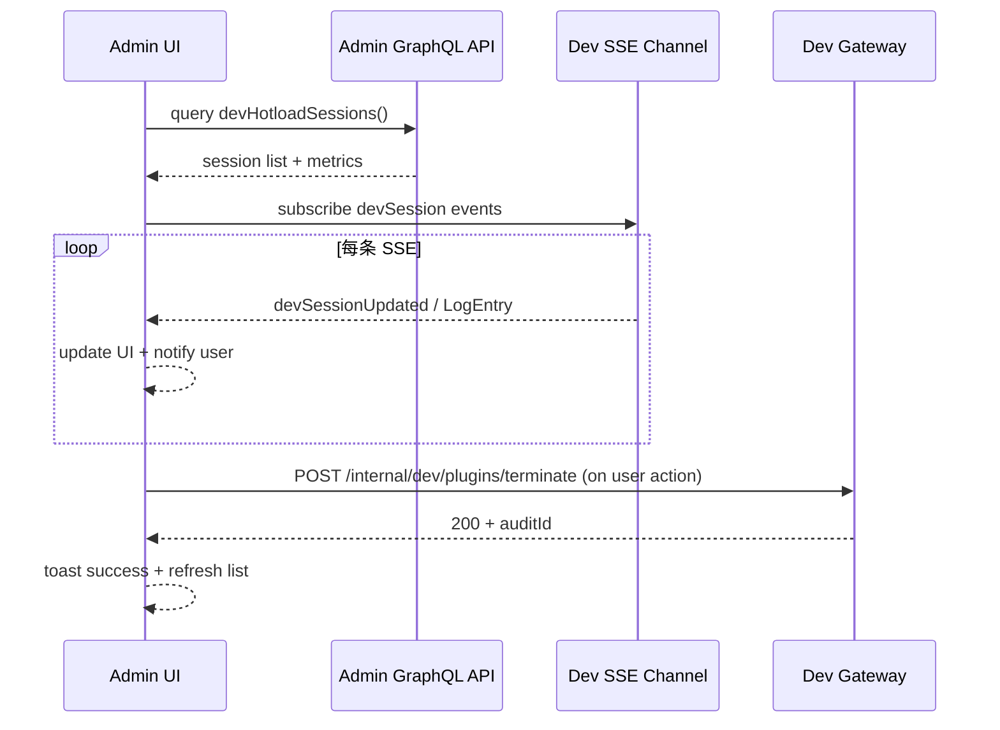

doc_id: PX-ADMIN-DEV-HOTLOAD-001
scn_id: SCN-PUBLISH-HUB-001
title: PX-ADMIN-DEV-HOTLOAD-001 - ui/dev
status: Draft
version: v0.1.0
repo_key: powerx
scope: powerx
layer: ui
domain: dev
scenario_title: "PowerX 插件开发与分发全链路"
owners:
  - name: Matrix-X
    role: Docs Coordinator
    contact: dev@artisan-cloud.com
  - name: Carol
    role: Product Owner
    contact: carol@artisan-cloud.com
contributors: []
linked_requirements: []
code_refs:
  - path: apps/admin/src/pages/dev-hotload/SessionDashboard.vue
  - path: apps/admin/src/services/devHotloadApi.ts
feature_flags:
  - PX_DEV_PLUGIN_HOTLOAD
  - PX_ADMIN_DEV_MODE
last_reviewed_at: 2025-10-25

---

# Usecase Overview

- **业务目标**：为插件研发与平台运维提供实时可观测的调试面板，展示 session 生命周期、日志、指标与回滚操作，确保热加载期间问题可视可控。
- **触发角色**：插件研发工程师、平台运维人员、UI 设计师（配置面板布局）。
- **成功度量**：日志渲染延迟 ≤ 1s；session 操作成功率 ≥ 99%；面板操作（终止/刷新）响应 ≤ 2s；关键告警 5s 内可见。
- **场景关联**：与 `PX-DEV-HOTLOAD-001` Dev API 形成闭环，并向 `PLG-DEV-HOTLOAD-001` CLI 提供反馈。

# Context & Assumptions

- **Feature Flags**：`PX_ADMIN_DEV_MODE` 打开开发调试入口，依赖 Backend `PX_DEV_PLUGIN_HOTLOAD` 同步开启。
- **依赖**：GraphQL `devHotloadSessions` 查询、SSE `devSession*` 事件、Prometheus proxy for metrics。
- **输入**：Dev API SSE 数据、Metrics 汇总、CLI Telemetry（经 Backend 转发）。
- **输出**：可视化仪表、操作按钮（终止 session、复制 reloadToken）、告警弹窗、调试下载链接。
- **边界**：不处理 CLI 构建；不会直接修改沙盒资源，只调用 Backend API；不承担 Marketplace 发布 UI。

# Solution Blueprint

## 体系分解

| 模块 | 主要组件 | 责任 | 代码入口 |
|------|----------|------|---------|
| SessionDashboard | `SessionDashboard.vue` | 展示 session 列表、状态、操作入口 | `apps/admin/src/pages/dev-hotload` |
| LogStreamPanel | `SessionLogs.vue` | 渲染 SSE 日志、支持过滤/搜索/导出 | 同上 |
| MetricsWidgets | `HotloadMetrics.vue` | 显示关键指标、趋势图、告警状态 | `apps/admin/src/components` |
| DevApiClient | `devHotloadApi.ts` | 调用 Backend REST/SSE、处理重连 | `apps/admin/src/services` |

## 流程与时序

# Contracts & Interfaces

- **GraphQL**
  - `query devHotloadSessions($tenantId)` 返回 session 列表、状态、正在构建的插件信息、指标快照。
  - `mutation terminateDevSession(id)` 委托 Backend 执行终止，返回 `auditId`。
- **SSE/WebSocket**
  - Channel `dev.session.events`：推送 `SessionStarted/Reloaded/Terminated`、日志条目、错误事件。
  - 支持断线重连，使用 `last-event-id`。
- **REST**
  - `POST /internal/dev/plugins/terminate`、`POST /internal/dev/plugins/refresh-metrics`。
- **配置**
  - `admin.dev.hotload.defaultTenant`、`admin.dev.hotload.logRetentionMinutes`。

# Implementation Checklist

| 项目 | 描述 | 完成状态 | 负责人 |
|------|------|----------|--------|
| 面板布局 | 设计 Session 列表、日志、指标组合布局 | [ ] | Carol |
| SSE 客户端 | 重连机制、日志队列、性能优化 | [ ] | Dave |
| 操作权限 | 基于角色控制终止/导出操作 | [ ] | Matrix-X |
| 指标组件 | Grafana proxy 图表、告警 badge | [ ] | Dave |
| 文档 | 补充 Admin 运维指南与 troubleshooting | [ ] | Matrix-X |

# Testing Strategy

- **单元测试**：Vue 组件测试（`SessionDashboard.spec.ts`）验证状态渲染；`devHotloadApi.spec.ts` 模拟 SSE 重连；`metrics.spec.ts` 校验图表阈值。
- **端到端测试**：Cypress 场景 `admin-dev-hotload.cy.ts` 启动 stub session 流，验证日志/操作/告警呈现。
- **可用性测试**：与 3 名插件研发者开展可用性访谈，收集操作反馈。
- **性能测试**：SSE 每秒 100 条日志时 UI FPS ≥ 55；Memory < 200MB。

# Observability & Ops

- **指标**：`admin.dev_hotload.active_sessions`、`admin.dev_hotload.log_throughput`、`admin.dev_hotload.terminate_latency_ms`。
- **日志**：`admin_dev_hotload.log`（包含 sessionId、action、result、errorCode）；Sentry 错误事件。
- **告警**：SSE 断线 > 60s 通知 `#powerx-alerts`；终止操作失败触发 PagerDuty L2。
- **Dashboards**：Admin Frontend Dashboard（App Metrics）、Sentry release health。

# Rollback & Failure Handling

- **回滚**：Feature Toggle 关闭面板；回滚 Admin release tag。
- **补救措施**：提供 `px-admin dev reload` CLI 辅助工具导出日志；UI 提示手动调用 Backend API；保存离线日志以供排查。
- **数据修复**：清理 IndexedDB/LocalStorage 缓存，强制刷新；必要时刷新 GraphQL cache。

# Follow-ups & Risks

| 风险/事项 | 影响 | 缓解方案 | 负责人 | ETA |
|-----------|------|----------|--------|-----|
| 日志量大导致浏览器卡顿 | 研发体验差 | 虚拟化渲染、分页、默认限流 | Dave | 2025-02-05 |
| 权限配置不当泄露日志 | 安全风险 | 审核角色策略、敏感字段脱敏 | Matrix-X | 2025-02-12 |
| SSE 断线后数据缺口 | 诊断困难 | last-event-id + 重放接口 | Carol | 2025-02-08 |

# References & Links

- 场景文档：`docs/scenarios/publish/SCN-DEV-HOTLOAD-001.md`
- 标准：`docs/standards/powerx/web-admin/plugins/admin_workflow.md`
- 设计：`Figma › Admin Dev Hotload Dashboard`
- 代码 PR：`https://github.com/ArtisanCloud/PowerX/pulls?q=dev+hotload`

> Seed 完成后同步 docmap（如有字段变更），执行 `npm run publish:usecases -- --scn-id SCN-PUBLISH-HUB-001 --validate-only` 以确保 UI Seed 与站点一致。
