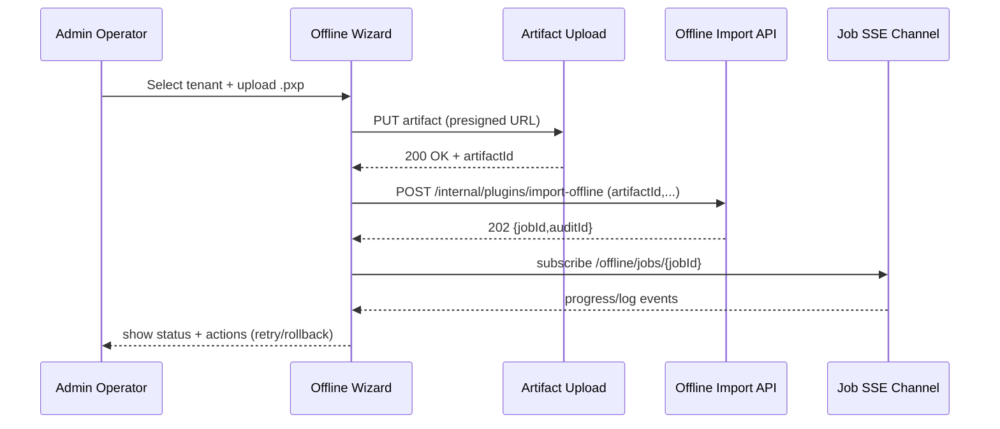

doc_id: PX-ADMIN-PUBLISH-OFFLINE-001
scn_id: SCN-PUBLISH-HUB-001
title: PX-ADMIN-PUBLISH-OFFLINE-001 - ui/publish
status: Draft
version: v0.1.0
repo_key: powerx
scope: powerx
layer: ui
domain: publish
scenario_title: "PowerX 插件开发与分发全链路"
owners:
  - name: Matrix-X
    role: Docs Coordinator
    contact: dev@artisan-cloud.com
  - name: Zoe Chen
    role: Product Owner
    contact: zoe@artisan-cloud.com
contributors: []
linked_requirements: []
code_refs:
  - path: apps/admin/src/pages/offline-import/Wizard.vue
  - path: apps/admin/src/services/offlineImportApi.ts
feature_flags:
  - PX_OFFLINE_IMPORT
  - PX_ADMIN_OFFLINE_WIZARD
last_reviewed_at: 2025-10-25

---

# Usecase Overview

- **业务目标**：提供面向运维与渠道伙伴的离线导入向导，覆盖上传、验证、跟踪、回滚，确保无 Marketplace 场景下的插件交付一致且可追踪。
- **触发角色**：Admin 运维、渠道伙伴、合规审计。
- **成功度量**：导入流程成功率 ≥ 98%；上传进度误差 < 5%；常见错误提供可执行指引；回滚操作可在 2 分钟内完成。
- **场景关联**：与 `PLG-PUBLISH-OFFLINE-001` 打包、`MKP-PUBLISH-OFFLINE-001` 登记、`PX-PUBLISH-OFFLINE-001` 服务对接。

# Context & Assumptions

- **Feature Flags**：`PX_ADMIN_OFFLINE_WIZARD` 打开 UI；需 Backend `PX_OFFLINE_IMPORT` 支持。
- **依赖**：GraphQL API `offlineImportJobs`、REST `POST /internal/plugins/import-offline`、文件上传服务（S3/MinIO）；SSE 获取任务状态。
- **输入**：用户上传 `.pxp` 包与签名；租户/环境选择；导入策略（覆盖/追加）；备注。
- **输出**：导入进度 UI、Job ID、Audit ID、失败日志、回滚操作入口。
- **边界**：不执行签名逻辑，仅展示 Backend 返回；不负责 CLI 打包与 Marketplace 操作。

# Solution Blueprint

## 体系分解

| 模块 | 组件 | 责任 | 入口 |
|------|------|------|------|
| OfflineImportWizard | `Wizard.vue` | 步进式流程（上传→验证→执行→完成） | `apps/admin/src/pages/offline-import` |
| UploadService | `offlineImportUploader.ts` | 生成预签名、断点续传、进度条 | `apps/admin/src/services` |
| JobTracker | `offlineImportJobs.vue` | 展示任务列表、状态、日志 | 同上 |
| RollbackPanel | `RollbackModal.vue` | 触发 `px-import rollback` API、展示影响范围 | `apps/admin/src/components` |

## 流程与时序

# Contracts & Interfaces

- **GraphQL**
  - `query offlineImportJobs($tenantId)` 返回最近 job，含状态、错误、auditId。
- **REST**
  - `POST /internal/plugins/import-offline`（通过 Admin BFF 转发）；`POST /internal/plugins/import-offline/{jobId}/rollback`。
- **SSE/WebSocket**
  - `offline.job.events`：发送 `Queued/Running/Success/Failed` 与日志块。
- **配置**
  - `admin.offline.maxUploadSizeMB`、`admin.offline.allowedTenants`、`admin.offline.autoRollbackEnabled`。

# Implementation Checklist

| 项目 | 描述 | 完成状态 | 负责人 |
|------|------|----------|--------|
| 向导 UX | 步进状态机、错误提示、拖拽上传 | [ ] | Zoe Chen |
| 上传组件 | 分片/断点续传、校验 hash、进度条 | [ ] | Dave |
| Job 面板 | 状态筛选、日志下载、Audit 展示 | [ ] | Matrix-X |
| 回滚入口 | 调用 Backend rollback、风险确认 | [ ] | Carol |
| 文档 | `docs/guides/admin/offline-import.md` | [ ] | Matrix-X |

# Testing Strategy

- **单元测试**：Vue 组件测试（Wizard、Uploader、JobTracker）；权限逻辑测试。
- **端到端**：Cypress `offline-import.cy.ts` 覆盖上传→执行→回滚；模拟失败场景。
- **可用性测试**：与运维/渠道用户试用，确认指引简明。
- **非功能**：大文件上传（500MB）网络抖动恢复；多语言显示验证。

# Observability & Ops

- **指标**：`admin.offline.upload_time_ms`、`admin.offline.import_success_rate`、`admin.offline.rollback_triggered`。
- **日志**：`admin_offline_import.log`（`jobId`、`tenantId`、`status`、`errorCode`）。
- **告警**：连续 3 次失败 job 提醒 `#powerx-alerts`；上传超限告警；SSE 断开 >60s 告警。
- **Dashboards**：Admin Offline Import Grafana；Sentry release health。

# Rollback & Failure Handling

- **回滚**：关闭 `PX_ADMIN_OFFLINE_WIZARD` feature；回滚 Admin release。
- **补救措施**：提供手动 API/CLI 步骤；导出失败日志供调查；引导用户重试或联系支持。
- **数据修复**：可编辑 Job 备注、重新关联 auditId；清理本地缓存。

# Follow-ups & Risks

| 风险/事项 | 影响 | 缓解方案 | 负责人 | ETA |
|-----------|------|----------|--------|-----|
| 上传中断导致重复导入 | 资源浪费 | 支持断点续传、MD5 比对、UI 提示重复 | Dave | 2025-02-03 |
| 角色权限配置不足 | 安全风险 | 集成 RBAC、细粒度操作日志 | Matrix-X | 2025-02-07 |
| 多语言缺失 | 影响全球部署 | 与 i18n 团队同步翻译计划 | Zoe Chen | 2025-02-15 |

# References & Links

- 场景：`docs/scenarios/publish/SCN-PUBLISH-OFFLINE-001.md`
- 标准：`docs/standards/powerx/web-admin/plugins/admin_workflow.md`
- 设计：`Figma › Offline Import Wizard`
- 代码 PR：`https://github.com/ArtisanCloud/PowerX/pulls?q=offline+import`

> Seed 完成后，建议跑 `node scripts/site/sync-scenario-pages.mjs --scn-id SCN-PUBLISH-HUB-001 --with-seeds` 同步站点预览。
