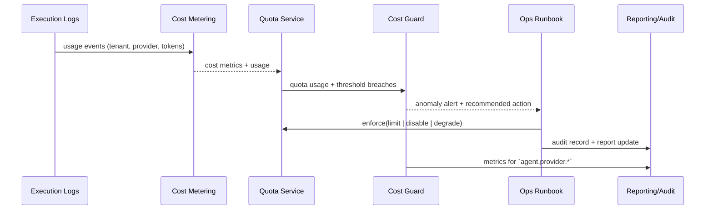

# PowerX (ops) - Model Cost & Quota Governance

## Usecase Overview

- **Business Goal**: Real-time visibility into model call costs, quotas, and health signals, detecting anomalies within 5 minutes and automatically executing throttling/degradation to ensure budget and compliance.
- **Success Metrics**: Cost data latency <1 minute; quota exceeded alerts delivered <5 minutes; throttling/shutdown actions 100% audited; automatic recovery <15 minutes; reports covering all tenants.
- **Scenario Linkage**: Integrates with `SCN-AGENT-MODEL-GOV-001` Stage (Model Cost & Quota Governance), outputs cost/quota signals to routing and execution scenarios, and depends on Provider and routing usecases for capability and health data.

> Summary: Through the closed loop of "metering → cost aggregation → quota comparison → alerts/automated runbook → reports/audit", achieves FinOps governance of model capabilities.

## Context & Assumptions

- **Prerequisites**
  - All model calls carry `trace_id`, `tenant_id`, `provider_id`, `invocation_type`, written to execution logs or event streams.
  - Cost Warehouse (or Lakehouse) can receive streaming metering data; Quota Service supports multi-dimensional configuration for tenant/project/environment.
  - Feature Flags `provider-cost-guard`, `quota-enforcer` registered in config center, can be staged by tenant.
  - `docs/_data/docmap.yaml` usecase node fields are fully consistent with this Seed.
- **Inputs**
  - Execution Logs, `agent.provider.*` metrics, Provider cost rate tables, tenant quota configurations, upper limits/alert thresholds.
  - Ops input for budget cycles, whitelist/exemption, degradation strategies.
- **Outputs**
  - Cost/quota metrics, `agent.provider.cost_total`, `agent.provider.quota_usage` monitoring data.
  - Anomaly events `agent.provider.cost.anomaly`, alert notifications, automated runbook execution results.
  - Cost reports (tenant/provider/capability dimension), audit logs, degradation receipts.
- **Boundaries**
  - Does not include financial settlement, contract negotiation, and pricing strategy.
  - Does not directly modify call paths, only issues throttling/shutdown instructions or Feature Flags.
  - Not responsible for Provider onboarding/routing strategies, only consumes their outputs.

## Solution Blueprint

### System Decomposition

| Layer | Main Components/Modules | Responsibilities | Code Entry Points |
|-------|-------------------------|------------------|-------------------|
| ops | Cost Metering Pipeline | Aggregate Token/call metrics, calculate real-time cost and write to warehouse | `services/cost/metering.ts` |
| ops | Quota & Enforcement Service | Maintain quota tables, execute throttling/shutdown, whitelist management | `services/quota/enforcer.go` |
| ops | Cost Guard & Alerting | Detect anomaly trends, push `provider-cost-guard` alerts, trigger runbook | `services/observability/model_cost_dashboard.ts` |
| ops | Reporting & Audit Layer | Generate reports, output to FinOps/Ops, record operation audit | `scripts/qa/provider-drill.mjs`, `services/audit/model_cost_audit.go` |

### Process & Sequence

1. **Step 1 – Metering Intake**: Execution Logs -> Cost Metering, calculate real-time cost per `provider_rates.yaml` and tag with tenant/project.
2. **Step 2 – Quota Comparison**: Quota Service compares cost/usage with `model_usage.yaml` quotas, generating utilization rates and remaining quotas.
3. **Step 3 – Anomaly Detection**: Cost Guard evaluates month-over-month/year-over-year, spikes, budget consumption, triggers `agent.provider.cost.anomaly` event and alerts when exceeding thresholds.
4. **Step 4 – Enforcement & Degrade**: `quota-enforcer` calls throttling/shutdown APIs or pushes Feature Flags per policy, executes `scripts/ops/quota-degrade.mjs` when necessary.
5. **Step 5 – Reporting & Audit**: Generate daily/weekly reports, sync to FinOps dashboard, write all throttling/recovery operations to audit.

## Contracts & Interfaces

- **Inbound APIs / Events**
  - `POST /internal/provider-usage/report` — Write metering data; supports batch/streaming mode.
  - `POST /internal/provider-cost/anomaly` — Manual anomaly reporting or FinOps data; generates audit.
  - `POST /internal/provider-quotas/enforce` — Execute throttling, degradation, shutdown operations, requires `quota.enforcer` permission.
  - `EVENT agent.provider.cost.anomaly` — Automatic alert event (carrying tenant, provider, weights, recommended actions).
- **Outbound Calls**
  - `GET /internal/provider-quotas` — Query latest quotas/whitelists.
  - `POST /internal/feature-flags/{flag}/toggle` — Enable/disable `provider-cost-guard`, `quota-enforcer`.
  - `Telemetry agent.provider.*` — Output cost, quota, degradation metrics.
  - `Ops Pager / ChatOps` — Publish alerts, runbook links.
- **Configuration & Scripts**
  - `config/cost/provider_rates.yaml`, `config/quotas/model_usage.yaml` — Rates and quotas.
  - `scripts/qa/provider-drill.mjs` — Stress test/simulate cost spikes.
  - `scripts/ops/quota-degrade.mjs` — Automated degradation/recovery operations.

## Implementation Checklist

| Item | Description | Completion Status | Owner |
|------|-------------|-------------------|-------|
| Streaming Metering & Aggregation | Connect execution logs, real-time Token/cost calculation, write to warehouse | [ ] | Ops Reliability Center |
| Rates & Budget Configuration | Maintain `provider_rates.yaml`, support multi-currency/discounts | [ ] | FinOps Taskforce |
| Quota & Whitelist Management | `model_usage.yaml` model, interface, tenant multi-dimensional quotas | [ ] | Agent Platform Guild |
| Anomaly Detection & Alerting | Metric thresholds, trend analysis, `agent.provider.cost.anomaly` events | [ ] | Ops Reliability Center |
| Throttling/Degradation Runbook | `quota-enforcer` API, scripts and audit | [ ] | Ops Reliability Center |
| Reporting & Visualization | Grafana/Datadog panels, periodic report exports | [ ] | FinOps Taskforce |

## Testing Strategy

- **Unit Tests**: Cost calculation functions, rate mapping, quota comparison, threshold decision.
- **Integration Tests**: Simulate real calls to write `provider-usage/report`, verify cost aggregation, quota APIs, alert events.
- **End-to-End**: Use `scripts/qa/provider-drill.mjs` in sandbox to create spike traffic, observe alert → throttling → recovery full链路.
- **Chaos / Failover**: Inject metering delay, Quota Service unavailable, Telemetry loss, confirm degradation strategy and compensation (e.g., cached quotas, manual review).

## Observability & Ops

- **Metrics**: `agent.provider.cost_total`, `agent.provider.cost_delta_percent`, `agent.provider.quota_usage`, `agent.provider.alert_total`, `agent.provider.degrade_total`, `agent.provider.cost_latency_ms`.
- **Logs**: Metering intake logs, quota decision logs, throttling/shutdown operation logs (including `tenant`, `provider`, `policy_version`), audit streams.
- **Alerts**: Cost spikes >20%/5min, quota usage rate ≥90%, degradation execution failure, metering delay >60s, report generation failure.
- **Dashboards**: Grafana「Model Cost & Quota」, Datadog `agent.provider.*`, FinOps monthly reports.

## Rollback & Failure Handling

- Quota/rate configuration supports versioning, anomalous releases can be reverted via Git + `npm run publish:usecases -- --scn-id SCN-AGENT-MODEL-HUB-001 --validate-only` for verification.
- `quota-enforcer` provides `POST /internal/provider-quotas/enforce/undo` API to rollback mistaken throttling.
- When metering pipeline异常, automatically switch to batch backfill mode and mark data quality.
- When alert/runbook failures, immediately escalate to manual on-call, output audit records for tracking.

## Follow-ups & Risks

| Risk/Item | Impact | Mitigation Plan | Owner | ETA |
|-----------|--------|-----------------|-------|-----|
| Cost data source delay or missing | Budget cannot be monitored in real-time | Introduce Kafka replay + data quality monitoring, establish SLA alerts | Ops Reliability Center | 2025-03-05 |
| Inconsistent quota configuration | Mis-throttling or privilege escalation | Establish approval workflow, auto-validation scripts, dual-person review | Agent Platform Guild | 2025-03-01 |
| Disconnect between reports and financial systems | Cannot support settlement/budget meetings | Integrate with FinOps DataMart, export standardized CSV/Looker views | FinOps Taskforce | 2025-03-12 |

## References & Links

- Scenario: `docs/scenarios/agent-orchestration/SCN-AGENT-MODEL-GOV-001.md`
- Docmap: `docs/_data/docmap.yaml` (`SCN-AGENT-MODEL-HUB-001 -> UC-AGENT-MODEL-GOV-001`)
- Repo Metadata: `docs/_data/repos.yaml` (`key: powerx`)
- Configuration: `config/cost/provider_rates.yaml`, `config/quotas/model_usage.yaml`
- Tools: `scripts/qa/provider-drill.mjs`, `scripts/ops/quota-degrade.mjs`
