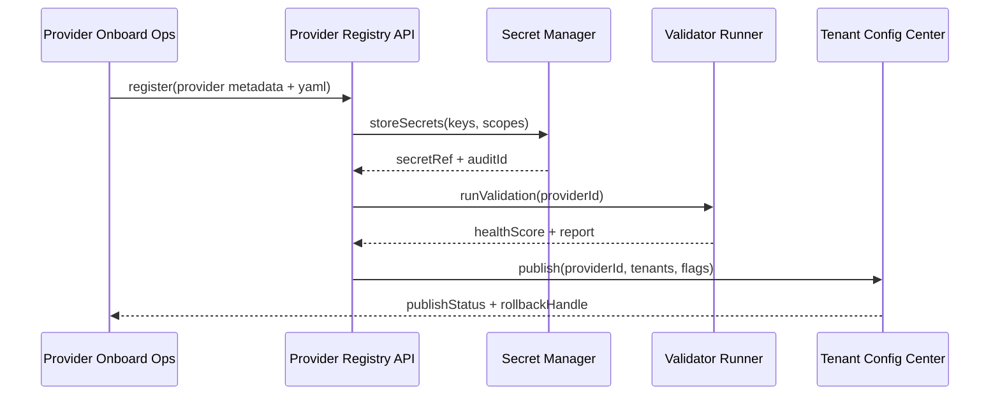

# PowerX (service) - Foundation Model Provider Onboarding & Governance
## Usecase Overview
- **Business Goal**: Standardize LLM/VLM/TTS/Embeddings Provider onboarding, secret management, verification, and tenant mapping, ensuring online within 24 hours while meeting security and compliance.
- **Success Metrics**: Onboarding time ≤24h; health verification pass rate ≥99%; 100% secrets under management and rotation; rollback ≤5 minutes; tenant staged rollout coverage ≥95%.
- **Scenario Linkage**: Supports `SCN-AGENT-MODEL-PROVIDER-001` Stage 1 (Provider Onboarding & Governance), provides capability metadata and health signals to routing and governance usecases.
> Summary: This Seed treats Provider registration, configuration, verification, publishing, and operations as an assembly line, ensuring the platform can rapidly introduce new models while maintaining observability and rollback capabilities.
## Context & Assumptions
- **Prerequisites**
  - Scenario document `docs/scenarios/agent-orchestration/SCN-AGENT-MODEL-PROVIDER-001.md` has defined processes, metrics, and responsibilities.
  - Vault/Secret Manager online with tenant/environment-level secret isolation and audit.
  - Feature Flags `model-provider-registry`, `provider-health-check` registered in config center.
  - `docs/_data/docmap.yaml` `SCN-AGENT-MODEL-HUB-001 -> UC-AGENT-MODEL-PROVIDER-001` child node fields consistent with this Seed.
- **Inputs/Outputs**
  - Input: Provider qualifications, API specs, secrets, quotas and tenant lists, cost/compliance materials, automated verification script parameters.
  - Output: `backend/config/agents/providers/*.yaml` configs, secret references, health scores, tenant config center deltas, audit records.
- **Boundaries**
  - Does not include model evaluation, cost governance, Prompt strategies (handled by other sub-scenarios).
  - Not responsible for cross-repo model code implementation, only covers PowerX Registry + Ops deliverables.
  - Training/inference call path performance optimization handled by routing and execution scenarios.
## Solution Blueprint
### System Decomposition
| Layer | Main Components/Modules | Responsibilities | Code Entry Points |
|-------|-------------------------|------------------|-------------------|
| service | Provider Registry Service | Handle registration API, YAML template generation, Schema validation, tenant publishing | `services/provider/registry.ts` |
| service | Secret Manager Adapter | Receive secrets, encrypt storage, rotation schedules, audit events | `services/security/secret_manager.go` |
| service | Provider Validation Runner | Call sandbox, run verification scripts, health scoring and log upload | `scripts/ops/provider-validator.mjs` |
| ops | Provider Release Pipeline | Staged rollout, tenant mapping sync, rollback orchestration | `scripts/ops/provider-release.mjs` |
### Process & Sequence
1. **Step 1 – Intake**: `POST /internal/providers/register` receives Provider metadata, writes to staging config and triggers Schema validation.
2. **Step 2 – Secret Management**: Secrets encrypted and stored via Secret Manager API, references written to YAML, rotation timer and audit started.
3. **Step 3 – Automated Verification**: Call `provider-validator.mjs` to execute function/latency/error rate checks, generate `agent.provider.health_signal` metrics and reports.
4. **Step 4 – Tenant Publishing**: Through Provider Registry publish API, push config to tenant config center and Feature Flags, support staged rollout and tenant whitelists.
5. **Step 5 – Monitoring & Rollback**: Continuously subscribe to health signals and secret rotation events; trigger `provider-release.mjs rollback` to recover previous version on anomalies.

## Contracts & Interfaces
- **Inbound APIs / Events**
  - `POST /internal/providers/register` — Accept provider profile, endpoints, tenant matrix; requires `agent.registry.write` permission.
  - `POST /internal/providers/{id}/validate` — Trigger or rerun automated verification, can specify capability suites and thresholds.
  - `POST /internal/providers/{id}/publish` — Publish to tenant config center, supports `--tenants`, `--env`, `--dry-run`.
- **Outbound Calls**
  - `Vault Secret Manager /v1/provider-secrets` — Store secrets, failure requires cascading rollback of registration.
  - `Tenant Config Service /internal/config/tenants` — Write tenant/environment mapping and staged parameters.
  - `Telemetry Pipeline agent.provider.health_signal` — Report latency, error rate, health scores, and rollback status.
- **Configuration & Scripts**
  - `backend/config/agents/providers/*.yaml` — Provider templates, capability tags, throttling, tenant mapping.
  - `config/feature_flags/provider.yaml` — Control staged enable/disable, degradation strategies.
  - `scripts/ops/provider-validator.mjs` / `scripts/ops/provider-release.mjs` — Automated verification, publish, rollback.
## Implementation Checklist
| Item | Description | Completion Status | Owner |
|------|-------------|-------------------|-------|
| Schema Validation & Template Generation | Define YAML Schema, lint, CI validation | [ ] | Agent Platform Guild |
| Secret Management & Rotation | Integrate with Vault, implement rotation schedules and alerts | [ ] | Ops Reliability Center |
| Automated Verification Suite | Expand scripts to cover LLM/VLM/TTS/Embeddings | [ ] | Agent Platform Guild |
| Tenant Staged Rollout & Rollback | Publish scripts & config center API integration | [ ] | Agent Platform Guild |
| Observability & Audit | Metrics, logs, events mapped to monitoring panels | [ ] | Ops Reliability Center |
## Testing Strategy
- **Unit Tests**: Registry Schema validators, Secret Manager adapters, health scoring algorithms, rollback switches.
- **Integration Tests**: Sandbox calls to real Providers, verify script outputs, secret write+reference replacement, tenant publishing APIs.
- **End-to-End Validation**: Full链路 from registration to staged rollout, run `provider-release.mjs --dry-run` in staging and verify metrics curves.
- **Non-functional/Chaos**: Secret expiration, Provider latency threshold exceeded, Telemetry delay, confirm automatic blocking and rollback paths.
## Observability & Ops
- **Metrics**: `agent.provider.onboard_duration`, `agent.provider.health_success_total`, `agent.provider.secret_rotation_total`, `agent.provider.publish_latency`.
- **Logs**: Registry interface audit, secret reference generation, verification script outputs, tenant publishing events (must include providerId/tenant/env/traceId).
- **Alerts**: Health score < threshold, secret rotation failure, rollback triggered, config center publish failure; delivered via Ops Pager & Teams channels.
- **Dashboards**: Grafana「Provider Onboarding」, Datadog `agent.provider.*`, Vault rotation panels.
## Rollback & Failure Handling
- `provider-release.mjs rollback --provider <id> --tenant <t>` rollback tenant configs and revoke Feature Flags.
- Secret Manager failure directly terminates registration, cleans up YAML references and generates audit events.
- Verification failure automatically marks Provider status as `pending_fix`, blocks publishing and generates JIRA tickets.
- Config center anomalies use cached previous version configs, restrict new tenant access and notify on-call.
## Follow-ups & Risks
| Risk/Item | Impact | Mitigation Plan | Owner | ETA |
|-----------|--------|-----------------|-------|-----|
| Provider qualification & secret review process not automated | Delayed launch, compliance risk | Introduce form/approval automation, integrate with IAM approval system | Agent Platform Guild | 2025-03-15 |
| Verification scripts don't cover multi-region endpoints | Production environment stability uncertain | Configure call samples and timeout thresholds for each region, include in CI | Ops Reliability Center | 2025-03-05 |
## References & Links
- Scenario: `docs/scenarios/agent-orchestration/SCN-AGENT-MODEL-PROVIDER-001.md`
- Docmap: `docs/_data/docmap.yaml` (SCN-AGENT-MODEL-HUB-001 -> UC-AGENT-MODEL-PROVIDER-001)
- Repo Metadata: `docs/_data/repos.yaml` (`key: powerx`)
- Config Templates: `backend/config/agents/providers/*.yaml`
- Automation Scripts: `scripts/ops/provider-validator.mjs`, `scripts/ops/provider-release.mjs`
