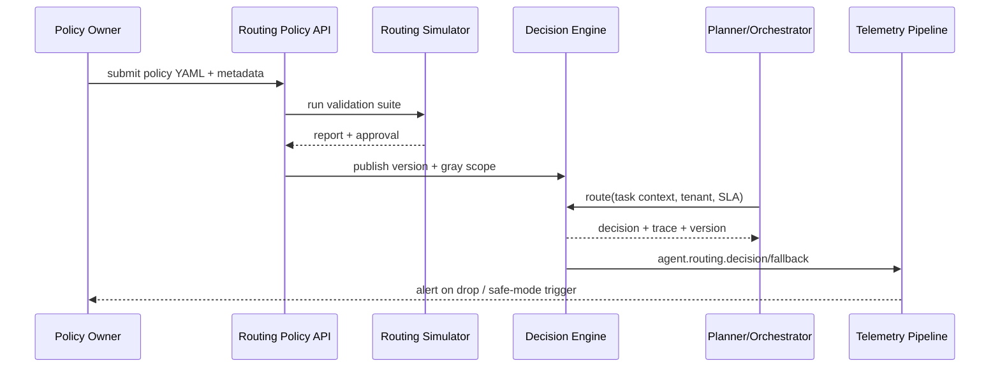

# PowerX (integration) - Multi-Model Routing & Policy Orchestration
## Usecase Overview
- **Business Goal**: Provide degradable and rollback-capable multi-model routing decisions for Planner/Orchestrator based on task tags, cost, SLA, and risk levels, reducing manual configuration and ensuring experience.
- **Success Metrics**: Real-time hit rate ≥90%; fallback success rate ≥95%; policy publish to effect <5 minutes; decision latency <200ms; safe mode triggers within 1 minute.
- **Scenario Linkage**: Implements `SCN-AGENT-MODEL-ROUTING-001` Stage 2, depends on capability/health data from Provider onboarding usecase, provides model decisions to task execution sub-scenario.
> Summary: This Seed chains "policy configuration → decision execution → telemetry feedback → rollback/safe mode" into a closed loop, ensuring model combinations can be supplied differentially by tenant/business line.
## Context & Assumptions
- **Prerequisites**
  - Provider Registry has synced capability tags, health scores, and tenant availability.
  - Feature Flags `multi-model-router`, `routing-safe-mode` integrated into config center, can be staged by tenant or business line.
  - `docs/_data/docmap.yaml` `SCN-AGENT-MODEL-HUB-001 -> UC-AGENT-MODEL-ROUTING-001` child node fields (scope/layer/domain/path) consistent with this file.
  - Telemetry Pipeline can write `agent.routing.*` metrics in real-time and configure alerts.
- **Inputs**
  - Task context output from Planner (task type, tenant, SLA, privacy level, budget, language/modality requirements).
  - Policy templates (primary/backup model lists, weights, constraints, A/B dimensions, version tags).
  - Provider health signals, cost weights, model quotas.
- **Outputs**
  - Routing decisions (primary model, backup sequence, Trace ID, cost estimation, policy version number).
  - Telemetry events `agent.routing.decision`, `agent.routing.fallback`.
  - Policy audit records, staged rollout/rollback status.
- **Boundaries**
  - Not responsible for Provider onboarding and secret management (handled by `UC-AGENT-MODEL-PROVIDER-001`).
  - Cost governance and quota settlement handled by `UC-AGENT-MODEL-GOV-001`.
  - Does not directly execute inference requests, only returns decisions and context, execution chain completed by task execution scenario.
## Solution Blueprint
### System Decomposition
| Layer | Main Components/Modules | Responsibilities | Code Entry Points |
|-------|-------------------------|------------------|-------------------|
| integration | Multi-Model Decision Engine | Parse policies, combine health/cost signals to generate primary/backup models | `services/model-routing/decision_engine.ts` |
| integration | Policy Center & Version Store | Manage YAML/JSON policies, approval, versioning, rollback points | `services/policy-center/routing_version_store.go` |
| integration | Telemetry Feedback Loop | Collect hit rate, fallback, safe-mode trigger data | `services/telemetry/routing_metrics.go` |
| ops | Routing Simulator & Release Pipeline | Replay policies before staged rollout, verify SLA, automated rollback | `scripts/ops/routing-simulator.mjs` |
### Process & Sequence
1. **Step 1 – Policy Authoring**: Define or update policies in `backend/config/agents/routing/*.yaml`, submit for approval and generate version numbers.
2. **Step 2 – Validation & Simulation**: Run `routing-simulator.mjs`, replay decisions for key task templates, write reports.
3. **Step 3 – Publish & Gray Release**: `POST /internal/model-routing/policies` push policies to decision engine, staged rollout by tenant/business line.
4. **Step 4 – Runtime Decision**: Planner calls `POST /internal/model-routing/route`, decision engine outputs primary/backup models and Trace based on policies + real-time health/cost signals.
5. **Step 5 – Feedback & Adaptation**: Telemetry statistics hit rate and fallback, if safe mode or rollback triggered, call corresponding APIs and record audit.

## Contracts & Interfaces
- **Inbound APIs / Events**
  - `POST /internal/model-routing/policies` — Upload/update policies, must include version info, staged scope, and approver; supports `--dry-run`.
  - `POST /internal/model-routing/route` — Input task context object `{tenant, taskType, sla, budget, modality}`, return decision and Trace; SLA <200ms.
  - `POST /internal/model-routing/rollback` — Specify `policy_version` or `tenant` to rollback to previous stable version.
  - `POST /internal/model-routing/safe-mode` — Enable/disable safe mode, default only allows whitelisted models.
- **Outbound Calls**
  - `Provider Registry /internal/providers/{id}/health` — Read latest health scores and capacity.
  - `Cost Service /internal/cost/model-quote` — Evaluate cost limits, discount strategies.
  - `Telemetry Pipeline agent.routing.*` — Write hit rate, latency, fallback events.
- **Configuration & Scripts**
  - `backend/config/agents/routing/*.yaml`, `config/policies/model-routing.json` — Policy templates and defaults.
  - `scripts/ops/routing-simulator.mjs` — Policy simulation, A/B replay.
  - `config/feature_flags/routing.yaml` — Staged rollout switches, safe mode thresholds.
## Implementation Checklist
| Item | Description | Completion Status | Owner |
|------|-------------|-------------------|-------|
| Policy Schema & Validator | JSON Schema/YAML lint, CI validation and diff audit | [ ] | Agent Platform Guild |
| Decision Engine Extension | Support multi-modal tags, cost/SLA weights, dynamic fallback | [ ] | Agent Platform Guild |
| Telemetry Metrics | Integrate `agent.routing.hit_rate`, `decision_latency`, `fallback_total` | [ ] | Ops Reliability Center |
| Staged Rollout/Safe Mode API | Implement tenant-level staged rollout, safe mode, approval flow | [ ] | Agent Platform Guild |
| Rollback & Audit | Version Store, audit logs, automatic rollback scripts | [ ] | Ops Reliability Center |
## Testing Strategy
- **Unit Tests**: Policy parsing, weight sorting, health signal fusion, fallback state machine.
- **Integration Tests**: Planner → Router → Provider sandbox, verify multi-tenant staged rollout, cost APIs, Telemetry output.
- **End-to-End**: Use `routing-simulator.mjs --scenario <id>` to cover high-value task templates, verify A/B and safe mode.
- **Chaos/Non-functional**: Simulate primary model failure, latency spikes, cost API timeout, ensure automatic fallback and rollback complete within SLA.
## Observability & Ops
- **Metrics**: `agent.routing.hit_rate`, `agent.routing.decision_latency`, `agent.routing.fallback_total`, `agent.routing.safe_mode_active`, `agent.routing.policy_publish_latency`.
- **Logs**: Policy publish/approval logs, decision Trace (including `tenant`, `policy_version`, `selected_model`, `fallback_path`), safe-mode operation records.
- **Alerts**: Hit rate drop >10%/5min, decision latency >200ms, fallback failure rate >5%, policy publish failure, safe mode持续 >30min.
- **Dashboards**: Grafana「Model Routing」, Datadog `agent.routing.*`, Ops middle platform safe mode dashboard.
## Rollback & Failure Handling
- Use `POST /internal/model-routing/rollback` or `routing-simulator.mjs rollback --policy <version>` to recover previous stable policy; automatically notify Planner.
- Safe Mode can be automatically enabled when policy anomalies occur, only allowing trusted models; manual解除 required after recovery.
- When Provider health signals missing, switch to previous available model and mark `degraded`, remind司机 teams.
- When policy publish fails, maintain old version, generate audit event and trigger alert.
## Follow-ups & Risks
| Risk/Item | Impact | Mitigation Plan | Owner | ETA |
|-----------|--------|-----------------|-------|-----|
| Policy approval & audit not automated | Time-consuming publishing, compliance risk | Introduce approval flow + automated audit snapshots (Policy Center) | Agent Platform Guild | 2025-03-10 |
| Telemetry feedback delay causing hit rate decline | Cannot switch policies in time | Establish real-time thresholds and automatic safe-mode triggers, optimize metric refresh cycles | Ops Reliability Center | 2025-03-05 |
| Missing cost signals affecting weights | May select high-cost models | Add cost API retry and cache, fallback to cost ceiling strategy on failure | Agent Platform Guild | 2025-02-28 |
## References & Links
- Scenario: `docs/scenarios/agent-orchestration/SCN-AGENT-MODEL-ROUTING-001.md`
- Docmap: `docs/_data/docmap.yaml` (`SCN-AGENT-MODEL-HUB-001 -> UC-AGENT-MODEL-ROUTING-001`)
- Repo Metadata: `docs/_data/repos.yaml` (`key: powerx`)
- Policy Templates: `backend/config/agents/routing/*.yaml`
- Telemetry & Scripts: `services/telemetry/routing_metrics.go`, `scripts/ops/routing-simulator.mjs`
