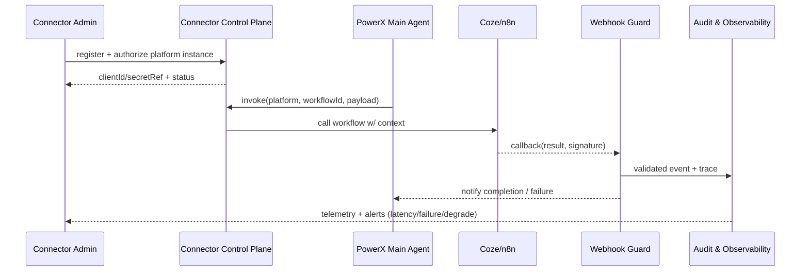

# PowerX (integration) - External Agent Platform Integration (Coze / n8n)

## Usecase Overview

- **Business Goal**: Enable PowerX main Agents to call external agent/workflow platforms such as Coze and n8n under unified identity, security, and audit framework, expanding automation capabilities in a controllable and rollback-capable manner.
- **Success Metrics**: Platform call success rate ≥98%; callback latency <3 seconds; signature failure rate <0.1%; degradation switch ≤5 minutes; multi-tenant credential sync success rate 100%.
- **Scenario Linkage**: Implements `SCN-AGENT-PLATFORM-COZE-001` Stage (External Platform Integration), provides "advanced providers" to task execution scenario, depends on health and policy output from Provider/routing usecases.

> Summary: Through connector SDK + Webhook Guard + tenant mapping, forms a closed loop of "register/authorize → invoke → callback → degradation", ensuring external platforms are observable, auditable, and secure.

## Context & Assumptions

- **Prerequisites**
  - External platforms provide OAuth/Token or API Key, Webhooks support signature validation.
  - `agent-platform-connectors` and `platform-webhook-guard` Feature Flags registered in config center, can be staged by tenant.
  - Vault/Secret Manager supports tenant-level encrypted storage of platform credentials.
  - `docs/_data/docmap.yaml` `SCN-AGENT-MODEL-HUB-001 -> UC-AGENT-PLATFORM-COZE-001` scope/layer/domain consistent with this Seed.
- **Inputs**
  - Platform OAuth/Token, App ID, Webhook Secret.
  - Tenant/user mapping, context templates, workflow IDs, runtime parameters.
  - Degradation strategies (human fallback, local degraded process, retry thresholds).
- **Outputs**
  - Connector instance configuration (`config/platform/connectors/*.yaml`) and secret references.
  - `POST /platform/connectors/{platform}/invoke` Trace, call results, error codes.
  - `EVENT platform.connector.callback` and audit records, alert signals.
- **Boundaries**
  - Not responsible for external platform internal Workflow/Node design and operations.
  - Does not cover third-party dependency qualification approval (handled by platform administrators).
  - Does not directly modify PowerX downstream plugins or task execution logic, only provides invocation and result synchronization.

## Solution Blueprint

### System Decomposition

| Layer | Main Components/Modules | Responsibilities | Code Entry Points |
|-------|-------------------------|------------------|-------------------|
| integration | Connector SDK (Coze/n8n) | Implement OAuth/Token management, context mapping, invoke/callback encapsulation | `connectors/coze/`, `connectors/n8n/` |
| integration | Webhook Guard & Gateway | Validate signatures, throttling, idempotency, replay protection | `services/security/webhook_guard.ts` |
| integration | Connector Control Plane | Connector instance management, tenant mapping, Feature Flags | `config/platform/connectors/` + Control APIs |
| ops | Audit & Degrade Pipeline | Trace, audit, degradation switches, alert handling | `services/audit/platform_trace.go`, `scripts/ops/platform-degrade.mjs` |

### Process & Sequence

1. **Step 1 – Platform Onboarding**: Create Connector instance, complete OAuth/Token or API Key exchange, write secrets to Vault.
2. **Step 2 – Context Mapping**: Define tenant/user mapping and input/output templates in config center, enable necessary Feature Flags.
3. **Step 3 – Invocation**: Main Agent triggers workflow through `POST /platform/connectors/{platform}/invoke`, with Trace, idempotency keys, tenant tags.
4. **Step 4 – Callback & Persistence**: Webhook Gateway validates signatures, writes results to task board, audit, and event streams, retries or marks degradation on failures.
5. **Step 5 – Monitoring & Degrade**: Telemetry monitors success rate/latency, switches to local process or manual handling via `POST /platform/connectors/{platform}/degrade` when necessary, and sends alerts.

## Contracts & Interfaces

- **Inbound APIs / Events**
  - `POST /platform/connectors/{platform}/instances` — Create/update instance, return secret reference and tenant scope, requires `agent.connector.manage` permission.
  - `POST /platform/connectors/{platform}/invoke` — Main Agent triggers external workflow, request body contains `tenant`, `workflowId`, `context`, `traceId`, `idempotencyKey`.
  - `POST /platform/connectors/{platform}/degrade` — Set degradation mode (local process/human), supports `--timeout`, `--reason`.
  - `EVENT platform.connector.callback` — Webhook successful callback, payload includes signature, results, error codes, traceId.
- **Outbound Calls**
  - External Platform OAuth/API (`https://api.coze.com/...`, `https://api.n8n.cloud/...`) — Must handle rate limiting and retries.
  - Secret Manager (`/v1/platform-secrets`) — Store/rotate platform secrets.
  - Audit & Telemetry (`agent.platform.*`) — Write metrics, alert events, and audit records.
- **Configuration & Scripts**
  - `config/platform/connectors/*.yaml` — Connector instances, tenant mapping, callback endpoints.
  - `scripts/ops/platform-degrade.mjs` — Fast degradation/recovery scripts.
  - `config/feature_flags/platform_connectors.yaml` — Staged rollout, tenant whitelists, rate limiting.

## Implementation Checklist

| Item | Description | Completion Status | Owner |
|------|-------------|-------------------|-------|
| OAuth / Token Management | Multi-platform credentials, tenant isolation, automatic rotation | [ ] | Plugin Guild |
| Context Templates & Validation | Input/output mapping, parameter validation, sensitive data masking | [ ] | Agent Platform Guild |
| Webhook Guard | Signature algorithms, idempotency tables, throttling, replay detection | [ ] | Ops Reliability Center |
| Invocation & Degradation APIs | Invoke/Degrade interfaces, Feature Flag control | [ ] | Agent Platform Guild |
| Audit & Telemetry | Trace, `agent.platform.*` metrics, alert routing | [ ] | Ops Reliability Center |

## Testing Strategy

- **Unit Tests**: Connector SDK parameter validation, signature verification, callback parsing, idempotency key generation.
- **Integration Tests**: Sandbox calls to Coze/n8n, Webhook callback signatures, Secret Manager replacement, tenant mapping coverage.
- **End-to-End**: Full链路 script from register → invoke → callback → audit → degradation (`npm run test:workflows -- --suite=platform-connectors` or combined with routing-simulator).
- **Chaos / Failover**: Simulate platform 5xx, network timeout, signature tampering, credential expiration, Webhook delays, verify degradation paths and alerts.

## Observability & Ops

- **Metrics**: `agent.platform.latency_p95`, `agent.platform.success_rate`, `agent.platform.callback_failure_total`, `agent.platform.degrade_total`, `agent.platform.signature_failure_total`.
- **Logs**: Connector invocation logs (including `traceId`, `tenant`, `workflowId`), Webhook validation logs, degradation operation records.
- **Alerts**: Callback failure rate >5%, signature failure >0.1%, degradation持续 >30 minutes, invocation latency >3s, credentials near expiration.
- **Dashboards**: Grafana「Platform Connectors」, Datadog `agent.platform.*`, Ops middle platform degradation panel.

## Rollback & Failure Handling

- `POST /platform/connectors/{platform}/degrade --mode local --tenant <id>` can switch to local process when platform unavailable, manually or automatically recover after completion.
- When OAuth/Token expires, trigger rotation process and block calls, rollback to previous credential references when necessary.
- Webhook failures automatically retry (exponential backoff), alert and record audit after exceeding thresholds.
- When platform contract changes, rollback `config/platform/connectors/*.yaml` through configuration versioning and republish.

## Follow-ups & Risks

| Risk/Item | Impact | Mitigation Plan | Owner | ETA |
|-----------|--------|-----------------|-------|-----|
| Platform protocol/Schema changes lack early warning | Cause invocation/callback failures | Subscribe to platform change Webhooks, pull SDK versions and add compatibility layer | Plugin Guild | 2025-03-08 |
| Manual tenant mapping maintenance error-prone | May cause privilege escalation or request failures | Establish auto-sync scripts + approval flow, periodically audit mappings | Agent Platform Guild | 2025-03-01 |
| Signature algorithm leakage or abuse | Security risk | Regularly rotate signature keys, enforce mTLS, enable Webhook Guard thresholds | Ops Reliability Center | 2025-03-05 |

## References & Links

- Scenario: `docs/scenarios/agent-orchestration/SCN-AGENT-PLATFORM-COZE-001.md`
- Docmap: `docs/_data/docmap.yaml` (`SCN-AGENT-MODEL-HUB-001 -> UC-AGENT-PLATFORM-COZE-001`)
- Repo Metadata: `docs/_data/repos.yaml` (`key: powerx`, `key: powerx-plugin`)
- Config Templates: `config/platform/connectors/*.yaml`
- Audit & Security: `services/security/webhook_guard.ts`, `services/audit/platform_trace.go`, `scripts/ops/platform-degrade.mjs`
