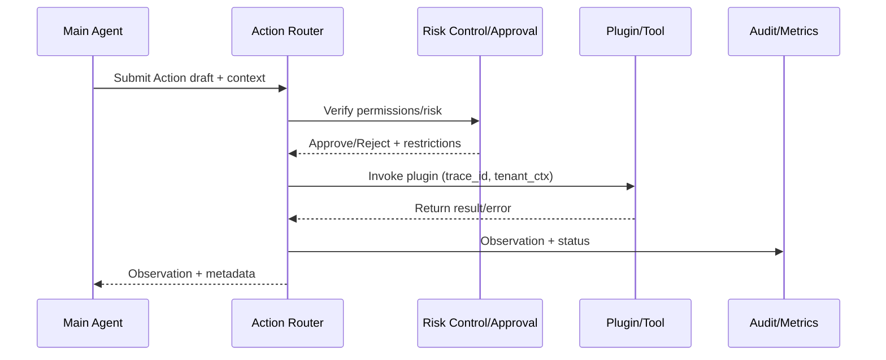

# Executive Summary

This sub-scenario is responsible for transforming Thought into executable Actions: evaluating required plugins, preparing parameters, verifying permissions and risks, executing calls, and writing Observations. The goal is to maintain ≥95% action success rate and ensure all sensitive operations go through approval or manual collaboration. Success signals: each Action binds a tracking ID, plugin calls complete <3 seconds (p95), automatic retry or degradation on failure, and visible pending approval status.

# Scope & Guardrails

- **In Scope**: Action templates, plugin capability matching, parameter filling and validation, tenant/user permission verification, risk control policies and manual approval, call execution, failure degradation and retry, Observation writing.
- **Out of Scope**: Plugin business logic itself, knowledge retrieval steps, general workflow canvas, cost billing strategies.
- **Environment & Flags**: `react-action-router`, `plugin-risk-guard`, `agent-approval-flow`, `react-actor-telemetry`; depends on Plugin Registry, IAM, Workflow Engine, Audit/Telemetry.

# Participants & Responsibilities

| Scope | Repository | Layer | Responsibilities & Deliverables | Owners |
|-------|------------|-------|--------------------------------|--------|
| action-router | powerx | service | Action generation, plugin capability matching, parameter templates, retry/degradation strategies | Agent Platform Guild |
| plugin-catalog | powerx-plugin | integration | Plugin metadata, permissions/tenant mapping, executor SDK, health probes | Plugin Guild |
| risk-control | powerx | ops | Risk classification, approval orchestration, manual collaboration, alerts | Ops Reliability Center |

# End-to-End Flow

1. **Stage 1 – Action Drafting**: Thought engine passes in objectives, required data, risk labels; Action Router selects templates, fills parameters, and generates call intentions.
2. **Stage 2 – Capability & Policy Check**: Verify plugin version, tenant permissions, rate limits, and sensitive labels; trigger approval or manual confirmation for high-risk operations.
3. **Stage 3 – Execution & Observation Capture**: Forward Action to plugin executor with tenant context, tracking ID, and Teleport token; collect responses and structure them into Observations.
4. **Stage 4 – Failure Handling & Escalation**: On failure, retry/degrade/manual collaborate according to policy; write all action results to audit and provide feedback to Thought/Memory sub-scenarios.

# Architecture Diagram

# Key Interactions & Contracts

- **APIs / Events**
  - `POST /internal/react/action`: Body contains `thought_id`, `tool`, `params`, `risk_level`; returns Action ID, status.
  - `POST /internal/react/action/{id}/approve`: Approval interface, supports manual and policy-based auto-approval.
  - `POST /internal/plugins/{plugin}/invoke`: Plugin execution entry point with headers `trace_id`, `tenant_id`, `auth_token`.
  - `EVENT react.action.state.changed`: Status `draft/pending/approved/running/succeeded/failed/aborted`.
- **Configs / Schemas**
  - `config/react/action_templates.yaml`, `config/plugins/catalog.yaml`, `config/risk/agent_action_policies.yaml`.
  - `schemas/react_action.json`, `schemas/react_observation.json`.
- **Security / Compliance**
  - All calls must carry short-lived credentials and tenant isolation labels.
  - High-risk operations require dual-person approval or risk control policy approval.
  - Failure logs need to be redacted and record plugin version, parameter hash.

# Usecase Links

- `UC-AGENT-REACT-ACTION-001` — Action Router + Risk Control Approval Chain (integration layer, `docs/usecases-seeds/SCN-AGENT-REACT-ORCH-001/UC-AGENT-REACT-ACTION-001.md`).

# Acceptance Criteria

1. Action generation time <800ms, template hit rate ≥90%, missing fields return prompts.
2. Plugin call success rate ≥95%, must degrade or switch to alternative plugin within three failures.
3. 100% of sensitive operations trigger approval or manual confirmation, average approval time <2 minutes.
4. Each Action/Observation binds Trace ID and writes to audit/Telemetry.

# Telemetry & Ops

- **Metrics**: `react.action.latency_ms`, `react.action.success_rate`, `react.action.retry_total`, `react.action.approval_pending_total`, `react.action.risk_block_total`.
- **Logs/Audit**: `audit.react_action` records plugin, version, parameter hash, approval results, retry count; executor INFO/ERROR logs include trace.
- **Alerts**: Success rate <95%, approval queue >2 minutes, continuous failures >3, trace loss; notify PagerDuty + Teams #agent-react.
- **Runbooks**: `scripts/ops/react-action-drill.mjs`, `runbooks/agent/react_action_escalation.md`.

# Open Issues & Follow-ups

| Risk/Issue | Impact Scope | Owner | ETA |
|------------|--------------|-------|-----|
| Plugin risk control tags not fully synchronized with Marketplace | Delayed sensitive operation detection | Plugin Guild | 2025-03-04 |
| Approval workflow lacks batch/revoke capability | High-concurrency approval, failure rollback | Ops Reliability Center | 2025-03-10 |

# Appendix

- `docs/meta/scenarios/powerx/agent-and-automation/agent-orchestration/react-agent-orchestration/primary.md`
- `docs/_data/docmap.yaml`
