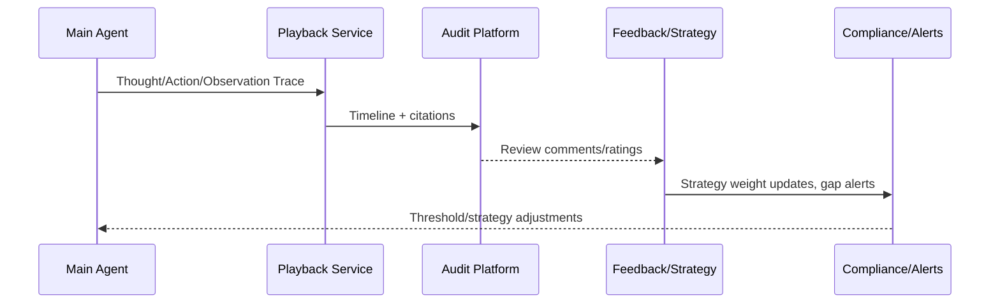

# Executive Summary

This sub-scenario ensures that when a ReAct session ends or is terminated, it can deliver complete answers, generate playable timelines, trigger audit/compliance processes, and write back strategies. The goal is to achieve 100% playback generation success rate, ensure key nodes have timestamps and operators, and allow audits to complete within 30 seconds; when logs are missing or violations are detected, automatically generate investigation tickets and block strategies from continuing to launch.

# Scope & Guardrails

- **In Scope**: Result summarization, citation and confidence display, playback trace generation, audit queries, user/audit feedback collection, strategy weight/threshold updates, missing log detection, compliance tickets.
- **Out of Scope**: Knowledge base update processes, manual approval implementation details, business report formatting.
- **Environment & Flags**: `react-audit-timeline`, `react-feedback-loop`, `audit-gap-detector`; depends on Audit Service, Telemetry, Workflow/Compliance platforms, Dashboard.

# Participants & Responsibilities

| Scope | Repository | Layer | Responsibilities & Deliverables | Owners |
|-------|------------|-------|--------------------------------|--------|
| playback-service | powerx | service | Playback trace generation, timeline visualization, citation/metric binding | Agent Platform Guild |
| audit-pipeline | powerx | ops | Audit queries, gap detection, compliance tickets, report generation | Ops Reliability Center |
| feedback-loop | powerx | service | User ratings, audit annotations, strategy weight/threshold updates | Agent Platform Guild |

# End-to-End Flow

1. **Stage 1 – Closure Summary**: Reasoner generates answers, key conclusions, citations, and confidence based on final Observations, and writes to answer templates.
2. **Stage 2 – Timeline Assembly**: Playback service collects all Thought/Action/Observation, plugin logs, and approval records to generate ordered timelines and diff comparisons.
3. **Stage 3 – Audit & Feedback**: Auditors/users can request playback, annotate "correct/needs improvement", and if gaps are found, trigger `audit-gap-detector` to automatically generate tickets.
4. **Stage 4 – Strategy Update & Reporting**: Update strategy weights or risk thresholds based on feedback, write metrics to monitoring platform, and generate daily/weekly reports.

# Architecture Diagram

# Key Interactions & Contracts

- **APIs / Events**
  - `POST /internal/react/playback`: Input Trace ID or conversation ID, return timeline, citations, approval records.
  - `GET /internal/react/playback/{id}`: For console/audit interface queries, support pagination and filtering.
  - `POST /internal/react/feedback`: Record user/audit evaluations, tags, attachments, strategy suggestions.
  - `EVENT react.audit.gap_detected`: Triggered when logs are missing or data is inconsistent, carrying severity level and handling recommendations.
- **Configs / Schemas**
  - `config/react/playback_layout.yaml`, `config/audit/reports/react_audit.yaml`, `schemas/react_feedback.json`.
  - Playback storage structure: `reports/react/<tenant>/<trace_id>.jsonl`.
- **Security / Compliance**
  - Playback is only visible to authorized roles, audit logs must record accessors.
  - Sensitive data is redacted in the playback interface, with original audit references retained.

# Usecase Links

- `UC-AGENT-REACT-AUDIT-001` — ReAct Playback and Audit Closed Loop (ops layer, `docs/usecases-seeds/SCN-AGENT-REACT-ORCH-001/UC-AGENT-REACT-AUDIT-001.md`).

# Acceptance Criteria

1. Playback generation success rate 100%, average time <5 seconds; missing fields alert immediately.
2. Key nodes (Thought/Action/Observation/approval) all have timestamps, operators, citations, and results.
3. Auditors can retrieve any Trace within 30 seconds and export reports or generate compliance tickets.
4. User/audit feedback is written back to strategy weights or risk thresholds within 10 minutes, with version recorded.

# Telemetry & Ops

- **Metrics**: `react.playback.latency_ms`, `react.playback.gap_total`, `react.audit.feedback_total`, `react.audit.approval_rate`, `react.strategy.update_total`.
- **Logs/Audit**: `audit.react_playback` saves timeline summary, accessor information, gap detection results; `audit.react_feedback` saves ratings and tags.
- **Alerts**: Playback failure, missing logs, audit access anomalies, feedback processing timeout; notify Ops on-call, Teams #agent-audit, compliance email.
- **Tools**: `scripts/qa/react-playback-check.mjs --trace <id>`, `node scripts/qa/workflow-metrics.mjs --metric react.playback.latency_ms`.

# Open Issues & Follow-ups

| Risk/Issue | Impact Scope | Owner | ETA |
|------------|--------------|-------|-----|
| Playback storage growth and tiering strategy not evaluated | Cost, query latency | Ops Reliability Center | 2025-03-07 |
| Audit annotation interface lacks batch operation capability | Audit efficiency | Agent Platform Guild | 2025-03-11 |

# Appendix

- `docs/meta/scenarios/powerx/agent-and-automation/agent-orchestration/react-agent-orchestration/primary.md`
- `docs/_data/docmap.yaml`
