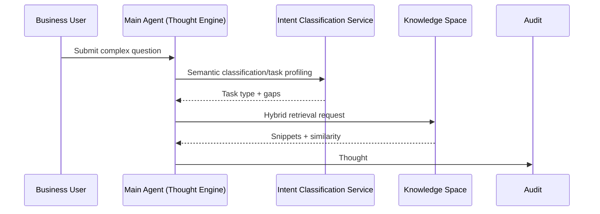

# Executive Summary

This sub-scenario ensures that the main Agent can generate the first Thought within 1.5 seconds after receiving a complex problem, select the optimal knowledge retrieval strategy, and provide replayable context. The focus is on the "intent understanding → gap identification → retrieval strategy mixing → snippet trimming" closed loop, avoiding thought chain breakpoints or low-confidence snippet pollution of subsequent actions. Success signals: Thought #1 includes hypotheses and missing information, first-round retrieval hit rate ≥80%, retrieval time <2 seconds, snippets carry citation IDs and similarity scores.

# Scope & Guardrails

- **In Scope**: Intent classification, task type recognition, Thought/Plan template selection, gap detection, retrieval strategy routing (vector/keyword/graph/Hybrid), snippet trimming and redaction, audit logging.
- **Out of Scope**: Plugin calls, risk approval, knowledge base construction or index refresh processes, model routing (handled by model access scenarios).
- **Environment & Flags**: `react-thought-engine`, `knowledge-hub-mix-search`, `react-trace-persist`; depends on LLM Gateway, Knowledge Store, Audit Service.

# Participants & Responsibilities

| Scope | Repository | Layer | Responsibilities & Deliverables | Owners |
|-------|------------|-------|--------------------------------|--------|
| intent-classifier | powerx | service | Intent/task type models, Thought template rendering, gap detection | Agent Platform Guild |
| knowledge-router | powerx | integration | Retrieval strategy routing, snippet scoring, confidence evaluation, audit writing | Knowledge Intelligence Team |
| audit-hooks | powerx | service | Thought chain persistence, citation ID generation, Trace binding | Ops Reliability Center |

# End-to-End Flow

1. **Stage 1 – Intent Intake & Session Seeding**: Generate session ID, Trace ID, run intent classification model to determine task type, semantic slots, and render Thought templates.
2. **Stage 2 – Gap Analysis & Strategy Planning**: Identify missing fields based on task type and tenant strategies, select retrieval modes (vector/keyword/graph/hybrid), with strategy reasons attached.
3. **Stage 3 – Retrieval Execution & Scoring**: Concurrently request knowledge space, integrate snippets, similarity, source metadata, label low-confidence snippets, and write summaries to Thought.
4. **Stage 4 – Logging & Handoff**: Write Thought/snippet citations to audit and metrics, pass enriched context to action sub-scenarios; if confidence below threshold, trigger user clarification or fallback.

# Architecture Diagram

# Key Interactions & Contracts

- **APIs / Events**
  - `POST /internal/react/thought`: Body contains `question`, `tenant_id`, `context`, `risk_profile`, returns Thought ID, gap list.
  - `POST /internal/knowledge/search`: Parameters `mode`, `filters`, `max_context_tokens`, returns `snippets[]`, `score`, `source_ref`.
  - `EVENT react.thought.logged`: Includes Trace ID, strategy, confidence, snippet IDs, for Observability subscription.
- **Configs / Schemas**
  - `config/react/thought_templates.yaml` (defines thought chain templates by task type).
  - `config/knowledge/routing.yaml` (strategy selection and thresholds).
  - `schemas/audit/react_thought.json`.
- **Security / Compliance**
  - Thought logs need to redact user text, only keep citation IDs.
  - Retrieval requests include tenant/data domain labels to prevent privilege escalation.

# Usecase Links

- `UC-AGENT-REACT-THOUGHT-001` — Thought Engine and Knowledge Retrieval Hybrid Strategy (service layer, `docs/usecases-seeds/SCN-AGENT-REACT-ORCH-001/UC-AGENT-REACT-THOUGHT-001.md`).

# Acceptance Criteria

1. Thought #1 generated within 1.5 seconds, includes task type, hypotheses, gaps, and next plan.
2. First-round retrieval hit rate ≥80%, snippets with similarity <0.6 must be labeled and trigger clarification/degradation.
3. Retrieval time <2 seconds (p95), if exceeded automatically degrade to cache/summary strategy and record alerts.
4. Each Thought/snippet written to audit with `trace_id`, `source_ref`, `score` attached.

# Telemetry & Ops

- **Metrics**: `react.thought.latency_ms`, `react.knowledge.hit_rate`, `react.knowledge.low_confidence_total`, `react.gap.prompt_rate`.
- **Logs/Audit**: `audit.react_thought` records template version, strategy, snippet IDs, gap descriptions; INFO logs keep trimmed context summaries.
- **Alerts**: Thought generation failure rate >1%, retrieval timeout rate >5%, low-confidence ratio >30%; notify Teams #agent-react and PagerDuty.
- **Tools**: `scripts/qa/react-thought-lab.mjs --tenant tenant-react-lab`, `node scripts/qa/workflow-metrics.mjs --metric react.thought.latency_ms`.

# Open Issues & Follow-ups

| Risk/Issue | Impact Scope | Owner | ETA |
|------------|--------------|-------|-----|
| Intent classification model insufficient industry/multilingual samples | Thought template accuracy degradation | Agent Platform Guild | 2025-03-08 |
| Graph retrieval interface lacks confidence explanation fields | Snippet explainability and audit description | Knowledge Intelligence Team | 2025-03-12 |

# Appendix

- `docs/meta/scenarios/powerx/agent-and-automation/agent-orchestration/react-agent-orchestration/primary.md`
- `docs/_data/docmap.yaml` (child_scenarios configuration)
