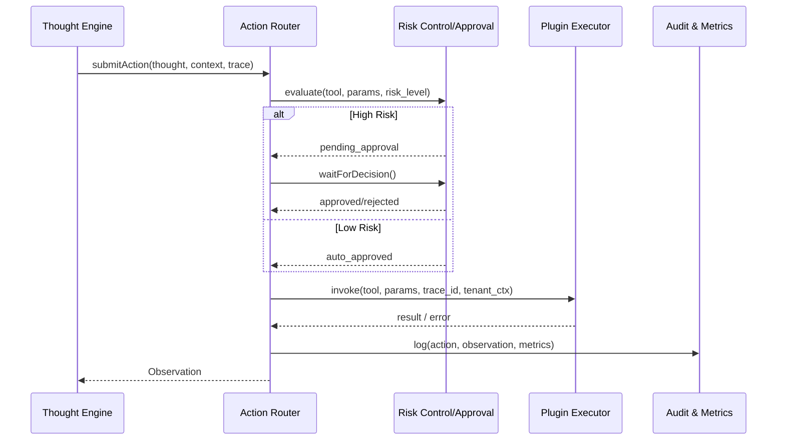

# Usecase Overview

- **Business Goal**: Transform Thought plans into executable Actions within 800ms, select the most suitable plugin/tool, complete permission verification, risk approval, and execution, ensuring action success rate ≥95%.
- **Success Metrics**: `react.action.success_rate` ≥95%; average approval time <2 minutes; 100% approval coverage for sensitive operations; `react.action.latency_ms_p95` < 3000ms; trace loss rate 0.
- **Scenario Association**: Provides execution capability for main scenario `SCN-AGENT-REACT-ORCH-001`; its Observation output is consumed by `UC-AGENT-REACT-MEMORY-001` and `UC-AGENT-REACT-AUDIT-001`.

> **Summary**: This use case focuses on the "Action templates → risk & approval → plugin invocation → Observation feedback" chain, ensuring every tool call is trackable, degradable, and auditable.

# Context & Assumptions

- **Prerequisites**
  - Feature Flags `react-action-router`, `agent-action-approval`, `plugin-risk-guard`, `react-actor-telemetry` are enabled.
  - Plugin catalog provides latest versions, permissions, risk labels; IAM, Workflow, Notification services are available.
  - Stage definitions in `docs/scenarios/agent-orchestration/SCN-AGENT-REACT-ACTION-001.md` are confirmed.
- **Input/Output**
  - Input: `thought_id`, `action_template`, `tool_candidates[]`, `tenant_ctx`, `user_ctx`, `risk_level`, `trace_id`, `context`.
  - Output: `action_id`, `tool`, `params`, `approval_state`, `status`, `observation`, `metrics`, `failure_reason?`, `fallback?`.
- **Boundaries**
  - Does not implement plugin business logic internally, only responsible for invocation and governance.
  - Does not handle long-term memory or knowledge writing (handled by Memory use case).
  - Does not output final answers or playback reports (handled by Audit use case).

# Solution Blueprint

## System Decomposition

| Layer | Main Components/Modules | Responsibilities | Code Entry Point |
|-------|-------------------------|------------------|------------------|
| integration | `services/react/action-router.ts` | Action template rendering, parameter synthesis, tool matching, trace management | `services/react/action-router.ts` |
| service | `services/security/action_risk_guard.ts` | Risk classification, approval/manual collaboration triggering, failure thresholds | `services/security/action_risk_guard.ts` |
| integration | `services/plugins/catalog_client.ts` | Query plugin capabilities, permissions, rate limits, tenant authorization | `services/plugins/catalog_client.ts` |
| ops | `workflow/agent_action_guard.yaml` | Approval state machine, notifications, escalation strategies | `workflow/agent_action_guard.yaml` |
| service | `services/observability/react_action_metrics.ts` | Metrics and audit writing, Grafana dashboards, alert hooks | `services/observability/react_action_metrics.ts` |

## Process & Sequence

1. **Step 1 – Draft Action**: Receive Thought draft, select template, fill parameters, set tracking/retry/timeout strategies.
2. **Step 2 – Capability & Policy Check**: Verify tool version, tenant authorization, rate limits, sensitive labels; if not met, switch alternatives or request additional information.
3. **Step 3 – Risk & Approval**: Call `agent_action_guard`: low-risk auto-approved, high-risk enters manual or multi-level approval; approval results written to state machine and notified.
4. **Step 4 – Execution & Observation Capture**: Call plugin executor, collect responses, metrics, errors, echo; on failure, retry/degrade/manual collaborate according to policy.
5. **Step 5 – Logging & Handoff**: Write action state, Observation, risk results to Audit/Telemetry, and hand back to Memory/Audit processes.

# Contracts & Interfaces

- **Inbound APIs / Events**
  - `POST /internal/react/action` — Body: `thought_id`, `tool_candidates`, `params`, `risk_level`, `tenant_ctx`, `trace_id`; returns `action_id`, `approval_state`, `status`, `retries`.
  - `EVENT react.action.state.changed` — For UI/monitoring consumption, includes `action_id`, `state`, `tool`, `trace_id`, `reason`.
- **Outbound Calls**
  - `POST /internal/plugins/{tool}/invoke` — Plugin executor; 3s timeout, exponential backoff retry 2 times on failure.
  - `POST /internal/workflow/agent_action_guard` — Create or update approvals; support rollback/escalation, SLA upgrade.
  - `POST /internal/iam/policies/validate` — Verify permissions/rate policies.
- **Configs & Scripts**
  - `config/react/action_templates.yaml`, `config/risk/agent_action_policies.yaml`, `config/plugins/catalog.yaml`.
  - `scripts/ops/react-action-drill.mjs`, `scripts/qa/plugin-risk-sim.mjs`.

# Implementation Checklist

| Item | Description | Completion Status | Owner |
|------|-------------|-------------------|-------|
| Action Templates & Risk Annotation | Design templates, variable mapping, risk levels | [ ] | Agent Platform Guild |
| Plugin Catalog Sync | Provide capabilities, permissions, rates, risk label APIs | [ ] | Plugin Guild |
| Risk Control/Approval Orchestration | Implement sensitive operation approval, manual collaboration, degradation paths | [ ] | Ops Reliability Center |
| Telemetry & Audit | `react.action.*` metrics, audit schema, dashboards | [ ] | Ops Reliability Center |
| CLI & Runbooks | `react-action-drill.mjs`, approval/degradation runbooks | [ ] | Agent Platform Guild |

# Testing Strategy

- **Unit**: Template rendering, parameter validation, tool matching, trace ID binding, approval state machine, degradation matrix.
- **Integration**: Mock IAM/Workflow/Plugin Runner, covering success, pending approval, rejection, failure/retry, degradation paths.
- **End-to-end**: Use `scripts/ops/react-action-drill.mjs --tool crm-query --risk medium` to execute in `tenant-react-lab`, verify trace, approval, observation, metrics.
- **Non-functional**: 100 RPS load test on Action Router; Chaos (Workflow delay, IAM timeout, plugin 500); verify automatic degradation and manual collaboration triggering.

# Observability & Ops

- **Metrics**: `react.action.latency_ms`, `react.action.success_rate`, `react.action.retry_total`, `react.action.approval_pending_total`, `react.action.risk_block_total`, `react.action.trace_missing_total`.
- **Logs**: `audit.react_action` records `action_id`, `trace_id`, `tool`, `params_hash`, `risk_level`, `approval_state`, `retries`, `result`; ERROR logs include failure reasons and degradation actions.
- **Alerts**: Success rate <95%, approval queue >2 minutes, sensitive operations not approved, trace loss, continuous failures ≥3, degradation rate >10%; notify PagerDuty + Teams #agent-react-action.
- **Dashboards**: Grafana "ReAct Action", Datadog `react.action.*`, Workflow SLA panels.

# Rollback & Failure Handling

- **Rollback Steps**: Use Feature Flags to disable new templates/strategies; rollback Action Router/Guard services; restore old configurations.
- **Remediation**: Auto-degrade to alternative tools, switch to manual mode, pause faulty plugins and notify vendor; automatically escalate to on-call when approval blocks.
- **Data Repair**: `scripts/ops/react-action-replay.mjs --action <id>` replay audit; unbind incorrect permissions or risk labels in catalog.

# Follow-ups & Risks

| Risk/Issue | Impact | Mitigation | Owner | ETA |
|------------|--------|------------|-------|-----|
| Plugin risk label lag | Sensitive operations bypassed or falsely blocked | Establish real-time sync with Marketplace risk control, validation scripts | Plugin Guild | 2025-03-04 |
| Approval lacks batch/revoke | Low efficiency in high-concurrency approval, difficult rollback | Extend Workflow API to support batch/revoke, introduce SLA escalation | Ops Reliability Center | 2025-03-10 |
| Trace loss causes unauditability | Compliance risk | Enforce trace verification, break loop on failure and prompt for manual intervention | Agent Platform Guild | 2025-03-08 |

# References & Links

- Scenario Document: `docs/scenarios/agent-orchestration/SCN-AGENT-REACT-ACTION-001.md`
- Main Scenario: `docs/scenarios/agent-orchestration/SCN-AGENT-REACT-ORCH-001.md`
- Standard: `docs/standards/powerx/backend/integration/09_agent/Agent_Manager_and_Lifecycle_Spec.md`
- Runbook: `runbooks/agent/react_action_escalation.md`
- QA: `scripts/ops/react-action-drill.mjs`
