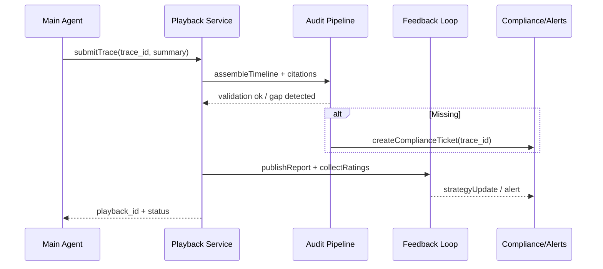

# Usecase Overview

- **Business Goal**: Within 30 seconds after ReAct session ends, generate playable timelines, citations, and approval records, deliver final answers and metrics, and automatically trigger compliance tickets/strategy updates when logs are missing or violations occur.
- **Success Metrics**: Playback generation success rate 100%; `react.playback.latency_ms_p95` < 5000; missing detection false positive <1%; feedback processing latency <10 minutes; audit query P95 < 2 seconds.
- **Scenario Association**: Consumes Thought/Action/Observation traces, provides closed-loop metrics to `SCN-AGENT-REACT-ORCH-001`, supporting compliance/operational audit processes.

> **Summary**: This use case defines the "summary → playback → audit → feedback → strategy update" closed loop for ReAct sessions, ensuring deliverable results are traceable, annotatable, and governable.

# Context & Assumptions

- **Prerequisites**
  - Feature Flags `react-audit-timeline`, `react-feedback-loop`, `audit-gap-detector` enabled.
  - Audit Service, Report Writer, Workflow/Compliance platforms available.
  - Thought/Action/Memory use cases all write Trace/Observation/citations, ensuring complete traces.
- **Input/Output**
  - Input: `trace_id`, `conversation_id`, `thoughts[]`, `actions[]`, `observations[]`, `approvals[]`, `memory_refs[]`, `user_feedback?`.
  - Output: `playback_id`, `timeline`, `citations`, `audit_report`, `feedback_summary`, `strategy_updates`, `alerts?`.
- **Boundaries**
  - Not responsible for real-time execution or loop governance; only handles closed loop and audit.
  - Does not generate cost billing or performance reports (handled by other use cases).

# Solution Blueprint

## System Decomposition

| Layer | Main Components/Modules | Responsibilities | Code Entry Point |
|-------|-------------------------|------------------|------------------|
| ops | `services/observability/react_playback.ts` | Aggregate Thought/Action/Observation/approvals, generate timeline and citations | `services/observability/react_playback.ts` |
| ops | `services/audit/react_report_writer.ts` | Generate audit reports, missing detection, compliance tickets | `services/audit/react_report_writer.ts` |
| service | `services/feedback/react_feedback_handler.ts` | Collect user/audit feedback, strategy weight updates, threshold tuning | `services/feedback/react_feedback_handler.ts` |
| ops | `scripts/qa/react-playback-check.mjs` | Automatically verify playback integrity, citation matching | `scripts/qa/react-playback-check.mjs` |
| ops | `config/audit/react_playback_layout.yaml` | Playback display, sensitive field redaction, export formats | `config/audit/react_playback_layout.yaml` |

## Process & Sequence

1. **Stage 1 – Closure Summary**: Reasoner ends session, generates final answers, conclusions, citations, and confidence.
2. **Stage 2 – Timeline Assembly**: Playback service fetches full traces, merges Thought/Action/Observation, approvals, memory references, verifies trace completeness.
3. **Stage 3 – Audit & Gap Detection**: Run missing detection (logs/citations/approvals/memory), on failure trigger `audit-gap-detector`, can automatically generate compliance tickets.
4. **Stage 4 – Feedback & Strategy Update**: Collect user ratings, audit annotations, strategy suggestions; update strategy weights/thresholds based on feedback and record versions.
5. **Stage 5 – Distribution & Reporting**: Output playback links, PDF/JSON reports, metric summaries; sync results to dashboards, notification channels, knowledge base.

# Contracts & Interfaces

- **Inbound APIs / Events**
  - `POST /internal/react/playback` — Input `trace_id` or `conversation_id`, return `playback_id`, `timeline`, `citations`, `metrics`.
  - `GET /internal/react/playback/{id}` — Query/export playback; support filtering, pagination, redaction modes.
  - `POST /internal/react/feedback` — Body: `playback_id`, `type=user|audit`, `rating`, `tags[]`, `comment`, `attachments[]`.
- **Outbound Calls**
  - `POST /internal/compliance/tickets` — Create tickets on missing or violations.
  - `POST /internal/strategy/react_update` — Update strategy weights, thresholds, and version numbers.
  - `EVENT react.audit.gap_detected` / `react.feedback.recorded` — For monitoring and automation consumption.
- **Configs & Scripts**
  - `config/audit/react_playback_layout.yaml`, `config/audit/reports/react_audit.yaml`, `config/feedback/react_strategy.yaml`.
  - `scripts/qa/react-playback-check.mjs`, `scripts/qa/react-feedback-digest.mjs`.

# Implementation Checklist

| Item | Description | Completion Status | Owner |
|------|-------------|-------------------|-------|
| Playback Aggregator | Trace assembly, citation association, redaction, export formats | [ ] | Agent Platform Guild |
| Audit Gap Detector | Missing detection rules, ticket integration, alerts | [ ] | Ops Reliability Center |
| Feedback Loop | User/audit ratings, tags, strategy update pipeline | [ ] | Agent Platform Guild |
| Reporting | PDF/JSON reports, metric summaries, API/CLI | [ ] | Ops Reliability Center |
| Dashboards & Alerts | Grafana/Datadog panels, PagerDuty alerts | [ ] | Ops Reliability Center |

# Testing Strategy

- **Unit**: Timeline rearrangement, citation verification, missing detection, feedback aggregation, strategy update idempotency.
- **Integration**: Mock Thought/Action/Observation input, verify Playback, Audit, Feedback, Compliance ticket interop; simulate missing logs, citation mismatch, missing approvals.
- **End-to-end**: Run `scripts/qa/react-playback-check.mjs --trace <id>`, verify generated timelines, reports, alerts; drill "successful playback / missing / violation" paths in sandbox tenant.
- **Non-functional**: Concurrent 50 playback requests, 100MB report generation, power failure/restart recovery; Chaos (Audit DB delay, object storage exceptions).

# Observability & Ops

- **Metrics**: `react.playback.latency_ms`, `react.playback.gap_total`, `react.audit.feedback_total`, `react.audit.approval_rate`, `react.strategy.update_total`.
- **Logs**: `audit.react_playback` (trace_id, playback_id, size, citations, gap_flag), `audit.react_feedback` (rating, reviewer, strategy_effect), `audit.react_strategy_update`.
- **Alerts**: Playback failure, missing logs, audit access anomalies, feedback processing timeout, strategy update failure; notify Ops on-call, Teams #agent-audit, compliance email.
- **Dashboards**: Grafana "ReAct Playback" "ReAct Feedback", Datadog `react.playback.*`, `react.audit.*`, Compliance SLA reports.

# Rollback & Failure Handling

- **Rollback Steps**: Disable `react-audit-timeline`, rollback Playback/Feedback services; restore old layouts and strategy configurations.
- **Remediation**: Playback failure → replay trace or switch to historical version; missing → trigger replay scripts and pause deployment; feedback delay → manual takeover; strategy update exception → rollback version and record audit.
- **Data Repair**: `scripts/ops/react-playback-rebuild.mjs --trace <id>` rebuild timeline; `audit-tools fill-gap --playback <id>` fill citations; `feedback-admin revert --version <n>` rollback strategy.

# Follow-ups & Risks

| Risk/Issue | Impact | Mitigation | Owner | ETA |
|------------|--------|------------|-------|-----|
| Uncontrolled playback storage growth | Cost, query delay, compliance risk | Design cold/hot tiering, compression strategy, retention policy | Ops Reliability Center | 2025-03-07 |
| Audit annotation interface lacks batch functionality | Low audit efficiency, easy to miss audits | Add batch annotation, hotkeys, templates to UI | Agent Platform Guild | 2025-03-11 |
| Feedback and strategy update disconnect | Strategy optimization lag | Build automated Feedback → Strategy pipeline with version audit | Agent Platform Guild | 2025-03-15 |

# References & Links

- Scenario: `docs/scenarios/agent-orchestration/SCN-AGENT-REACT-AUDIT-001.md`
- Main Scenario: `docs/scenarios/agent-orchestration/SCN-AGENT-REACT-ORCH-001.md`
- Standard: `docs/standards/powerx/backend/integration/09_agent/Agent_Manager_and_Lifecycle_Spec.md`
- QA: `scripts/qa/react-playback-check.mjs`, `scripts/qa/react-feedback-digest.mjs`
- Docmap: `docs/_data/docmap.yaml`
