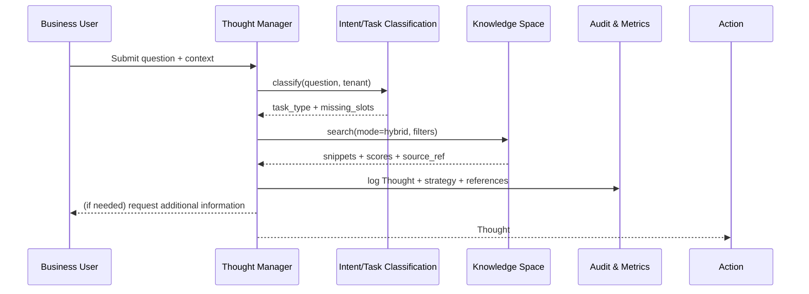

# Usecase Overview

- **Business Goal**: Generate the first Thought within 1.5 seconds after user submits a complex problem, identify missing information, automatically select vector/keyword/graph retrieval strategies, and write high-confidence snippets to context and audit.
- **Success Metrics**: `react.thought.latency_ms_p95` < 1500ms; first-round retrieval hit rate ≥80%; low-confidence (<0.6) prompt rate ≤20%; audit write success rate 100%.
- **Scenario Association**: Supports `SCN-AGENT-REACT-ORCH-001` main loop, provides context to Action/Memory sub-scenarios, and feeds back strategy results to knowledge/reasoning主线.

> **Summary**: This use case defines the "intent understanding → gap identification → hybrid retrieval → citation labeling" capability at the ReAct thought chain entry, ensuring reasoning chains are explainable, trackable, and governable.

# Context & Assumptions

- **Prerequisites**
  - Feature Flags `react-thought-engine`, `knowledge-hub-mix-search`, `react-trace-persist` are enabled.
  - LLM Gateway, Knowledge Hub (vector/keyword/graph indexes), Audit Service are online.
  - Tenant policies and data domain labels synchronized to Thought Engine, accessible in requests.
  - `docs/scenarios/agent-orchestration/SCN-AGENT-REACT-THOUGHT-001.md` has defined flows, metrics, and risk control.
- **Input/Output**
  - Input: `question`, `tenant_id`, `risk_profile`, `conversation_context`, optional `follow_up_hint`.
  - Output: `thought_id`, `task_type`, `hypothesis`, `missing_slots`, `retrieval_plan`, `snippets[]` (with score, source_ref, safety_tag), audit trace.
- **Boundaries**
  - Not responsible for plugin calls, parameter assembly, or action approval (covered by Action use case).
  - Does not handle knowledge base construction, index updates (handled by knowledge space scenarios).
  - Does not directly write long-term memory, only labels high-value snippets for Memory use case consumption.

# Solution Blueprint

## System Decomposition

| Layer | Main Components/Modules | Responsibilities | Code Entry Point |
|-------|-------------------------|------------------|------------------|
| service | `services/react/thought-manager.ts` | Session ID/trace generation, intent classification, Thought template rendering, gap detection | `services/react/thought-manager.ts` |
| service | `services/knowledge/search.ts` | Route vector, keyword, graph, or hybrid retrieval by task/data domain and aggregate scores | `services/knowledge/search.ts` |
| service | `services/observability/react_audit.ts` | Record Thought/snippet citations, strategy reasons, low-confidence alerts | `services/observability/react_audit.ts` |
| integration | `config/react/thought_templates.yaml` | Define task types and templates, slots, metric thresholds | `config/react/thought_templates.yaml` |
| ops | `workflow-metrics.mjs` | Collect `react.thought.*` metrics and write to reports | `scripts/qa/workflow-metrics.mjs` |

## Process & Sequence

1. **Step 1 – Session Seeding**: Main Agent receives question, generates `conversation_id` + `trace_id`, calls intent classification model to get task type, risk labels, gap descriptions.
2. **Step 2 – Strategy Planning**: Thought Manager combines task type, tenant strategies, historical success rates, selects single or combined retrieval modes from `config/knowledge/routing.yaml` and writes plan.
3. **Step 3 – Retrieval Execution**: Concurrently request vector, keyword, graph services, aggregate snippets and re-rank by `score + policy_weight`, label low-confidence snippets with `needs_clarification`.
4. **Step 4 – Logging & Handoff**: Write Thought, snippet citations, strategy reasons to Audit; send enriched context to Action use case; if confidence insufficient, prompt user to supplement information or switch strategies.

# Contracts & Interfaces

- **Inbound APIs / Events**
  - `POST /internal/react/thought` — Body: `question`, `tenant_id`, `context`, `trace_id?`, `risk_profile?`; Headers: `x-tenant`, `x-trace`; returns `thought_id`, `task_type`, `retrieval_plan`, `missing_slots`, `snippets`.
- **Outbound Calls**
  - `POST /internal/intent/classify` — Pass question, tenant, historical context, return task type, confidence, gap list.
  - `POST /internal/knowledge/search` — Parameters `mode`, `filters`, `max_tokens`; return snippets and similarity; 2s timeout, 1 retry.
  - `POST /internal/audit/react_thought` — Write Thought, strategy, citations, and low-confidence metrics.
- **Configs & Scripts**
  - `config/react/thought_templates.yaml` — Template/slot definitions.
  - `config/knowledge/routing.yaml` — Retrieval strategies, thresholds, fallback.
  - `scripts/qa/react-thought-lab.mjs` — Sandboxing & regression.

# Implementation Checklist

| Item | Description | Completion Status | Owner |
|------|-------------|-------------------|-------|
| Thought Template Governance | Design task types, slots, gap descriptions, localized copy | [ ] | Agent Platform Guild |
| Intent Classification Upgrade | Expand industry/multilingual samples, produce v2 model | [ ] | Agent Platform Guild |
| Retrieval Strategy Orchestration | Support hybrid retrieval, weight configuration, fallback, low-confidence hooks | [ ] | Knowledge Intelligence Team |
| Audit/Metrics Extension | `audit.react_thought` schema, `react.thought.*` metrics, Grafana panels | [ ] | Ops Reliability Center |
| SDK/CLI | `scripts/qa/react-thought-lab.mjs` for regression and performance testing | [ ] | Agent Platform Guild |

# Testing Strategy

- **Unit Tests**: Thought template rendering, gap detection, strategy selection, snippet ranking, low-confidence labeling.
- **Integration Tests**: Connect to Intent Service, Knowledge Search, Audit; simulate 200/400/500 responses and timeouts, confirm retry + degradation strategies.
- **End-to-end**: Run `scripts/qa/react-thought-lab.mjs --tenant tenant-react-lab --question "<>"`, verify Thought/snippet/metric writing.
- **Non-functional**: Stress test `POST /internal/react/thought` (100 RPS), Chaos (Intent Service down, vector retrieval timeout), and automatic degradation.

# Observability & Ops

- **Metrics**: `react.thought.latency_ms`, `react.knowledge.hit_rate`, `react.knowledge.low_confidence_total`, `react.gap.prompt_rate`, `react.thought.audit_failure_total`.
- **Logs**: `audit.react_thought` records `thought_id`, `trace_id`, `task_type`, `strategy`, `missing_slots`, `snippets[#]`, `scores`; INFO logs output trimmed context and time.
- **Alerts**: Latency >1.5s (p95), hit rate <70%, low-confidence ratio >30%, audit write failure, tracer loss; notify PagerDuty + Teams #agent-react.
- **Dashboards**: Grafana "ReAct Thought", including latency, strategy success rate, failure reason distribution; Datadog `react.thought.*`; `reports/usecases/usecases_SCN-AGENT-REACT-ORCH-001.json`.

# Rollback & Failure Handling

- **Rollback Steps**: Version rollback Thought Manager (blue-green), restore template/strategy configurations, recover old model.
- **Remediation**: On retrieval failure, degrade to cached summary or request user clarification; on intent classification anomalies, switch to rule templates; on audit failure, use local buffering and timed replay.
- **Data Repair**: Use `scripts/ops/react-thought-replay.mjs --trace <id>` to re-write missing audit; mark replay events in Audit DB if necessary.

# Follow-ups & Risks

| Risk/Issue | Impact | Mitigation | Owner | ETA |
|------------|--------|------------|-------|-----|
| Insufficient industry samples in intent model | Thought template hit rate degradation, need manual clarification | Expand training set, deploy online learning/feedback loop | Agent Platform Guild | 2025-03-10 |
| Graph retrieval lacks confidence explanation | Difficult audit and debugging | Return `explanations[]` field in Graph API | Knowledge Intelligence Team | 2025-03-12 |
| Surging audit log volume | Rising storage and query costs | Introduce data tiering, TTL, sampling strategies | Ops Reliability Center | 2025-03-20 |

# References & Links

- Scenario Document: `docs/scenarios/agent-orchestration/SCN-AGENT-REACT-THOUGHT-001.md`
- Main Scenario: `docs/scenarios/agent-orchestration/SCN-AGENT-REACT-ORCH-001.md`
- Standard: `docs/standards/powerx/backend/integration/09_agent/Agent_Manager_and_Lifecycle_Spec.md`
- QA: `scripts/qa/react-thought-lab.mjs`
- Docmap: `docs/_data/docmap.yaml`
