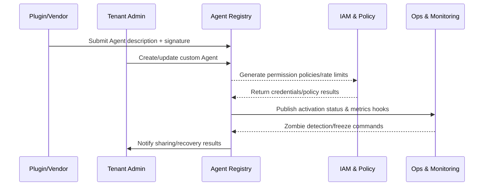

# Executive Summary

PowerX plugin ecosystem, tenant administrators, and platform operations need a unified Agent registration and asset governance system to ensure trusted sources, controlled permissions, observable operations, and recoverable at any time. This scenario covers the full lifecycle of "plugin/tenant submission → review & policy binding → activation & monitoring → cross-tenant sharing/recovery", with goals of completing automatic registration within 5 seconds, completing custom Agent approval within 2 business days, achieving 100% monitoring coverage, and recycling zombie Agents within 30 minutes, ensuring the platform has transparent Agent ledger and risk control capabilities.

# Positioning & Goals

- Establish Agent Registry as a unified entry point for plugins, tenants, and operations, where all Agents must hold the same set of metadata, permissions, and audit fields.
- Enable plugin vendors and tenant teams to self-service create/modify Agents, while embedding security approval, rate limiting, and tenant policy validation to reduce misconfiguration and privilege escalation.
- Provide operations with runtime metrics, alerts, zombie detection, and one-click recovery tools to eliminate "long-tail ownerless Agents".
- Provide cross-tenant sharing and catalog capabilities, ensuring context isolation, independent quotas, and timely revocation during sharing.

# Core Capabilities

| Capability Domain | Description | Key Systems/Materials |
|-------------------|-------------|-----------------------|
| Registry & Metadata Governance | Unified Agent description, version, plugin mapping, signature/approval status, written to audit ledger | `services/agent-registry`, Agent Metadata DB, Audit Log |
| Tenant Self-Service & Approval | Console forms, permission/rate policy binding, approval orchestration, API Key/Webhook generation | `console/agent-center`, IAM Policy Service, Workflow Engine |
| Lifecycle Monitoring & Recovery | Metrics collection, zombie detection, anomaly alerts, freeze/recovery execution & Runbook | Telemetry Pipeline, `scripts/ops/agent-lifecycle.mjs`, Ops Console |
| Multi-tenant Catalog & Sharing | Agent tags/catalog, sharing whitelist, quota replication, revocation notification | `services/agent-catalog`, Tenant Label Service, Notification Center |

# Scope & Guardrails

- **In Scope**: Plugin automatic registration, tenant custom Agent approval, runtime monitoring/zombie governance, cross-tenant sharing/revocation, audit and metrics.
- **Out of Scope**: Model training/inference, Agent task execution details, Marketplace billing strategies, external third-party platform registration flows.
- **Environment & Flags**: `agent-registry-v1`, `tenant-agent-center`, `agent-lifecycle-ops`, `agent-sharing-directory`; depends on IAM, Secret Manager, Telemetry, Workflow, Notification services.

# Participants & Responsibilities

| Scope | Repository | Layer | Responsibilities & Deliverables | Owners |
|-------|------------|-------|--------------------------------|--------|
| registry-core | powerx | service | Registry API, metadata Schema, signature verification, audit/reporting | Agent Platform Guild |
| tenant-console | powerx | service | Custom Agent forms, permission policy binding, approval orchestration, key issuance | Agent Platform Guild |
| lifecycle-ops | powerx | ops | Metrics collection, zombie detection policies, freeze/recovery Runbook, alert handling | Ops Reliability Center |
| plugin-vendors | powerx-plugin | integration | Plugin Agent descriptions, version compatibility declarations, sharing policies, sandbox verification scripts | Plugin Guild |

# End-to-End Flow

1. **Stage 1 – Manifest Intake & Cataloging**: Plugins or tenants submit Agent description files, Registry verifies signature/fields and generates Agent ID, associates with plugin and tenant labels.
2. **Stage 2 – Policy Binding & Approval**: Generate permission configuration combining tenant policies, data domains, and rate limits; if tenant-built Agent, enter approval flow or automatic risk control validation.
3. **Stage 3 – Activation & Observability**: After approval, generate runtime credentials, Webhook/scheduling policies, and run sandbox verification; monitoring surface collects call volume, latency, error rates.
4. **Stage 4 – Lifecycle Governance & Sharing**: Trigger zombie detection, freeze/recovery based on usage; if cross-tenant sharing needed, set sharing whitelist, replicate quotas, and support one-click revocation.

# Key Interactions & Contracts

- **APIs / Events**: `POST /internal/agent/registry`, `POST /internal/agent/custom`, `POST /internal/agent/{id}/approve`, `POST /internal/agent/catalog/share`, `EVENT agent.registry.state.changed`, `EVENT agent.lifecycle.alert`.
- **Configs / Schemas**: `docs/standards/powerx/backend/integration/09_agent/Agent_Manager_and_Lifecycle_Spec.md`, `config/agent/registry/schema.yaml`, `config/agent/sharing/policies.yaml`.
- **Security / Compliance**: Plugin signature verification, tenant isolation, approval audit trails, credential encryption, operation audit, sharing whitelist and revocation notifications.

# Usecase Links

- `UC-AGENT-REG-AUTO-001` — Plugin-built-in Agent automatic registration (integration layer, `docs/use_cases/_from_hub/SCN-AGENT-REG-MGMT-001/UC-AGENT-REG-AUTO-001.md`).
- `UC-AGENT-REG-TENANT-001` — Tenant custom Agent creation & approval (service layer, `docs/use_cases/_from_hub/SCN-AGENT-REG-MGMT-001/UC-AGENT-REG-TENANT-001.md`).
- `UC-AGENT-REG-LIFECYCLE-001` — Agent runtime monitoring & zombie governance (ops layer, `docs/use_cases/_from_hub/SCN-AGENT-REG-MGMT-001/UC-AGENT-REG-LIFECYCLE-001.md`).
- `UC-AGENT-REG-SHARE-001` — Multi-tenant Agent catalog & sharing policies (integration layer, `docs/use_cases/_from_hub/SCN-AGENT-REG-MGMT-001/UC-AGENT-REG-SHARE-001.md`).

# Implementation Checklist

| Item | Description | Owner | Status |
|------|-------------|-------|--------|
| Registry API & Manifest Schema | `services/agent-registry` + `config/agent/registry/schema.yaml`: unified registration entry for plugins/tenants, signature/field verification, audit extensions | Agent Platform Guild | [ ] |
| Tenant Agent Center & Approval Flow | `services/tenant-agent-center` & `services/workflow/agent_approval_flow.ts`: forms, templates, multi-level approval, conflict hints, automated credential issuance | Agent Platform Guild / Ops Reliability Center | [ ] |
| Lifecycle Telemetry & Policy Engine | `services/telemetry/agent-lifecycle-pipeline.ts` + `services/agent/lifecycle/policy_engine.ts`: metrics collection, zombie/anomaly detection, Runbook triggering | Ops Reliability Center | [ ] |
| Catalog Sharing & Revoke | `services/agent/catalog/share_service.ts` + `services/iam/quota/share_provisioner.ts`: whitelist, quota replication, scripted revocation | Agent Platform Guild | [ ] |
| Audit / Notification / Reporting | `services/observability/audit_pipeline.ts`, notification center, `scripts/qa/workflow-metrics.mjs`: unified metrics, logs, reports, alert escalation | Ops Reliability Center | [ ] |

# Testing Strategy

1. **Schema & API Unit Tests**: Write Jest/Go unit tests for Registry, Tenant Console, Catalog interfaces with 90%+ core logic coverage (field validation, signature, conflict detection, whitelist).
2. **Integration Tests**: In staging environment, use sandbox plugins and tenants to run `POST /internal/agent/registry`, `/agent/custom`, `/agent/catalog/share`, observe interaction logs with IAM, Workflow, Telemetry.
3. **End-to-End Drills**: Run `npm run publish:scenarios -- --scn-id SCN-AGENT-REG-MGMT-001 --validate-only`, `npm run publish:usecases -- --scn-id ...`, and execute `scripts/ops/agent-sandbox-validate.mjs`, `scripts/ops/agent-lifecycle-drill.mjs`, `scripts/ops/agent-share-drill.mjs` to simulate main flows.
4. **Non-functional/Chaos**: Load test Registry API (100 RPS) verifying 95% latency; shutdown IAM/Telemetry/Notification services to verify degradation and rollback; execute zombie batch recovery and sharing revocation rollback drills.

# Acceptance Criteria

1. Plugin-built-in Agent automatic registration completes within 5 seconds, signature/field verification 100% written to audit and alerts.
2. Tenant custom Agent approval averages <2 business days, permission/rate policy distribution accuracy 100%.
3. Runtime monitoring coverage 100%, zombie Agents automatically frozen and notified to responsible parties within 30 minutes of detection.
4. Cross-tenant sharing/revocation operations generate independent quotas, credentials, and logs; credentials immediately invalid after revocation.

# Observability & Ops

- **Metrics**: `agent.registry.latency_p95`, `agent.registry.success_rate`, `agent.custom.approval_duration_hours`, `agent.custom.policy_conflict_total`, `agent.lifecycle.zombie_detected_total`, `agent.share.active_total`, `agent.share.revocation_time_seconds`.
- **Logs & Audit**: All Registry/Console/Catalog write operations must record Agent ID, tenant, version, policy/credential ID, initiator, approval ticket, sandbox results; sensitive fields masked before writing to Elastic/S3 + `Audit Service`.
- **Alerts**: Registration error rate >5%, approval queue >48h, sandbox failure rate >5%, zombie recovery timeout >30m, sharing revocation failure rate >1%, unmonitored Agents >0; channels cover PagerDuty (P1), Teams #agent-governance, Ops email.
- **Dashboards**: Grafana「Agent Registry」「Tenant Agent Center」「Agent Lifecycle」「Agent Catalog Sharing」 four sets of dashboards; Datadog `agent.*` namespace; `scripts/qa/workflow-metrics.mjs` generates daily reports.

# Rollback & Failure Handling

- Plugin registration/approval failure: Idempotently delete newly created Agent records, revoke IAM policies, clean up audit references written by this operation, return clear error codes.
- Sandbox or sharing verification failure: Automatically mark Agent status as `pending_fix` or `share_failed`, block orchestration platform usage, trigger notifications + tickets.
- Zombie recovery/revocation failure: Auto-retry three times, still failed create P1 ticket and lock Agent/tenant, rely on `scripts/ops/agent-registry-cleanup.mjs`, `agent-share-revoke.mjs` for forced cleanup.
- Core dependency outage (IAM, Telemetry, Notification): Enter degradation mode (cache + delayed publish), after recovery replay events via dead letter queue and backfill audit.

# Validation Workflow

1. Update `docs/_data/docmap.yaml` to register `SCN-AGENT-REG-MGMT-001` and sub-scenarios (including usecase seeds and paths).
2. Execute `npm run publish:scenarios -- --scn-id SCN-AGENT-REG-MGMT-001 --dry-run` to validate structure, Mermaid, and Frontmatter.
3. Run `npm run publish:usecases -- --scn-id SCN-AGENT-REG-MGMT-001 --validate-only`, ensure future usecase seeds align with docmap.
4. Use `node scripts/qa/workflow-metrics.mjs --scenario SCN-AGENT-REG-MGMT-001` to collect registration/approval/recovery pipeline metrics.

# Follow-ups & Risks

| Risk/Item | Impact | Mitigation | Owner | ETA |
|-----------|--------|------------|-------|-----|
| docmap/usecase metadata drift | Publish script failures, site broken links | Include `npm run publish:usecases -- --validate-only` in CI, auto-validate after changes | Agent Platform Guild | 2025-02-25 |
| Cross-tenant sharing whitelist inconsistent with IAM labels | Privilege escalation or sharing failure | Build `agent-catalog-whitelist-sync.mjs` for periodic sync, automatic diff alerts | Plugin Guild & IAM Team | 2025-03-05 |
| Tenant Policy templates not versioned | Approval conflicts, privilege escalation risk | Generate versioned policy files for each tenant, force diff validation before approval | IAM Platform Team | 2025-03-08 |
| Sandbox resource insufficiency causing registration/activation queuing | SLA violations | Scale container pool, introduce priority queue and "post-sandbox" approval strategy | Ops Reliability Center | 2025-03-01 |

# Appendix

- `docs/meta/scenarios/powerx/agent-and-automation/agent-orchestration/agent-registration-and-management/primary.md`
- `docs/meta/scenarios/powerx/list.md`
- `docs/standards/powerx/backend/integration/09_agent/Agent_Manager_and_Lifecycle_Spec.md`
