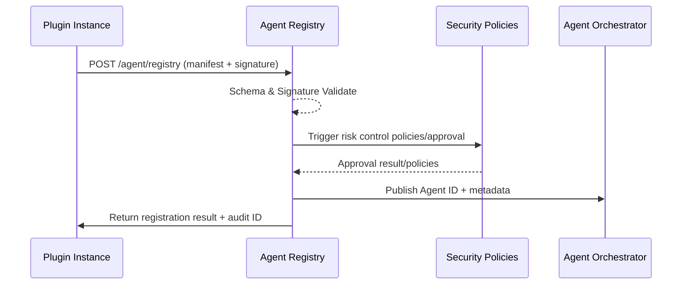

# Executive Summary

Plugins should carry Agent description files upon startup or upgrade and automatically complete registration through the Registry API. The platform needs to complete signature/field verification, generate Agent ID, write metadata and audit within 5 seconds, while triggering security reviews or directly authorizing sandbox runs based on policies. This sub-scenario ensures Vendor-delivered Agents are immediately纳入资产台账 and can be referenced by the main orchestration platform, avoiding zombie or duplicate instances.

# Scope & Guardrails

- **In Scope**: Agent description generation, Registry API, signature and compatibility verification, Agent ID generation, approval policies, sandbox verification, audit and metrics.
- **Out of Scope**: Plugin business logic, Agent task execution, Tenant custom configuration, Marketplace review.
- **Environment & Flags**: `agent-registry-v1`, `plugin-autoreg-webhook`, `vendor-sandbox`; depends on Secret Manager, Plugin Manifest Builder, Audit Service.

# Participants & Responsibilities

| Scope | Repository | Layer | Responsibilities & Deliverables | Owners |
|-------|------------|-------|--------------------------------|--------|
| registry-api | powerx | service | Registry API, signature & Schema verification, Agent ID allocation, audit logging | Agent Platform Guild |
| plugin-manifest | powerx-plugin | integration | Build Agent description, carry version/permissions, sandbox regression scripts | Plugin Guild |
| security-hooks | powerx | service | Plugin Allowlist, risk policies, auto-approval/review logic | Agent Platform Guild |

# End-to-End Flow

1. **Stage 1 – Manifest Build & Dispatch**: Plugins generate `agent.manifest.json` at compile time or startup, containing capabilities, interfaces, permissions, version, dependencies and signature, and call Registry API via startup hooks.
2. **Stage 2 – Validation & Correlation**: Registry verifies signature, Schema, and plugin version alignment, blocks missing fields or duplicate Agents, and correlates records to plugin version ledger and Vendor version history.
3. **Stage 3 – ID Issuance & Policy Hooks**: Generate Agent ID via snowflake or UUID, write to metadata repository and trigger IAM Policy Publisher to generate permission/rate policies.
4. **Stage 4 – Sandbox & Security Checks**: Automatically trigger sandbox verification, auto-review or manual review based on risk policies,沉淀沙箱报告与 Audit Trail.
5. **Stage 5 – Activation, Broadcast & Telemetry**: Synchronize Agent information to orchestration platform, Catalog, monitoring metrics, publish `agent.registry.state.changed` event, and return traceable audit ID to Vendor.

# Key Interactions & Contracts

- **APIs / Events**: `POST /internal/agent/registry`, `GET /internal/agent/{id}`, `POST /internal/agent/registry/{id}/validate`, `EVENT agent.registry.registered`, `EVENT agent.registry.failed`.
- **Configs / Schemas**: `config/agent/registry/schema.yaml`, `docs/standards/powerx/backend/integration/09_agent/Agent_Manager_and_Lifecycle_Spec.md`, `plugins/<name>/agent.manifest.json` template.
- **Security / Compliance**: Plugin signature and certificate verification, Manifest version compatibility strategy, same-name Agent conflict protection, audit trails and risk control events.

# Usecase Links

- `UC-AGENT-REG-AUTO-001` — Plugin automatic registration flow (integration layer, `docs/use_cases/_from_hub/SCN-AGENT-REG-MGMT-001/UC-AGENT-REG-AUTO-001.md`).

# Implementation Checklist

| Item | Description | Owner | Status |
|------|-------------|-------|--------|
| Manifest Schema & CLI | Maintain `config/agent/registry/schema.yaml` and lint/CLI tools, covering capabilities, permissions, dependencies, tenant labels | Plugin Guild | [ ] |
| Registry API Gateway | `services/agent/registry/http.ts`: authentication, rate limiting, callbacks, replay protection | Agent Platform Guild | [ ] |
| Signature & Security Hooks | `services/security/signature_verifier.ts`, Allowlist, risk policies, audit extensions | Agent Platform Guild | [ ] |
| IAM Policy Binding | `services/iam/policy/publisher.ts`: permission/rate policy generation, conflict rollback | Agent Platform Guild | [ ] |
| Sandbox & Telemetry | `scripts/ops/agent-sandbox-validate.mjs`, `services/observability/audit_pipeline.ts`: verification, metrics, events, alerts | Ops Reliability Center | [ ] |

# Acceptance Criteria

1. Manifest submission to successful registration averages <5 seconds, failures return debuggable error codes.
2. Description file signature and required field verification coverage is 100%, duplicate or missing fields must be blocked.
3. Within 1 second after successful registration, Agent can be queried in Agent ledger, orchestration platform and plugin version records.

# Testing Strategy

- **Unit**: Manifest Schema validator, signature verifier, duplicate blocking logic, IAM publisher idempotency all need 90%+ coverage.
- **Integration**: Use sandbox plugins to call `POST /internal/agent/registry` covering success/failure paths; simulate signature expiration, missing fields, IAM failure, sandbox errors.
- **End-to-End**: Run `scripts/ops/agent-sandbox-validate.mjs --agent <id>`, `scripts/qa/plugin-autoreg.mjs --plugin insight-bot@1.2.0`, observe Audit/metrics/events.
- **Non-functional**: Concurrent load testing of Registry API (100 RPS) and Chaos (Secret Manager/Audit unavailable) to verify degradation and rollback.

# Observability & Ops

- **Metrics**: `agent.registry.latency_p95`, `agent.registry.success_rate`, `agent.registry.signature_failure_total`, `agent.registry.duplicate_block_total`, `agent.registry.sandbox_failure_total`.
- **Logs/Audit**: Each registration records plugin ID, Agent ID, manifest hash, signature fingerprint, policy ID, sandbox results; INFO/ERROR level written to Elastic + Audit Log.
- **Alerts**: Signature failure rate >2%, registration error rate >5%, sandbox Pending >10 minutes, Audit write failures; push to PagerDuty + Teams #agent-registry.
- **Dashboards**: Grafana「Agent Registry」, Datadog `agent.registry.*`, Vendor self-service reports (output by `scripts/qa/plugin-autoreg.mjs`).

# Rollback & Failure Handling

- Registration failure: Revoke newly created Agent records, clean up policies/credentials and audit; return `4xx`/`5xx` error and traceId.
- Signature/Schema compatibility issues: Blocked by CLI/lint in CI stage, Registry provides `dry_run=true` diagnostic mode.
- Sandbox failure: Mark Agent as `pending_fix`, block orchestration platform references, notify Vendor and allow `POST /internal/agent/registry/{id}/validate` rerun.
- Audit/Telemetry unavailable: Temporarily store events in local queue, batch replay after recovery; trigger manual runbook on timeout.

# Follow-ups & Risks

| Risk/Item | Impact | Mitigation | Owner | ETA |
|-----------|--------|------------|-------|-----|
| Manifest Schema incompatible with Vendor legacy versions | Mass registration failures | Maintain `schema_version` strategy + compatibility layer, provide upgrade guide and CLI validation | Plugin Guild | 2025-03-01 |
| Signature certificate rotation not timely | Security risk/registration rejection | Build certificate expiration alert, force Vendor upload T-7 days in advance | Agent Platform Guild | 2025-02-28 |
| Sandbox resource bottleneck | Registration queuing | Scale up resource pool, introduce priority queue and offline batch mode | Ops Reliability Center | 2025-03-05 |

# Appendix

- `docs/meta/scenarios/powerx/agent-and-automation/agent-orchestration/agent-registration-and-management/primary.md`
- `docs/scenarios/agent-orchestration/SCN-AGENT-REG-MGMT-001.md`
