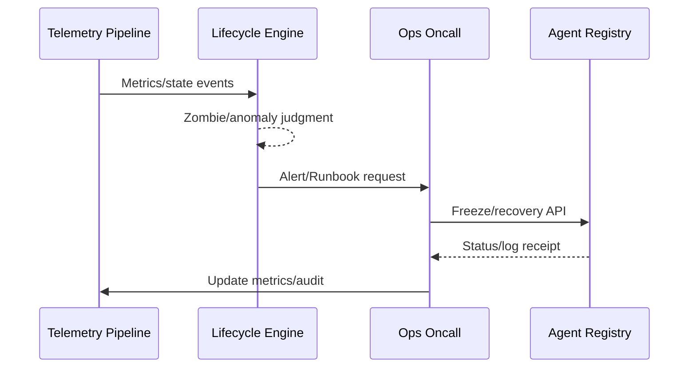

# Executive Summary

The platform needs to continuously monitor Agent call volume, success rate, latency and error types, and identify zombie or abnormal Agents based on policies, executing self-healing, freezing, decommissioning or resource recovery actions. This sub-scenario ensures "monitoring → judgment → handling → audit" loop, with goals of 100% monitoring coverage, <10 minutes anomaly response, 100% resource recovery success rate, and all operations recorded.

# Scope & Guardrails

- **In Scope**: Metrics collection, zombie detection policies, anomaly alerts, self-healing actions (restart/rate limiting/degradation), freeze/decommission APIs, resource recovery, audit.
- **Out of Scope**: Model-level observation, business SLA details, COPILOT ticket collaboration strategies (covered by task execution scenarios).
- **Environment & Flags**: `agent-lifecycle-ops`, `agent-telemetry-bus`, `agent-recovery-framework`; depends on Grafana/Datadog, Ops alerting, Notification, Audit services.

# Participants & Responsibilities

| Scope | Repository | Layer | Responsibilities & Deliverables | Owners |
|-------|------------|-------|--------------------------------|--------|
| telemetry-pipeline | powerx | service | Call/latency/error metrics collection, state event bus | Agent Platform Guild |
| lifecycle-engine | powerx | ops | Zombie/anomaly detection policies, alert routing, self-healing orchestration | Ops Reliability Center |
| remediation-runs | powerx | ops | Freeze/decommission/recovery APIs, Runbook, audit output | Ops Reliability Center |

# End-to-End Flow

1. **Stage 1 – Metrics & Signals**: Collect Agent call volume, success rate, latency, errors, resource usage and other signals, write to `agent.lifecycle.state` Topic.
2. **Stage 2 – Policy Evaluation**: Lifecycle Engine executes judgment based on `policies.yaml` (zombie rules, anomaly thresholds, priority) and outputs action recommendations.
3. **Stage 3 – Remediation & Recovery**: Execute self-healing (restart, rate limiting, degradation) or manual Runbook; call freeze/recovery APIs to release resources when necessary.
4. **Stage 4 – Audit & Notification**: Record operation logs, audit events, metrics, and notify responsible parties and tenant administrators.
5. **Stage 5 – Review & Continuous Improvement**: Regularly review policy effectiveness, metrics trends, alert accuracy, adjust thresholds and sync to Policy Engine.

# Key Interactions & Contracts

- **Events**
  - `agent.metrics.emitted` — Payload: `agent_id`, `tenant_id`, `calls`, `errors`, `latency_ms`, `idle_days`, `resource_usage`, `timestamp`.
  - `agent.lifecycle.zombie_detected` — Contains policy ID, hit reason, recommended action, priority, trigger person.
  - `agent.lifecycle.frozen` / `agent.lifecycle.recovered` — Record freeze/recovery status, initiator, audit_id.
- **APIs**
  - `POST /internal/agent/{id}/freeze` — Body: `reason`, `initiator`, `force`, `ticket_id`; requires dual-person token.
  - `POST /internal/agent/{id}/recover`, `/retire`, `/resource/reclaim` — Control recovery and retirement.
- **Configs / Schemas**: `config/agent/lifecycle/policies.yaml` (zombie/anomaly rules, priority, gradual), `docs/standards/powerx/backend/integration/09_agent/Agent_Metrics_and_Observability.md`, `runbooks/agent-freeze.yaml` / `agent-recover.yaml`.
- **Security / Compliance**: Freeze/decommission dual confirmation, operation signature, ≥180 days audit, resource recovery records, tenant notification.

# Usecase Links

- `UC-AGENT-REG-LIFECYCLE-001` — Agent runtime monitoring and zombie governance (ops layer, `docs/use_cases/_from_hub/SCN-AGENT-REG-MGMT-001/UC-AGENT-REG-LIFECYCLE-001.md`).

# Implementation Checklist

| Item | Description | Owner | Status |
|------|-------------|-------|--------|
| Telemetry Pipeline | `services/telemetry/agent-lifecycle-pipeline.ts`: metrics access, tenant/owner labels, Kafka/Datadog integration | Agent Platform Guild | [ ] |
| Lifecycle Policy Engine | `services/agent/lifecycle/policy_engine.ts`: policy DSL, priority, action orchestration | Ops Reliability Center | [ ] |
| Remediation APIs & Runbooks | `services/ops/runbooks/agent_freeze.ts`, `scripts/ops/agent-retire-zombie.mjs` | Ops Reliability Center | [ ] |
| Audit & Notification | `services/observability/audit_pipeline.ts`, Notification Center, PagerDuty integration | Ops Reliability Center | [ ] |
| Drill & Reporting | `scripts/ops/agent-lifecycle-drill.mjs`, Grafana「Agent Lifecycle」dashboard, weekly review reports | Ops Reliability Center | [ ] |

# Acceptance Criteria

1. Monitoring data coverage 100%, metrics latency <60 seconds.
2. Zombie or high-error Agents trigger self-healing or manual response within 10 minutes, freeze/recovery success rate 100%.
3. All lifecycle actions written to audit and notify responsible parties, resource release time <5 minutes.

# Testing Strategy

- **Unit**: Policy engine (various rules/thresholds/priority), zombie timer, freeze API logic, metrics parser.
- **Integration**: Simulate metrics streams and events, verify policy triggering, alert routing, Runbook execution, audit writing; cover success/failure paths.
- **End-to-End**: Run `scripts/ops/agent-lifecycle-drill.mjs --profile zombie --tenant tenant-lab`, drill zombie identification, freeze, recovery; execute `agent-retire-zombie.mjs --dry-run`.
- **Non-functional**: Policy Engine performance testing handling 10k Agent events per minute; Chaos (Telemetry, Audit, Notification interruption) to verify degradation strategies.

# Observability & Ops

- **Metrics**: `agent.lifecycle.coverage_rate`, `agent.lifecycle.zombie_detected_total`, `agent.lifecycle.alert_backlog`, `agent.lifecycle.freeze_duration_minutes`, `agent.lifecycle.mttd_minutes`, `agent.lifecycle.mttre_minutes`, `agent.lifecycle.resource_release_success_rate`.
- **Logs/Audit**: Record metrics summary, policy hit details, executed actions, initiator, ticket_id; sensitive field masking; written to Elastic + Audit Service.
- **Alerts**: Coverage <100%, MTTR >10 minutes, freeze failure, audit/notification failure, unmonitored Agents >0.
- **Dashboards**: Grafana「Agent Lifecycle」, Datadog `agent.lifecycle.*`, Audit Explorer, Ops Pager reports.

# Rollback & Failure Handling

- Policy false positive: Use `POST /internal/agent/{id}/recover` to restore status, record `reverted` audit; rollback policy version in Policy Engine.
- Telemetry interruption: Enable degradation mode (local cache, scheduled inspection scripts), send high-priority alerts to on-call.
- Freeze/recovery failure: Auto-retry and trigger P1 ticket, call `agent-registry-cleanup.mjs` to clean up half-finished states.
- Metrics delay: Enter degradation when Kafka/Datadog delay >60 seconds, suspend automatic actions, keep alerts only.

# Follow-ups & Risks

| Risk/Item | Impact | Mitigation | Owner | ETA |
|-----------|--------|------------|-------|-----|
| Zombie policy threshold inconsistent with business SLA | False positives/negatives | Introduce tenant/scenario-level thresholds and gradual rollout, run `agent-lifecycle-drill.mjs --what-if` before policy changes | Ops Reliability Center | 2025-02-28 |
| Telemetry delay or loss | Unable to respond timely | Kafka delay monitoring + automatic degradation + manual inspection scripts | Agent Platform Guild | 2025-03-05 |
| Audit/Notification unavailable | Compliance gap | Cache to S3, backfill after recovery; generate tickets when notifications fail | Ops Reliability Center | 2025-02-28 |

# Appendix

- `docs/meta/scenarios/powerx/agent-and-automation/agent-orchestration/agent-registration-and-management/primary.md`
- `docs/scenarios/agent-orchestration/SCN-AGENT-REG-MGMT-001.md`
