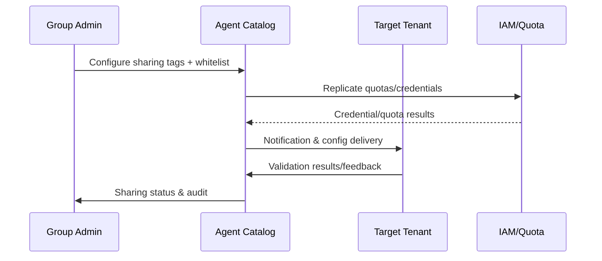

# Executive Summary

Group or platform administrators need to share verified Agents across multiple tenants while maintaining context isolation, independent quotas, and log attribution. This sub-scenario defines the flow of "mark sharing scope → replicate configuration & quotas → target tenant validation → periodic review & revocation" to ensure secure calls after sharing, transparent audit, and immediate credential invalidation upon revocation.

# Scope & Guardrails

- **In Scope**: Agent tags, sharing whitelist, tenant mapping, credential & quota replication, target tenant validation, sharing revocation, logs & notifications.
- **Out of Scope**: Marketplace external sales, cross-organization data synchronization, tenant billing strategies.
- **Environment & Flags**: `agent-sharing-directory`, `agent-multi-tenant`, `agent-share-review`; depends on IAM, Quota Service, Notification, Audit.

# Participants & Responsibilities

| Scope | Repository | Layer | Responsibilities & Deliverables | Owners |
|-------|------------|-------|--------------------------------|--------|
| catalog-service | powerx | integration | Agent catalog, sharing whitelist, tenant mapping, quota replication APIs | Agent Platform Guild |
| tenant-verifier | powerx-plugin | integration | Target tenant sandbox validation, call context isolation testing, log attribution checking | Plugin Guild |
| compliance-review | powerx | ops | Periodic review, revocation policies, notifications & audit | Ops Reliability Center |

# End-to-End Flow

1. **Stage 1 – Catalog Tagging**: Administrators configure Agent sharing tags, tenant whitelist, permission scope, quota templates, and expiration time.
2. **Stage 2 – Sharing Execution**: Share Service validates whitelist and calls IAM/Quota to replicate credentials and rate limits, synchronizing configuration to target tenants.
3. **Stage 3 – Validation & Monitoring**: Tenant Validation Worker performs sandbox calls, checking context isolation, log attribution, rate limits, results written to `agent.share.validation` metrics.
4. **Stage 4 – Review & Compliance**: Compliance Review Engine periodically checks (expiration, anomalies, audit audits), creates review tasks when necessary.
5. **Stage 5 – Revoke & Notify**: Sharing expiration or violations trigger `POST /internal/agent/catalog/revoke`, release quotas, invalidate credentials, send notifications & audit records.

# Key Interactions & Contracts

- **APIs**
  - `POST /internal/agent/catalog/share` — Body: `agent_id`, `tenants[]`, `permissions`, `quota`, `credential_profile`, `expires_at`, `reason`; requires `agent.catalog.manage` + approval token.
  - `POST /internal/agent/catalog/revoke` — Body: `agent_id`, `tenants[]`, `reason`, `immediate`, `notify=true|false`.
  - `GET /internal/agent/catalog/{agent_id}` — Returns sharing status, whitelist, credential references, history.
- **Events**
  - `agent.share.issued` / `agent.share.revoked` — Includes tenant, credential reference, quota, initiator, audit ID, whether auto-revoked.
- **Configs / Schemas**: `config/agent/sharing/policies.yaml` (whitelist source, isolation strategy, auto-revocation conditions), `config/iam/quota/*.yaml` (quota templates), `docs/standards/powerx/backend/integration/09_agent/Agent_Manager_and_Lifecycle_Spec.md`.
- **Security / Compliance**: Independent credentials + rate, log partitioning, revocation audit trails, sharing approval records, sensitive data masking, tenant notifications.

# Usecase Links

- `UC-AGENT-REG-SHARE-001` — Multi-tenant sharing/revocation flow (integration layer, `docs/use_cases/_from_hub/SCN-AGENT-REG-MGMT-001/UC-AGENT-REG-SHARE-001.md`).

# Implementation Checklist

| Item | Description | Owner | Status |
|------|-------------|-------|--------|
| Catalog Share Service | `services/agent/catalog/share_service.ts`: share/revoke APIs, whitelist, tag synchronization | Agent Platform Guild | [ ] |
| Quota & Credential Provisioner | `services/iam/quota/share_provisioner.ts`: replicate rate, quotas, credentials, rollback | Agent Platform Guild | [ ] |
| Tenant Validation Worker | `services/agent/catalog/tenant_validator.ts`: sandbox validation, log/context checks | Plugin Guild | [ ] |
| Compliance Review Engine | `services/compliance/share_review.ts`: periodic review, expiration revocation, reports | Ops Reliability Center | [ ] |
| Automation Scripts | `scripts/ops/agent-share-drill.mjs`, `agent-share-revoke.mjs`: drill/batch operations | Ops Reliability Center | [ ] |

# Acceptance Criteria

1. Sharing configuration 100% written to audit, quotas and credentials synchronized to target tenants within 1 minute.
2. Target tenant validation required before production, logs and call context isolated by tenant.
3. Revocation operations immediately invalidate credentials, release quotas and notify involved tenants, revocation failure rate <1%.

# Testing Strategy

- **Unit**: Share/revoke APIs, whitelist matching, quota replication, rollback logic, event publishing.
- **Integration**: In staging environment call `POST /internal/agent/catalog/share` with IAM/Quota/Notification/Audit; simulate validation failure, revocation failure.
- **End-to-End**: Run `scripts/ops/agent-share-drill.mjs --agent <id> --tenant tenant-b --dry-run`; execute `agent-share-revoke.mjs` to verify batch revocation and notifications.
- **Non-functional**: Concurrent sharing requests, long list tenant sync performance, Chaos (IAM/Notification/Audit unavailable) to verify rollback.

# Observability & Ops

- **Metrics**: `agent.share.active_total`, `agent.share.validation_failure_total`, `agent.share.revocation_time_seconds`, `agent.share.cross_tenant_success_rate`, `agent.share.unauthorized_attempt_total`.
- **Logs/Audit**: Sharing/revocation requests must record Agent, tenant, permissions, quotas, credential references, approval tickets, audit ID; sensitive fields masked.
- **Alerts**: Quota sync >5 minutes, validation failure 3 times consecutively, revocation failure, unauthorized tenant attempts >0, Audit write failure.
- **Dashboards**: Grafana「Agent Catalog Sharing」, Datadog `agent.share.*`, audit reports, drill reports generated by `scripts/ops/agent-share-drill.mjs`.

# Rollback & Failure Handling

- Sharing failure: Revoke issued credentials/quotas, delete sharing records, notify applicant and create ticket.
- Validation failure: Auto-execute `agent-share-revoke.mjs` rollback, mark status as `validation_failed`, require re-submission through Catalog interface.
- Revocation failure: Retry three times then escalate P1, lock credentials and block calls, manually execute `agent-share-revoke.mjs --force`.
- Whitelist misconfiguration: Use `agent-catalog-whitelist-sync.mjs --rollback` to restore previous version.

# Follow-ups & Risks

| Risk/Item | Impact | Mitigation | Owner | ETA |
|-----------|--------|------------|-------|-----|
| Whitelist data source out of sync with IAM labels | Sharing failure or privilege escalation | Build sync script with diff alerts, policy changes require approval | Agent Platform Guild & IAM Team | 2025-03-05 |
| Quota/credential replication failure | Sharing unavailable or data leakage | Enable transaction log + rollback script in Catalog, revoke on failure | Agent Platform Guild | 2025-03-02 |
| Missing revocation notifications | Tenants continue calling, errors increase | `agent.share.revoked` event must include notification results with secondary validation | Ops Reliability Center | 2025-02-28 |

# Appendix

- `docs/meta/scenarios/powerx/agent-and-automation/agent-orchestration/agent-registration-and-management/primary.md`
- `docs/scenarios/agent-orchestration/SCN-AGENT-REG-MGMT-001.md`
