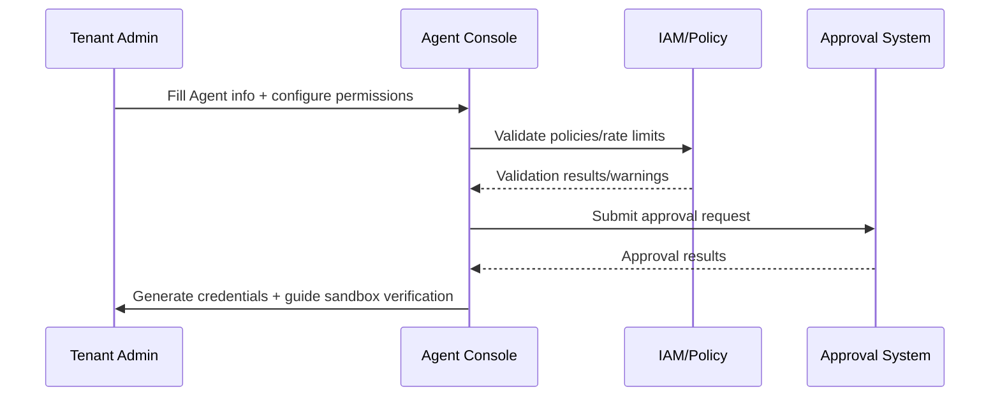

# Executive Summary

Tenant administrators need to self-service create Agents in the console for internal knowledge Q&A, automation tasks, or plugin orchestration. The platform must provide unified forms, permission/rate policy selectors, approval flows, and activation steps, ensuring unapproved Agents cannot go online. This sub-scenario focuses on the "create → approve → activate → sandbox verification" pipeline, with goals of average approval time under 2 business days, zero tolerance for permission conflicts, and immediate observability after activation.

# Scope & Guardrails

- **In Scope**: Agent forms (name, purpose, Prompt, referenced plugins/tools), permission/data domain configuration, approval flows, credential generation, sandbox verification, audit.
- **Out of Scope**: Plugin development, knowledge base construction, business process logic, Marketplace external approval.
- **Environment & Flags**: `tenant-agent-center`, `agent-approval-flow`, `agent-sandbox`; depends on IAM, Workflow, Notification, Template Scanner.

# Participants & Responsibilities

| Scope | Repository | Layer | Responsibilities & Deliverables | Owners |
|-------|------------|-------|--------------------------------|--------|
| tenant-console | powerx | service | Agent forms, prompt templates, plugin/tool reference configuration, data domain selection | Agent Platform Guild |
| policy-engine | powerx | service | Permission policies, rate limits, tenant/user group binding, conflict validation | Agent Platform Guild |
| approval-workflow | powerx | ops | Approval rules, compliance validation, notifications, API Key/Webhook generation | Ops Reliability Center |

# End-to-End Flow

1. **Stage 1 – Definition & Inputs**: Tenant administrators fill in Agent basic information, Prompt templates, referenced plugins/tools, knowledge base, and runtime purposes; forms automatically load tenant templates, multi-language hints, preset tool lists.
2. **Stage 2 – Policy Selection & Validation**: Administrators select accessible data domains, tenant/user groups, rate limits; Policy Engine performs conflict validation and supplementary parameters based on tenant policies, sensitivity levels, and SLAs.
3. **Stage 3 – Approval & Compliance**: Multi-level approval (security, compliance, business) triggered after submission, supporting countersign, rollback, and comment recording; Template Scanner performs sensitive word scanning on Prompt/knowledge base.
4. **Stage 4 – Activation & Sandbox**: After approval, automatically bind IAM policies, generate API Key/Webhook/scheduling policies, call `agent-sandbox-validate.mjs` for sandbox regression and report output.
5. **Stage 5 – Post-Activation Governance**: Synchronize Agent metadata to Lifecycle, Catalog, Audit; if modifications or revocations occur, automatically re-enter approval/verification.

# Key Interactions & Contracts

- **APIs / Events**
  - `POST /internal/agent/custom` — Body: `name`, `purpose`, `prompt_template`, `knowledge_sources[]`, `plugins[]`, `tools[]`, `data_domains[]`, `rate_limits`, `owners`; requires `tenant.agent.manage` permission.
  - `POST /internal/agent/approval` — Body: `agent_id`, `approvers[]`, `urgency`, `attachments`, `comments`; supports `dry_run`.
  - `PATCH /internal/agent/{id}/policy` — Used for permission or rate policy updates after approval rollback.
  - `EVENT agent.approval.state.changed` — Payload: `agent_id`, `state`, `approver`, `reason`, `timestamp`, `audit_id`.
- **Configs / Schemas**: `config/agent/templates/prompt.yaml` (form templates + multi-language), `config/iam/policies/*.yaml` (data domains/permissions/rate), `config/workflows/agent_approval.yaml` (state machine), `docs/standards/powerx/backend/integration/09_agent/Agent_Manager_and_Lifecycle_Spec.md`.
- **Security / Compliance**: Tenant isolation, template sensitive word scanning, approval audit trails, API Key/Webhook encrypted storage, rate/quota isolation, dual-person approval token.

# Usecase Links

- `UC-AGENT-REG-TENANT-001` — Tenant custom Agent approval pipeline (service layer, `docs/use_cases/_from_hub/SCN-AGENT-REG-MGMT-001/UC-AGENT-REG-TENANT-001.md`).

# Implementation Checklist

| Item | Description | Owner | Status |
|------|-------------|-------|--------|
| Tenant Agent Center Forms | Componentized forms, template loading, multi-language, field validation, draft saving | Agent Platform Guild | [ ] |
| Policy Conflict Engine | Permission/rate/data domain conflict detection, hints, auto-repair | Agent Platform Guild / IAM Team | [ ] |
| Approval Workflow & Notifications | `services/workflow/agent_approval_flow.ts`, `config/workflows/agent_approval.yaml` | Ops Reliability Center | [ ] |
| Template/Compliance Scanner | Prompt/knowledge base sensitive words, data domain policy validation | Security & Compliance | [ ] |
| Sandbox Activation | Credential generation, `scripts/ops/agent-sandbox-validate.mjs`, audit writing | Agent Platform Guild | [ ] |

# Acceptance Criteria

1. Average approval time <2 business days, rejection rate/reasons queryable in console.
2. Permission or rate policy conflicts must be blocked before submission with actionable hints.
3. API Key/Webhook generated and distributed within 30 seconds after approval, sandbox verification results written to audit.

# Testing Strategy

- **Unit**: Form validation, template loading, multi-language hints, Policy conflict detection, approval state machine, notification routing.
- **Integration**: In staging tenants execute complete submission flow, verify interaction with IAM, Workflow, Notification, Audit services. Simulate sensitive words, permission conflicts, approval rejections.
- **End-to-End**: Run `scripts/ops/agent-sandbox-validate.mjs --agent <id> --profile tenant-lab`; execute "submit → approve → activate → revoke → resubmit" pipeline.
- **Non-functional/Chaos**: Concurrent form submission, peak approval, Workflow/IAM unavailable degradation (cache+tickets).

# Observability & Ops

- **Metrics**: `agent.custom.requests_total`, `agent.custom.approval_duration_hours`, `agent.custom.policy_conflict_total`, `agent.custom.activation_success_rate`, `agent.custom.sandbox_failure_total`.
- **Logs**: Record tenant, Agent, input summary, approvers, comments, credential references (masked); written to Elastic + Audit; INFO/ERROR levels for key actions.
- **Alerts**: Approval queue >48h, conflict rate >10%, sandbox failure rate >5%, Audit write failure; notify PagerDuty + Teams #tenant-agent.
- **Dashboards**: Grafana「Tenant Agent Center」, Datadog `agent.custom.*`, Workflow reports.

# Rollback & Failure Handling

- **Approval rejection**: Keep drafts, allow admin adjustments and resubmission, record audit.
- **Credential/policy rollback**: Revoke issued credentials, restore status to `pending`, re-trigger approval + sandbox after fix.
- **Workflow failure**: Auto-convert to manual tickets and lock status, prevent duplicate submission.
- **Sandbox failure**: Mark `sandbox_failed`, block activation, notify Ops & tenant; can rerun after fix.
- **Form version rollback**: `tenant-agent-center rollback --agent <id> --version <n>` restore previous version configuration.

# Follow-ups & Risks

| Risk/Item | Impact | Mitigation | Owner | ETA |
|-----------|--------|------------|-------|-----|
| Prompt template sensitive word policies not aligned with compliance | Approval quality, compliance risk | Collaborate with Legal/Compliance to build rule library, update with version releases | Ops Reliability Center | 2025-03-03 |
| Feature Flag not synchronized causing console feature gaps | Submission failures, inconsistent experience | Validate Flags in CI before release, provide fallback paths | Agent Platform Guild | 2025-03-01 |
| Permission policies inconsistent with tenant terms | Privilege escalation or false positives | Introduce tenant-level policy template diff, force validation before approval | IAM Platform Team | 2025-03-05 |
| Approver absence causing SLA timeout | Agent activation blockage | Enable multi-level proxy approval & automatic escalation on timeout | Ops Reliability Center | 2025-02-28 |

# Appendix

- `docs/meta/scenarios/powerx/agent-and-automation/agent-orchestration/agent-registration-and-management/primary.md`
- `docs/scenarios/agent-orchestration/SCN-AGENT-REG-MGMT-001.md`
