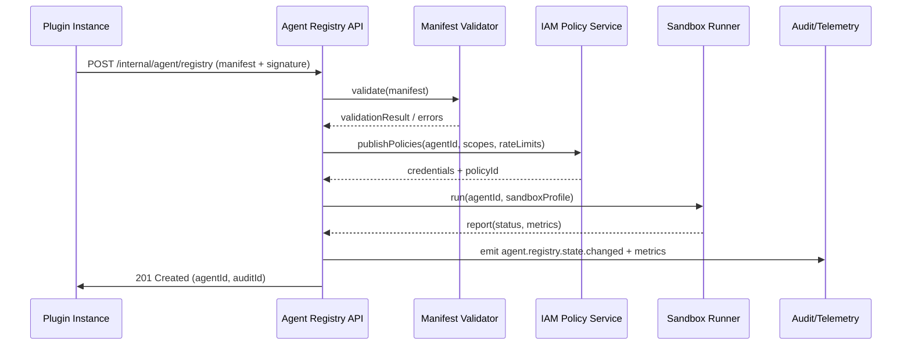

# Usecase Overview

- **Business Goal**: Enable Agent descriptions carried by plugins to complete registration, signature verification, Agent ID generation, and admission policy binding within 5 seconds, allowing the platform to maintain real-time control of Agent ledger and immediate reference in orchestration platforms.
- **Success Metrics**: Registration success rate ≥98%; signature/Schema verification coverage 100%; `agent.registry.latency_p95` <5s; duplicate/conflict blocking rate 100%; audit write latency <1s.
- **Scenario Association**: Corresponds to sub-scenario A of `SCN-AGENT-REG-MGMT-001`, provides metadata foundation to `SCN-AGENT-REG-TENANT-001`, `SCN-AGENT-REG-LIFECYCLE-001`, and also provides input to capability map synchronization of `SCN-AGENT-TASK-EXEC-001`.

> **Summary**: This Seed focuses on Registry API, signature verification, permission policy binding, and sandbox verification, incorporating plugin-built-in Agents into controlled catalogs in an automated manner with continuous observability.

# Context & Assumptions

- **Prerequisites**
  - Scenario document `docs/scenarios/agent-orchestration/SCN-AGENT-REG-AUTO-001.md` has defined processes, metrics, and participants.
  - `UC-AGENT-REG-AUTO-001` node in `docs/_data/docmap.yaml` is fully consistent with this Seed frontmatter.
  - Feature Flags `agent-registry-v1`, `plugin-autoreg-webhook`, `agent-sandbox` are registered in the configuration center.
  - Plugin build pipeline generates `agent.manifest.json` and calls Registry API on startup.
  - IAM, Secret Manager, Telemetry pipeline are online with necessary permissions.
- **Input/Output**
  - Input: plugin ID/version, signature, Agent capability description, permission/rate declarations, dependency tool list, sandbox validation parameters.
  - Output: Agent ID, metadata records, permission policy ID, sandbox validation results, audit events, `agent.registry.*` metrics.
- **Boundaries**
  - Not responsible for tenant custom Agents (handled by `UC-AGENT-REG-TENANT-001`).
  - Does not handle runtime monitoring or sharing policies (see lifecycle/sharing sub-usecases).
  - Does not include plugin internal business logic or model inference pipelines.

# Solution Blueprint

## System Decomposition

| Layer | Main Components/Modules | Responsibilities | Code Entry |
|-------|-------------------------|------------------|------------|
| integration | Agent Registry API Gateway | Receive plugin manifest, authentication, rate limiting, Agent ID generation | `services/agent/registry/http.ts` |
| integration | Manifest Validator & Schema | Validate fields, signature, plugin version compatibility, generate audit payload | `backend/config/agent/registry/schema.yaml` + `services/agent/registry/validator.ts` |
| integration | IAM Policy Publisher | Map permission/rate policies to IAM, generate credential references | `services/iam/policy/publisher.ts` |
| integration | Sandbox Validation Runner | Trigger `scripts/ops/agent-sandbox-validate.mjs`, upload execution reports | `scripts/ops/agent-sandbox-validate.mjs` |
| integration | Audit & Telemetry Sink | Write `agent.registry.state.changed` events, metrics, logs | `services/observability/audit_pipeline.ts` |

## Flow & Sequence

1. **Step 1 – Manifest Intake**: Plugin startup hook submits manifest + signature to `POST /internal/agent/registry`; gateway performs OAuth2 + plugin certificate authentication.
2. **Step 2 – Schema & Signature Validation**: Validator validates fields, capability references, version compatibility, signature certificates; failures return debuggable error codes and write alerts.
3. **Step 3 – Agent ID Issuance**: Generate Agent ID, record plugin mapping, write to metadata tables and audit logs; pass manifest parsing results to IAM publisher.
4. **Step 4 – Policy Binding & Sandbox**: IAM publisher generates permission/rate policies and credentials; trigger Sandbox Runner to execute regression use cases, get health reports.
5. **Step 5 – Activation & Broadcast**: Write registration success event to `agent.registry.state.changed`, synchronize to Agent orchestration platform and monitoring dashboards; if Sandbox fails, mark status as `pending_fix` and notify Vendor.

# Contracts & Interfaces

- **Inbound APIs / Events**
  - `POST /internal/agent/registry` — Body includes `agent_id?`, `plugin_id`, `version`, `capabilities[]`, `permissions`, `rate_limits`, `signature`; requires `agent.registry.write` scope and plugin certificate; supports `dry_run`.
  - `POST /internal/agent/registry/{agent_id}/sandbox` — Manually rerun sandbox validation; can specify `profile`, `timeout`, `telemetry_tags`.
  - `EVENT agent.registry.registered` / `agent.registry.failed` — Connect to monitoring, alerting, and Copilot.
- **Outbound Calls**
  - `IAM Policy Service /internal/policies` — Create permission, rate policies and credentials; failures require Registry state rollback.
  - `Agent Catalog Sync /internal/catalog/agents` — Publish metadata to orchestration platform.
  - `Telemetry Bus agent.registry.*`, `Audit Service /events` — Write metrics/logs.
- **Configs & Scripts**
  - `backend/config/agent/registry/schema.yaml` — Define required fields and compatibility policies.
  - `config/feature_flags/agent-registry.yaml` — Control auto-approval/sandbox policies.
  - `scripts/ops/agent-sandbox-validate.mjs` — Run regression, record health reports.

# Implementation Checklist

| Item | Description | Completion Status | Owner |
|------|-------------|-------------------|-------|
| Manifest Schema & Lint | Support capabilities, permissions, dependencies, tenant label fields, provide CLI validation | [ ] | Agent Platform Guild |
| Signature Verification | Integrate certificate trust chain, expiration alerts, replay protection | [ ] | Plugin Guild |
| Agent ID & Metadata Store | Create/migrate table structure, indexes, idempotent writes | [ ] | Agent Platform Guild |
| IAM Policy Binding | Auto-generate permission/rate policies, credential callback, conflict rollback | [ ] | Agent Platform Guild |
| Sandbox Automation | Extend script to cover core plugins, upload metrics & reports | [ ] | Ops Reliability Center |
| Audit & Alerting | Event/metrics writing, Grafana dashboards, PagerDuty alerts | [ ] | Ops Reliability Center |

# Testing Strategy

- **Unit Tests**
  - Manifest Schema validator (required/enum/JSON schema).
  - Signature verification, replay protection, duplicate Agent blocking logic.
  - IAM publisher serialization and idempotency for rate/permission mapping.
- **Integration Tests**
  - Use sandbox plugins to trigger `POST /internal/agent/registry`, verify interaction with IAM, Sandbox Runner.
  - Inject exceptions (signature errors, missing fields, IAM failures) to ensure rollback and alert triggering.
- **End-to-End Validation**
  - In staging use real plugin packages to execute auto-registration, observe Agent ID generation, orchestration platform sync, sandbox reports.
  - Run `scripts/ops/agent-sandbox-validate.mjs --agent <id> --profile full` to validate regression pipeline.
- **Non-functional Tests**
  - Load test Registry API (100 concurrent RPS) ensuring <5s SLA.
  - Chaos: network jitter, Secret Manager failures, confirm alert/rollback paths.

# Observability & Ops

- **Metrics**
  - `agent.registry.latency_p95`, `agent.registry.success_total`, `agent.registry.signature_failure_total`, `agent.registry.duplicate_block_total`, `agent.registry.sandbox_failure_total`.
- **Logs**
  - Each registration writes plugin ID, Agent ID, version, signature fingerprint, policy ID, sandbox results; log levels INFO/ERROR;落地 Elastic + S3.
- **Alerts**
  - Signature failure rate >2% (5-minute window), registration error rate >5%, Sandbox Pending >10 minutes, IAM publishing failure.
  - Notification channels: Ops Pager, Agent Platform Teams channel, Vendor email broadcast.
- **Dashboards**
  - Grafana「Agent Registry」 panel, Datadog `agent.registry.*`, Elastic Dashboard (audit logs), Sandbox report view.

# Rollback & Failure Handling

- Immediately delete newly created Agent records, revoke IAM policies, clean up audit references after failure, return debuggable error codes.
- Provide `scripts/ops/agent-registry-cleanup.mjs --agent <id>` to clean residual metadata and credentials.
- Sandbox failure: mark Agent status `pending_fix`, block orchestration platform reference, and automatically open `agent-registry-sandbox-failure` Pager.
- When IAM or Audit unavailable: retry in memory queue, after 5-minute timeout enter isolated queue and alert on-call.

# Follow-ups & Risks

| Risk/Item | Impact | Mitigation | Owner | ETA |
|-----------|--------|------------|-------|-----|
| Legacy plugins not upgraded manifest Schema, causing mass registration failures | Affect Vendor rollout节奏 | Provide CLI validator, add schema lint to release script; allow `schema_version` gradual strategy | Plugin Guild | 2025-03-05 |
| Sandbox resource insufficient causing queuing >10 minutes | Registration pipeline delay, SLA violation | Scale sandbox pool, introduce priority queue, allow "post-sandbox" when necessary with Ops approval | Ops Reliability Center | 2025-03-01 |

# References & Links

- Scenario Document: `docs/scenarios/agent-orchestration/SCN-AGENT-REG-MGMT-001.md`
- Sub-scenario: `docs/scenarios/agent-orchestration/SCN-AGENT-REG-AUTO-001.md`
- Docmap: `docs/_data/docmap.yaml` (SCN-AGENT-REG-MGMT-001 → UC-AGENT-REG-AUTO-001)
- Repo Metadata: `docs/_data/repos.yaml` (`key: powerx`)
- Contracts & Standards: `docs/standards/powerx/backend/integration/09_agent/Agent_Manager_and_Lifecycle_Spec.md`
- Related Scripts: `scripts/ops/agent-sandbox-validate.mjs`, `scripts/ops/agent-registry-cleanup.mjs`
