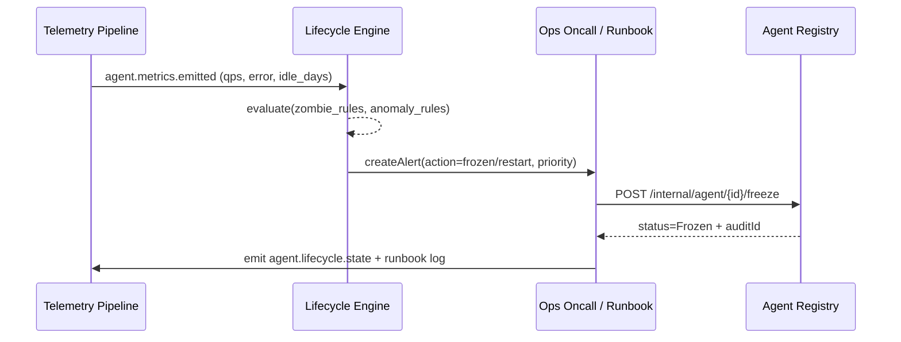

# Usecase Overview

- **Business Goal**: Establish unified runtime monitoring, zombie detection, and recovery closure for all registered Agents, ensuring anomalies respond within 10 minutes, 100% resource recovery success rate, and full traceability in audit.
- **Success Metrics**: `agent.lifecycle.coverage_rate`=100%; `agent.lifecycle.mttd_minutes`≤5; `agent.lifecycle.mttre_minutes`≤10; zombie recovery success rate=100%; audit write latency <60s.
- **Scenario Association**: Supports Stage 1-4 of `SCN-AGENT-REG-LIFECYCLE-001`, depends on `UC-AGENT-REG-AUTO-001` / `UC-AGENT-REG-TENANT-001` for metadata, outputs Agent status to `UC-AGENT-REG-SHARE-001` for sharing policy reuse.

> **Summary**: Through Telemetry Pipeline, Lifecycle Policy Engine, and Runbook automation, continuously collect Agent signals, detect anomalies, execute freeze/recovery, and output audit, making the platform visible, controllable, and rollback-capable.

# Context & Assumptions

- **Prerequisites**
  - Scenario document `docs/scenarios/agent-orchestration/SCN-AGENT-REG-LIFECYCLE-001.md` has defined processes and metrics.
  - Feature Flags `agent-lifecycle-ops`, `agent-telemetry-bus`, `agent-recovery-framework` are enabled in configuration center.
  - Agent Registry has output complete metadata (status, responsible person, tenant labels).
  - Grafana/Datadog, Audit, Notification, IAM and other basic services are online.
- **Input/Output**
  - Input: `agent.metrics.emitted`, `agent.lifecycle.zombie_detected`, Agent metadata, Ops Runbook status.
  - Output: freeze/recovery API responses, `agent.lifecycle.state` metrics, audit logs, notifications (email/IM/tickets).
- **Boundaries**
  - Does not handle specific task execution or Copilot ticket details (covered by task execution scenarios).
  - Does not cover model-level monitoring, cost governance.
  - Depends on external log/metrics pipeline availability; if external downtime, must enter degradation mode.

# Solution Blueprint

## System Decomposition

| Layer | Main Components/Modules | Responsibilities | Code Entry |
|-------|-------------------------|------------------|------------|
| service | Telemetry Pipeline | Aggregate Agent metrics, logs, events and write to state bus | `services/telemetry/agent-lifecycle-pipeline.ts` |
| ops | Lifecycle Policy Engine | Execute zombie/anomaly detection, action decisions, alert routing | `services/agent/lifecycle/policy_engine.ts` |
| ops | Remediation Orchestrator | Call freeze/recovery APIs, Runbooks, self-healing scripts, audit output | `services/ops/runbooks/agent_freeze.ts` |
| ops | Drill & Automation Scripts | Drills, batch recovery, metrics validation | `scripts/ops/agent-lifecycle-drill.mjs`, `scripts/ops/agent-retire-zombie.mjs` |

## Flow & Sequence

1. **Step 1 – Metrics & Signal Intake**: Telemetry Pipeline writes call volume, success rate, error types, CPU/memory and other metrics every 30 seconds, pushing to `agent.lifecycle.state` bus.
2. **Step 2 – Policy Evaluation**: Lifecycle Policy Engine executes zombie/anomaly identification based on policies (30 days no calls, error rate >50%, latency >5s, cost anomalies), prioritizes and decides automatic/manual actions.
3. **Step 3 – Remediation**: Execute automatic restart/rate limiting for low-risk anomalies; trigger `agent-retire-zombie.mjs` for zombie Agent recovery, or via API `POST /internal/agent/{id}/freeze` to enter frozen state; high-risk anomalies automatically escalate to on-call.
4. **Step 4 – Audit & Notification**: All actions write to `agent.lifecycle.frozen`, `agent.lifecycle.recovered` events and audit logs, notify responsible parties, tenant administrators and sync back to Agent Registry.

# Contracts & Interfaces

- **Inbound APIs / Events**
  - `EVENT agent.metrics.emitted` — Metrics payload includes `agent_id`, `tenant_id`, `calls`, `errors`, `latency_ms`, `last_invoked_at`, `resource_usage`.
  - `EVENT agent.lifecycle.zombie_detected` — Policy Engine output, carrying policy hit details and recommended actions.
  - `POST /internal/agent/{agent_id}/freeze` — Request body includes `reason`, `initiator`, `force=true|false`; requires Ops dual-person token.
  - `POST /internal/agent/{agent_id}/recover` — Unfreeze and trigger sandbox validation.
- **Outbound Calls**
  - `Notification Center /v1/notify` — Push to responsible parties, tenant administrators.
  - `Ops Pager /v1/incidents` — High-risk anomaly escalation.
  - `Audit Service /internal/events` — Write `agent.lifecycle.*` audit records.
  - `Resource Manager /internal/resources/reclaim` — Release compute/credentials.
- **Configs & Scripts**
  - `config/agent/lifecycle/policies.yaml` — Metrics thresholds, zombie rules, priority.
  - `runbooks/agent-freeze.yaml`, `runbooks/agent-recover.yaml` — Manual/automated steps.
  - `scripts/ops/agent-lifecycle-drill.mjs` — Periodic drills.
  - `scripts/ops/agent-retire-zombie.mjs` — Batch recovery.

# Implementation Checklist

| Item | Description | Completion Status | Owner |
|------|-------------|-------------------|-------|
| Telemetry Coverage | Connect all Agent metrics to `agent.lifecycle.state` Topic, add tenant/responsible person labels | [ ] | Agent Platform Guild |
| Policy Engine & Thresholds | Implement `policies.yaml`, support dynamic thresholds & A/B testing | [ ] | Ops Reliability Center |
| Freeze/Recovery APIs | Implement `freeze/recover` interface idempotency, audit, dual-person confirmation | [ ] | Ops Reliability Center |
| Self-Healing Scripts & Runbooks | Complete `agent-retire-zombie.mjs`, `agent-lifecycle-drill.mjs`, and document | [ ] | Ops Reliability Center |
| Audit & Notifications | Write actions to Audit, Pager, Notification; add Grafana panels | [ ] | Security & Compliance Office |

# Testing Strategy

- **Unit Tests**
  - Policy engine: various zombie/anomaly rules, thresholds, priority decisions.
  - Freeze/recovery APIs: idempotency, permissions, input validation.
  - Telemetry Parser: metrics validity, tenant label completeness.
- **Integration Tests**
  - Simulate metrics streams (idle 30 days, 60% error rate) verify policy triggering and actions.
  - Call `POST /internal/agent/{id}/freeze` with Registry + Audit interaction.
  - Execute `scripts/ops/agent-retire-zombie.mjs --dry-run` verify resource recovery.
- **End-to-End Validation**
  - Drill script: `scripts/ops/agent-lifecycle-drill.mjs --profile zombie --tenant tenant-lab`.
  - Chaos: shutdown Telemetry or Notification, confirm degradation paths (local cache, delayed alerts).
- **Non-functional Tests**
  - Performance: Policy Engine can process 10k Agent signals per minute.
  - Fault tolerance: Audit write failure retry + dead letter queue, prevent data loss.

# Observability & Ops

- **Metrics**
  - `agent.lifecycle.coverage_rate`, `agent.lifecycle.zombie_detected_total`, `agent.lifecycle.freeze_duration_minutes`, `agent.lifecycle.reclaim_success_total`, `agent.lifecycle.alert_backlog`.
- **Logs**
  - Runbook results (including agent_id, action, initiator, duration, audit_id), policy hit details; INFO for success, WARN/ERROR for failures.
- **Alerts**
  - Coverage <100%; MTTR >10 minutes; freeze/recovery failure; unmonitored Agents >0; audit write failure.
  - Notification channels: PagerDuty (P1), Teams #agent-lifecycle (P2), Email (daily summary).
- **Dashboards**
  - Grafana「Agent Lifecycle」: zombie trends, MTTD/MTTR, freeze execution time.
  - Datadog `agent.lifecycle.*`: metrics details.
  - Audit Explorer: action log queries.

# Rollback & Failure Handling

- If policy mis-triggered: use `POST /internal/agent/{id}/recover` and rollback resource release scripts; audit records must be marked `reverted`.
- Telemetry interruption: switch to degradation mode, enable `agent-lifecycle-drill.mjs --fallback` for manual inspection of key Agents, notify on-call.
- Freeze API failure: auto-retry 3 times, still failed create P1 ticket and lock Agent, prevent duplicate operations.
- Batch recovery failure: execute `scripts/ops/agent-registry-cleanup.mjs` to clean half-finished states, then re-trigger recovery scripts.

# Follow-ups & Risks

| Risk/Item | Impact | Mitigation | Owner | ETA |
|-----------|--------|------------|-------|-----|
| Zombie policy threshold inconsistent with business SLA, easy false positives | Business interruption, complaints | Introduce tenant/scenario-level thresholds and gradual rollout, run `agent-lifecycle-drill.mjs --what-if` before policy changes | Ops Reliability Center | 2025-03-10 |
| Telemetry delay causing MTTD >5 minutes | Unable to respond to failures promptly | Enable delay monitoring on Kafka topic, after 60s auto-transfer to manual inspection | Agent Platform Guild | 2025-03-05 |
| Audit & Notification system temporarily unavailable | Compliance risk, missing information | Cache action logs to S3, backfill Audit after recovery; generate tickets when notifications fail | Security & Compliance Office | 2025-02-28 |

# References & Links

- Scenario: `docs/scenarios/agent-orchestration/SCN-AGENT-REG-MGMT-001.md`
- Sub-scenario: `docs/scenarios/agent-orchestration/SCN-AGENT-REG-LIFECYCLE-001.md`
- Docmap: `docs/_data/docmap.yaml` (SCN-AGENT-REG-MGMT-001 → UC-AGENT-REG-LIFECYCLE-001)
- Repo metadata: `docs/_data/repos.yaml` (`key: powerx`)
- Standards: `docs/standards/powerx/backend/integration/09_agent/Agent_Metrics_and_Observability.md`
- Runbooks & Scripts: `scripts/ops/agent-lifecycle-drill.mjs`, `scripts/ops/agent-retire-zombie.mjs`, `services/ops/runbooks/agent_freeze.ts`
