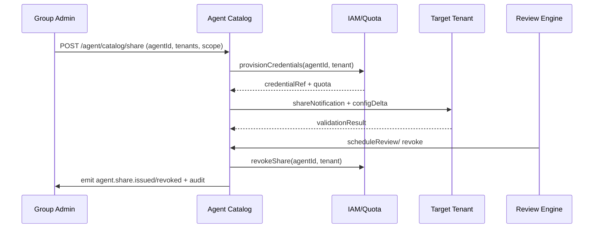

# Usecase Overview

- **Business Goal**: Enable group/platform administrators to safely share Agents across multiple tenants, automatically generating independent credentials and quotas, ensuring logs, context, and rate limits are isolated by tenant, and providing traceable revocation and review capabilities.
- **Success Metrics**: Sharing requests complete within 1 minute on average; `agent.share.validation_failure_total` <2%; revocation failure rate <1%; sharing/revocation events 100% written to audit; `agent.share.cross_tenant_success_rate` ≥99%.
- **Scenario Association**: Implements full flow of `SCN-AGENT-REG-SHARE-001`, depends on metadata and permission information from `UC-AGENT-REG-AUTO-001`/`UC-AGENT-REG-TENANT-001`, and outputs sharing status to `UC-AGENT-REG-LIFECYCLE-001` for lifecycle governance reference.

> **Summary**: Through Agent Catalog, Quota Provisioner, and compliance revocation scripts, achieves configured, audited, and rollback-capable cross-tenant sharing, ensuring shared Agents are isolated, visible, and controllable.

# Context & Assumptions

- **Prerequisites**
  - Scenario document `docs/scenarios/agent-orchestration/SCN-AGENT-REG-SHARE-001.md` has defined processes and metrics.
  - Feature Flags `agent-sharing-directory`, `agent-multi-tenant`, `agent-share-review` are enabled.
  - Agent Registry includes Agent tags, responsible person, tenant whitelist fields.
  - IAM, Quota Service, Notification, Audit services are available; shared target tenants have completed basic table structure/permission initialization.
- **Input/Output**
  - Input: sharing requests (Agent ID, tenant list, permission scope, quota policy, expiration time), approval records, tenant validation results.
  - Output: sharing credentials/quotas, tenant configuration deltas, `agent.share.issued` / `agent.share.revoked` events, audit logs, notifications.
- **Boundaries**
  - Does not handle Marketplace external sales and billing.
  - Target tenant internal workflow configuration is self-managed by the tenant.
  - Does not cover tenant localization or language pack synchronization (handled by other scenarios).

# Solution Blueprint

## System Decomposition

| Layer | Main Components/Modules | Responsibilities | Code Entry |
|-------|-------------------------|------------------|------------|
| integration | Agent Catalog Share Service | Handle share/revoke APIs, whitelist validation, tag synchronization | `services/agent/catalog/share_service.ts` |
| integration | Quota & Credential Provisioner | Replicate rates, quotas, credentials for target tenants, write to IAM/Quota | `services/iam/quota/share_provisioner.ts` |
| integration | Tenant Validation Worker | Call sandbox validation, context isolation checks, log attribution confirmation | `services/agent/catalog/tenant_validator.ts` |
| ops | Compliance Review Engine | Periodic review, expiration/violation revocation, notifications & audit | `services/compliance/share_review.ts` |
| ops | Share Automation Scripts | Drills, batch revocation, metrics validation | `scripts/ops/agent-share-drill.mjs`, `scripts/ops/agent-share-revoke.mjs` |

## Flow & Sequence

1. **Stage 1 – Catalog Tagging & Request**: Administrators configure Agent sharing tags, target tenants, and permission scope in Catalog, call `POST /internal/agent/catalog/share`.
2. **Stage 2 – Provision & Publish**: Share Service validates whitelist then calls Quota Provisioner to replicate credentials/quotas, write to IAM/Quota and generate tenant configuration deltas.
3. **Stage 3 – Tenant Validation**: Tenant Validation Worker runs first calls in target tenant sandbox, validates context isolation, log attribution, rate limits; auto-rollback on failure.
4. **Stage 4 – Review & Revoke**: Compliance Review Engine triggers `agent.share.revoked` based on expiration time or violation signals, calls revocation scripts to release quotas and notify all tenants.

# Contracts & Interfaces

- **Inbound APIs / Events**
  - `POST /internal/agent/catalog/share` — Body: `agent_id`, `tenants[]`, `permissions`, `quota`, `expires_at`, `reason`; requires `agent.catalog.manage` permission and dual-person approval token.
  - `POST /internal/agent/catalog/revoke` — Body: `agent_id`, `tenants[]`, `reason`, `immediate=true|false`; supports specifying trigger source (manual/auto).
  - `EVENT agent.share.issued` / `agent.share.revoked` — Includes tenant, credentials, quotas, initiator, audit ID.
  - `GET /internal/agent/catalog/{agent_id}` — Returns sharing status, whitelist, history.
- **Outbound Calls**
  - `IAM/Quota Service /internal/quota/share` — Replicate rates, quotas, credentials; failures require Catalog rollback.
  - `Notification Center /v1/notify` — Notify responsible parties, target tenant administrators.
  - `Tenant Validation Runner /internal/tenant/{id}/agent-validation` — Execute sandbox calls and return results.
  - `Audit Service /internal/events` — Write sharing/revocation audit.
- **Configs & Scripts**
  - `config/agent/sharing/policies.yaml` — Whitelist source, tenant isolation policies, auto-revocation thresholds.
  - `config/iam/quota/*.yaml` — Per-tenant quota templates and rate limits.
  - `scripts/ops/agent-share-drill.mjs` / `agent-share-revoke.mjs` — Drill and batch operation scripts.

# Implementation Checklist

| Item | Description | Completion Status | Owner |
|------|-------------|-------------------|-------|
| Catalog API & Schema | Support share/revoke APIs, tags, whitelist, audit fields | [ ] | Agent Platform Guild |
| Quota & Credential Provisioner | Replicate quotas, credentials, rate limits, ensure isolation | [ ] | Agent Platform Guild |
| Tenant Validation Flow | Automated sandbox validation, log attribution checks, failure rollback | [ ] | Plugin Guild |
| Compliance Review Engine | Scheduled review, expiration revocation, notifications & reports | [ ] | Ops Reliability Center |
| Scripts & Dashboards | Complete `agent-share-drill.mjs`, `agent-share-revoke.mjs`, Grafana panels | [ ] | Ops Reliability Center |

# Testing Strategy

- **Unit Tests**
  - Share API permission validation, input Schema, whitelist matching.
  - Quota Provisioner: quota replication, rate limit synchronization, rollback.
  - Validation Worker: context isolation, log attribution, rate limit simulation.
- **Integration Tests**
  - Use sandbox tenants to call `POST /internal/agent/catalog/share`, verify interaction with IAM, Notification, Audit.
  - Simulate validation failure/revocation scenarios, ensure credential recovery and audit records.
- **End-to-End Validation**
  - `scripts/ops/agent-share-drill.mjs --agent <id> --tenant tenant-b --dry-run` run through "apply→validate→revoke" pipeline.
  - Pre-production gradual rollout: share to two tenants in staging, observe `agent.share.cross_tenant_success_rate` metrics.
- **Non-functional Tests**
  - Concurrent sharing requests (10 RPS) Catalog performance.
  - Chaos: IAM or Notification failure, confirm auto-rollback and alerts.

# Observability & Ops

- **Metrics**
  - `agent.share.active_total`, `agent.share.validation_failure_total`, `agent.share.revocation_time_seconds`, `agent.share.cross_tenant_success_rate`, `agent.share.unauthorized_attempt_total`.
- **Logs**
  - Record sharing/revocation requests, tenants, permission scopes, credential references, approvers, audit ID; sensitive fields masked; logs written to Elastic + S3.
- **Alerts**
  - Quota sync >5 minutes, validation failure 3 times consecutively, revocation failure, unauthorized tenant attempts.
  - Channels: PagerDuty (P1), Teams #agent-catalog (P2), Email daily reports.
- **Dashboards**
  - Grafana「Agent Catalog Sharing」: active sharing count, validation failure rate, revocation time.
  - Datadog `agent.share.*` metrics panels.
  - Audit Explorer: sharing/revocation history.

# Rollback & Failure Handling

- Sharing failure: revoke generated quotas/credentials, delete sharing records and notify applicant.
- Validation failure: auto-execute `agent-share-revoke.mjs --agent <id> --tenant <id>`, mark status `validation_failed` in Catalog.
- Revocation failure: retry 3 times still failed create P1 ticket, lock credentials, prevent continued calls.
- Whitelist misconfiguration: provide `scripts/ops/agent-catalog-whitelist-sync.mjs` rollback to last snapshot, then re-push.

# Follow-ups & Risks

| Risk/Item | Impact | Mitigation | Owner | ETA |
|-----------|--------|------------|-------|-----|
| Whitelist source inconsistent with IAM causing sharing failure | Sharing blocked or privilege escalation | Build sync script with diff alerts, run `agent-catalog-whitelist-sync.mjs --dry-run` before release | Agent Platform Guild | 2025-03-05 |
| Shared tenant logs not properly partitioned | Compliance risk | Enforce log Index checks in Validation stage, rollback if not passed | Plugin Guild | 2025-03-01 |
| Revocation process missing tenant notifications | Tenants continue calling, error rate increases | `agent.share.revoked` event must include notification information and track sending results | Ops Reliability Center | 2025-02-28 |

# References & Links

- Scenario: `docs/scenarios/agent-orchestration/SCN-AGENT-REG-MGMT-001.md`
- Sub-scenario: `docs/scenarios/agent-orchestration/SCN-AGENT-REG-SHARE-001.md`
- Docmap: `docs/_data/docmap.yaml` (SCN-AGENT-REG-MGMT-001 → UC-AGENT-REG-SHARE-001)
- Repo metadata: `docs/_data/repos.yaml` (`key: powerx`)
- Contracts/Standards: `docs/standards/powerx/backend/integration/09_agent/Agent_Manager_and_Lifecycle_Spec.md`
- Scripts: `scripts/ops/agent-share-drill.mjs`, `scripts/ops/agent-share-revoke.mjs`, `config/agent/sharing/policies.yaml`
