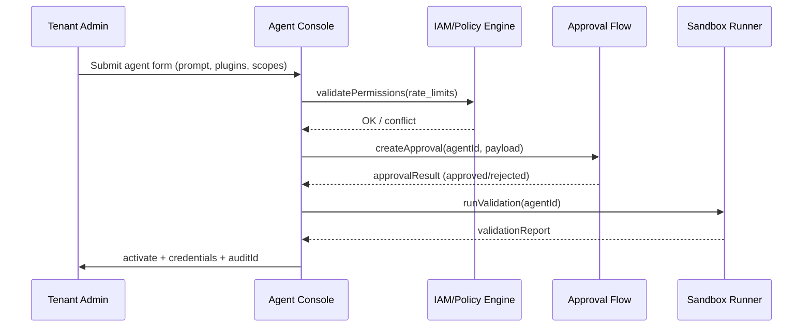

# Usecase Overview

- **Business Goal**: Support tenant administrators to self-service create, configure, and activate custom Agents, using unified forms and approval flows to ensure correct permission/rate policy binding, with unapproved Agents not allowed to go online.
- **Success Metrics**: Average approval time <2 business days; permission conflict blocking rate 100%; credentials generated and sandbox verification completed within 30 seconds of activation; `agent.custom.approval_duration_hours` trackable.
- **Scenario Association**: Implements full flow of `SCN-AGENT-REG-TENANT-001`, outputs complete metadata and policy information to `UC-AGENT-REG-LIFECYCLE-001` and `UC-AGENT-REG-SHARE-001`.

> **Summary**: This Seed defines Tenant Agent Center forms, policy validation, approval orchestration, and activation actions, ensuring tenant-built Agents have auditable, controllable, and rollback-capable go-live experience.

# Context & Assumptions

- **Prerequisites**
  - Scenario document `docs/scenarios/agent-orchestration/SCN-AGENT-REG-TENANT-001.md` has finalized processes.
  - Feature Flags `tenant-agent-center`, `agent-approval-flow`, `agent-sandbox` are enabled.
  - IAM, Workflow, Notification, Audit, Sandbox validation and other dependent services are available.
  - Tenant administrators have necessary permissions and have completed organization/data domain configuration.
- **Input/Output**
  - Input: Agent basic information, purpose, Prompt/knowledge base, referenced plugins/tools, permission scope, rate limits, approvers, attachments.
  - Output: Agent ID, policy binding results, approval records, call credentials, Webhook/API Key, sandbox validation reports, audit logs.
- **Boundaries**
  - Does not handle plugin development, knowledge base construction (handled by other scenarios).
  - Marketplace external publishing not in scope of this usecase.
  - Manual Copilot collaboration details described separately in lifecycle/execution scenarios.

# Solution Blueprint

## System Decomposition

| Layer | Main Components/Modules | Responsibilities | Code Entry |
|-------|-------------------------|------------------|------------|
| service | Tenant Agent Center Forms | Collect basic information, templates, knowledge base, plugin references, permission selection | `services/tenant-agent-center/forms` |
| service | Policy & Rate Publisher | Validate tenant policies, generate IAM permission/rate configurations, conflict rollback | `services/iam/policy/publisher.ts` |
| service | Approval Workflow Orchestrator | Build approval pipeline, notifications, state machine, rollback mechanisms | `services/workflow/agent_approval_flow.ts` |
| service | Template & Compliance Scanner | Check Prompt, knowledge base sensitive words, data domain restrictions | `services/security/template_scanner.ts` |
| ops | Sandbox Validation Runner | Pre-activation run `scripts/ops/agent-sandbox-validate.mjs` for validation | `scripts/ops/agent-sandbox-validate.mjs` |

## Flow & Sequence

1. **Step 1 – Definition & Inputs**: Tenant administrators fill Agent information, Prompt templates, referenced plugins/tools in console, and select data domains/user groups.
2. **Step 2 – Policy Merge & Validation**: System calls Policy Publisher to validate permission/rate conflicts, Template Scanner checks sensitive words, required approval fields.
3. **Step 3 – Approval Workflow**: Submit form triggers approval flow, security/compliance personnel review, comment, rollback, or approve in Workflow; status written to audit.
4. **Step 4 – Activation & Sandbox**: After approval, generate credentials, Webhook, scheduling policies, trigger sandbox validation script; on success set status to `active` and notify administrators.

# Contracts & Interfaces

- **Inbound APIs / Events**
  - `POST /internal/agent/custom` — Create/update Agent, includes basic fields, Prompt, tool references; requires `tenant.agent.manage` permission.
  - `POST /internal/agent/approval` — Submit approval, fields include approver list, urgency, attachments; supports `dry_run`.
  - `PATCH /internal/agent/{id}/policy` — Used for conflict adjustment or modifications after approval rejection.
  - `EVENT agent.approval.state.changed` — Approval results, approver, reason, time.
- **Outbound Calls**
  - `IAM Policy Service /internal/policies` — Generate permission/rate policies; conflicts trigger rollback.
  - `Workflow Engine /internal/workflows` — Initiate approval tasks, rollback, record comments.
  - `Notification Center /v1/notify` — Notify approvers, tenant administrators, Ops.
  - `Sandbox Validation Runner` — `scripts/ops/agent-sandbox-validate.mjs --agent <id>`.
  - `Audit Service /internal/events` — Record submission, approval, activation, rejection.
- **Configs & Scripts**
  - `config/agent/templates/prompt.yaml` — Prompt/knowledge base templates and sensitive word policies.
  - `config/iam/policies/*.yaml` — Permissions, rate, data domain mapping.
  - `config/workflows/agent_approval.yaml` — Approval pipeline definition.
  - `scripts/ops/agent-sandbox-validate.mjs` — Pre-activation validation script.

# Implementation Checklist

| Item | Description | Completion Status | Owner |
|------|-------------|-------------------|-------|
| Tenant Form Builder | Form components, multi-language, template loading, validation rules | [ ] | Agent Platform Guild |
| Policy Conflict Engine | Permission/rate conflict detection, hints, rollback | [ ] | IAM Platform Team |
| Approval Workflow | Workflow definition, notifications, rollback, audit | [ ] | Ops Reliability Center |
| Template Scanner | Prompt/knowledge base sensitive words, data domain checks | [ ] | Security Partner |
| Sandbox Activation | Auto-generate credentials, call Sandbox validation, status sync | [ ] | Agent Platform Guild |
| Audit & Telemetry | `agent.custom.*` metrics, logs, alerts, dashboards | [ ] | Ops Reliability Center |

# Testing Strategy

- **Unit Tests**
  - Form validation (required, data domain whitelist, plugin reference validity).
  - Policy Engine conflict detection and rollback.
  - Approval state machine (submit, reject, approve, withdraw).
- **Integration Tests**
  - In staging tenants submit Agent forms, verify interaction with IAM, Workflow, Notification, Audit.
  - Intentionally trigger permission conflicts, sensitive words, approval rejections, confirm hints and rollback.
- **End-to-End Validation**
  - `scripts/ops/agent-sandbox-validate.mjs --agent <id> --profile tenant-lab` validate activation flow.
  - QA use case: submit→approve→activate→revoke→resubmit, observe `agent.custom.approval_duration_hours`.
- **Non-functional Tests**
  - Form concurrent submission (50 RPS) and Workflow queue pressure.
  - Chaos: Workflow/IAM service unavailable degradation strategies (cache + retry + tickets).

# Observability & Ops

- **Metrics**
  - `agent.custom.requests_total`, `agent.custom.approval_duration_hours`, `agent.custom.policy_conflict_total`, `agent.custom.activation_success_rate`, `agent.custom.sandbox_failure_total`.
- **Logs**
  - Record submitter, tenant, permission scope, approvers, comments, credential references (masked); INFO/ERROR levels, output to Elastic.
- **Alerts**
  - Approval queue >48h, permission conflict rate >10%, sandbox failure rate >5%, Audit write failure.
  - Notification channels: PagerDuty, Teams #tenant-agent, Email.
- **Dashboards**
  - Grafana「Tenant Agent Center」: approval SLA, activation success rate, conflict TopN.
  - Datadog `agent.custom.*` metrics.

# Rollback & Failure Handling

- **Approval rejection**: Keep drafts, allow admin modifications and resubmission; generate audit records.
- **Credential/policy rollback**: Revoke issued credentials and policies, reset status to `pending`, re-trigger approval and sandbox after fix.
- **Workflow failure**: Auto-convert to manual tickets and lock status, prevent duplicate submission.
- **Sandbox failure**: mark `sandbox_failed`, block activation and notify Ops; can rerun after fix.
- **Form version rollback**: `tenant-agent-center rollback --agent <id> --version <n>` restore previous version configuration and form fields.

# Follow-ups & Risks

| Risk/Item | Impact | Mitigation | Owner | ETA |
|-----------|--------|------------|-------|-----|
| Feature Flag not synchronized causing tenant console feature gaps | Submission failures, inconsistent experience | Validate `tenant-agent-center` flag in release script, fallback to old process when necessary | Agent Platform Guild | 2025-03-01 |
| Permission policies not synchronized with tenant compliance terms | Privilege escalation or false positives | Introduce tenant-level Policy templates with version control, auto-compare diffs before approval | IAM Platform Team | 2025-03-05 |
| Approver absence causing SLA timeout | Agent activation blockage | Set multi-level proxy approval & automatic escalation on timeout | Ops Reliability Center | 2025-02-28 |

# References & Links

- Scenario: `docs/scenarios/agent-orchestration/SCN-AGENT-REG-MGMT-001.md`
- Sub-scenario: `docs/scenarios/agent-orchestration/SCN-AGENT-REG-TENANT-001.md`
- Docmap: `docs/_data/docmap.yaml` (SCN-AGENT-REG-MGMT-001 → UC-AGENT-REG-TENANT-001)
- Repo metadata: `docs/_data/repos.yaml` (`key: powerx`)
- Contracts: `docs/standards/powerx/backend/integration/09_agent/Agent_Manager_and_Lifecycle_Spec.md`
- Related Scripts: `scripts/ops/agent-sandbox-validate.mjs`, `config/workflows/agent_approval.yaml`, `config/agent/templates/prompt.yaml`
