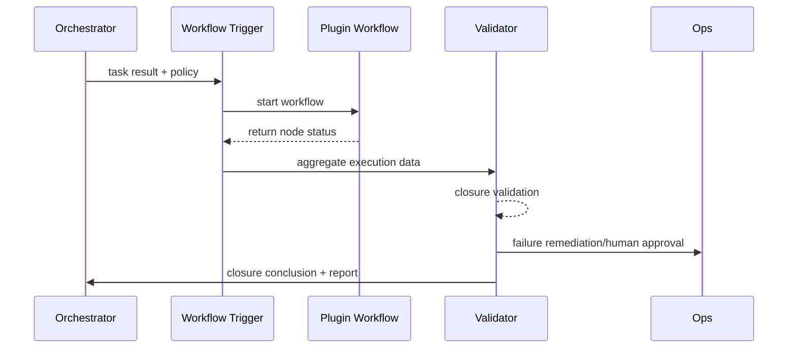

# Plugin Workflow Closure Verification

## Executive Summary

This sub-scenario ensures that the main Agent can trigger plugin workflows, verify notifications and reconciliation results after task completion, and immediately remediate or escalate alerts on failure. Target metrics: closure pass rate ≥98%, remediation process starts within 2 minutes, delivery reports and audit records cover 100%.

## Scope & Guardrails

- **In Scope**: Workflow triggering, callback/polling, closure rules, reconciliation verification, notification, remediation, report generation, metrics and alerts.
- **Out of Scope**: Plugin internal node implementation, deep logic of financial settlement systems.
- **Environment & Flags**: `workflow-trigger-kit`, `closure-verification`, `telemetry-unified-sink`; depends on plugin workflow callbacks, notification channels, audit warehouse.

## Participants & Responsibilities

| Scope | Repository | Layer | Responsibilities & Deliverables | Owners |
|-------|------------|-------|--------------------------------|--------|
| workflow-trigger | powerx | ops | Invoke plugin workflows, parameter mapping, idempotency keys | Agent Platform Guild |
| closure-validator | powerx | ops | Verify notifications, reconciliation, receipts and mandatory nodes | Ops Reliability Center |
| remediation-orchestrator | powerx | ops | Remediation scripts, human approval, escalation alerts | Ops Reliability Center |
| reporting | powerx | ops | Delivery reports, audit and user notifications | Agent Platform Guild |

## End-to-End Flow

1. **Stage 1 – Workflow Trigger**: Main Agent triggers plugin or external workflow based on policy, with delivery parameters and callback configuration.
2. **Stage 2 – Status Collection**: Plugin nodes execute approval/writing/notification and return status through callbacks or polling.
3. **Stage 3 – Closure Validation**: Verify mandatory nodes, notification receipts, and reconciliation consistency, determine success or failure level.
4. **Stage 4 – Remediation & Reporting**: Failure triggers remediation or human approval, success generates delivery report and updates monitoring.

## Key Interactions & Contracts

- **APIs / Events**: `POST /internal/agent/workflow/trigger`, `POST /plugins/{pluginId}/workflow`, `EVENT plugin.workflow.completed`, `EVENT agent.workflow.closure.failed`, `POST /notifications/agent-delivery`, `POST /audit/agent-closure-report`.
- **Configs / Schemas**: `config/agent/workflow_templates/*.yaml`, `config/agent/closure_rules.yaml`, `docs/standards/powerx-plugin/contract/agent_contract.md`.
- **Security / Compliance**: Signed callbacks, notification audit, reconciliation data masking, remediation approval trails.

## Usecase Links

- `UC-AGENT-EXEC-CLOSURE-001` — Plugin workflow closure verification.

## Acceptance Criteria

1. Closure pass rate ≥98%, all notification/reconciliation nodes provide receipts.
2. Failure triggers remediation or human approval within 2 minutes, generating high-priority alerts in Ops panel.
3. Delivery reports and audit logs cover execution results, remediation actions, user notification records.

## Telemetry & Ops

- **Metrics**: `plugin.workflow.closure_rate`, `agent.workflow.remediation_total`, `agent.workflow.callback_latency`, `agent.workflow.audit_delay`.
- **Alert Thresholds**: 3 consecutive closure failures, remediation time >5 minutes, audit write failure.
- **Observability**: Grafana「Agent Closure」, Ops closure board, `scripts/ops/closure-validation.mjs`.

## Open Issues & Follow-ups

| Risk/Item | Impact Scope | Owner | ETA |
|-----------|--------------|-------|-----|
| Inconsistent plugin callback protocols, causing validation difficulties | Multi-plugin closure reliability | Plugin Guild | 2025-03-12 |
| Reconciliation logic not aligned with financial systems | False positives/negatives | Ops Reliability Center | 2025-03-20 |

## Appendix

- `docs/scenarios/agent-orchestration/SCN-AGENT-TASK-EXEC-001.md`
- `docs/meta/scenarios/powerx/agent-and-automation/agent-orchestration/agent-task-execution/primary.md`
- `docs/standards/powerx-plugin/contract/agent_contract.md`
