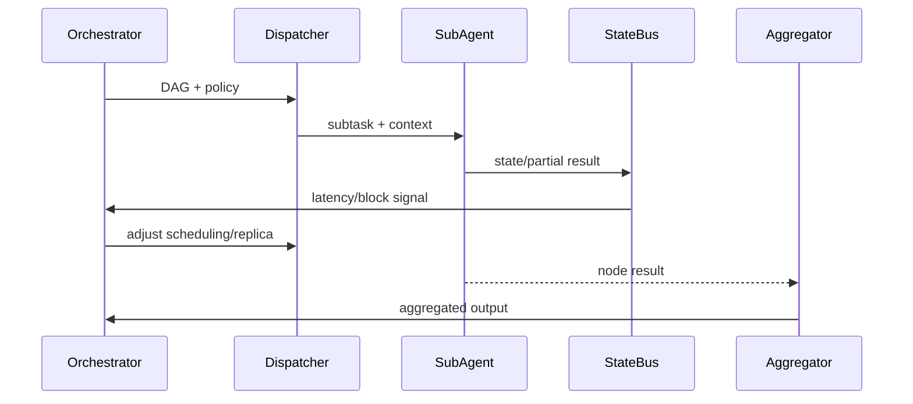

# Multi-Agent Parallel Execution & State Coordination

## Executive Summary

This sub-scenario focuses on parallel execution, status reporting, and scheduling optimization of tasks among multiple sub-Agents after Planner output. The goal is to ensure throughput and observability for complex tasks: parallel subtask success rate ≥95%, state bus latency <1 second, blocks automatically identified and mitigated.

## Scope & Guardrails

- **In Scope**: DAG parsing, sub-Agent distribution, context injection, state bus, scheduling optimization, result aggregation.
- **Out of Scope**: Failure retry/human collaboration (see recovery sub-scenario), plugin internal execution logic.
- **Environment & Flags**: `agent-orchestrator-v2`, `statebus-stream`, `scheduler-autoscale`; depends on sub-Agent registry, Kafka state bus, scheduling policy library.

## Participants & Responsibilities

| Scope | Repository | Layer | Responsibilities & Deliverables | Owners |
|-------|------------|-------|--------------------------------|--------|
| orchestrator-runtime | powerx | integration | DAG Runtime, dependency management, resource inference | Agent Platform Guild |
| sub-agent-pool | powerx | integration | Sub-Agent registration and task claiming, context injection | Agent Platform Guild |
| statebus | powerx | integration | State event push, block detection, scheduling optimization | Ops Reliability Center |

## End-to-End Flow

1. **Stage 1 – DAG Loading**: Load DAG generated by Planner, compute topology order and resource requirements.
2. **Stage 2 – Subtask Distribution**: Push tasks to sub-Agents based on tenant, permissions, and plugin availability.
3. **Stage 3 – State Sync**: Sub-Agents write progress and partial results to state bus for scheduler and monitoring consumption.
4. **Stage 4 – Scheduling Optimization & Aggregation**: Scheduler adjusts parallelism, throttling, or reordering based on state; aggregates output after all nodes complete.

## Key Interactions & Contracts

- **APIs / Events**: `POST /internal/agent/dag/{id}/execute`, `EVENT agent.task.status.updated`, `EVENT agent.task.blocked`, `POST /internal/plugins/{pluginId}/invoke`.
- **Configs / Schemas**: `config/agent/subagents.yaml`, `config/agent/scheduler_policies.yaml`, `docs/standards/powerx/backend/integration/09_agent/Agent_Metrics_and_Observability.md`.
- **Security / Compliance**: Tenant isolation, idempotent task claiming, sub-Agent credential rotation, state event masking.

## Usecase Links

- `UC-AGENT-EXEC-COORD-001` — Multi-Agent parallel execution and state coordination.

## Acceptance Criteria

1. Subtask success rate ≥95%, state sync latency <1 second.
2. Blocked tasks detected within SLA (configurable, e.g., 30 seconds), automatically trigger reordering or scaling.
3. Aggregated results written to audit and task board, avoid duplicate execution rate >0.5%.

## Telemetry & Ops

- **Metrics**: `agent.statebus.lag_ms`, `agent.task.parallelism`, `agent.task.blocked_total`, `agent.result.generation_latency`.
- **Alerts**: State latency >1s, blocked tasks >20, duplicate execution rate >0.5%.
- **Observability**: Grafana「Agent Execution」, Datadog `agent.statebus.*`, Ops task board.

## Open Issues & Follow-ups

| Risk/Item | Impact | Owner | ETA |
|-----------|--------|-------|-----|
| Sub-Agent registry not synced with plugin new versions | Task claiming failure/rollback | Plugin Guild | 2025-03-08 |
| State event schema changes not notified downstream | Metric panel anomalies | Agent Platform Guild | 2025-03-01 |

## Appendix

- `docs/scenarios/agent-orchestration/SCN-AGENT-TASK-EXEC-001.md`
- `docs/meta/scenarios/powerx/agent-and-automation/agent-orchestration/agent-task-execution/primary.md`
- `scripts/qa/dag-simulator.mjs`
