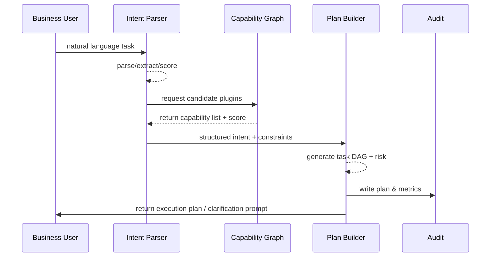

# Natural Language Task Parsing & Plugin Matching

## Executive Summary

This sub-scenario ensures that business users' natural language tasks are converted into executable task DAGs within 2 seconds and automatically matched with compliant plugin combinations. The Planner needs to output structured plans by combining capability graphs, tenant policies, and risk labels, laying the foundation for subsequent parallel execution, risk control, and closure. Success criteria: matching accuracy ≥90%, plans, risks, and plugin lists all written to audit.

## Scope & Guardrails

- **In Scope**: Intent parsing, multi-language support, entity extraction, constraint merging, plugin capability retrieval, plan generation, risk hints, audit writing.
- **Out of Scope**: Plugin implementation/testing, ReAct Prompt strategies, runtime retries, human collaboration.
- **Environment & Flags**: `agent-orchestrator-v2`, `capability-graph-service`, `telemetry-unified-sink`; depends on vector search, capability metadata, audit streams.

## Participants & Responsibilities

| Scope | Repository | Layer | Responsibilities & Deliverables | Owners |
|-------|------------|-------|--------------------------------|--------|
| nlu-core | powerx | service | Intent Parser, entity extraction, confidence evaluation | Agent Platform Guild |
| capability-graph | powerx | service | Plugin capability search, scoring, tenant availability validation | Plugin Guild |
| planner | powerx | service | Task DAG construction, constraint merging, risk annotation, audit output | Agent Platform Guild |

## End-to-End Flow

1. **Stage 1 – Input Parsing**: Parse natural language and context, output structured intents with confidence scores.
2. **Stage 2 – Constraint Merge**: Integrate tenant policies, SLA, sensitivity levels, fill in missing parameters.
3. **Stage 3 – Capability Search**: Filter candidate plugins in capability graph, combine with health signal scoring.
4. **Stage 4 – Plan Build & Audit**: Generate task DAG, node dependencies, risk and approval information, write to audit/metrics.

## Key Interactions & Contracts

- **APIs / Events**: `POST /internal/agent/intents:parse`, `POST /internal/capabilities/search`, `POST /audit/agent-plan`, `EVENT agent.plan.created`.
- **Configs / Schemas**: `config/agent/intent_rules.yaml`, `config/agent/capability_weights.yaml`, `docs/standards/powerx/backend/integration/09_agent/Agent_Adaptor_and_Transport_Spec.md`.
- **Security / Compliance**: Tenant isolation, sensitive task approval prompts, PII masking logs, immutable audit.

## Usecase Links

- `UC-AGENT-EXEC-PLAN-001` — Planner generates executable task plans and plugin matching.

## Acceptance Criteria

1. Return plan within 2 seconds on average, must provide clarification questions when confidence is low.
2. Plugin matching accuracy ≥90%, unavailable plugins automatically excluded and manual process prompted.
3. Each plan written to audit and metrics, including intent, plugin list, risk tags.

## Telemetry & Ops

- **Metrics**: `agent.plan.latency_p95`, `agent.plan.success_rate`, `agent.plan.low_confidence_total`, `agent.plan.audit_write_total`.
- **Alerts**: Plan time >5s (3 consecutive), matching failure rate >5%, audit write failure.
- **Observability**: Grafana「Agent Planner」, Datadog `planner.*`, `scripts/qa/intent-regression.mjs`.

## Open Issues & Follow-ups

| Risk/Item | Impact | Owner | ETA |
|-----------|--------|-------|-----|
| Not all plugin health signals integrated causing score fluctuations | Plugin selection accuracy | Plugin Guild | 2025-03-10 |
| Insufficient multi-language corpus, low parsing accuracy for some tenants | Internationalization experience | Agent Platform Guild | 2025-03-05 |

## Appendix

- `docs/meta/scenarios/powerx/agent-and-automation/agent-orchestration/agent-task-execution/primary.md`
- `docs/scenarios/agent-orchestration/SCN-AGENT-TASK-EXEC-001.md`
- `docs/standards/powerx/backend/integration/09_agent/Agent_Metrics_and_Observability.md`
