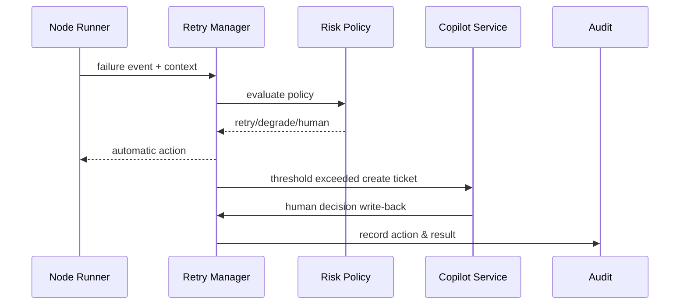

# Failure Recovery & Copilot Collaboration
## Executive Summary
This sub-scenario covers automatic retry, degradation, compensation, and human collaboration workflows after task node failures. The system needs to deliver recoverable results within 5 minutes or trigger Copilot tickets, with automatic retry success rate ≥80%, all actions having audit closure to prevent infinite retries or risk overflow.
## Scope & Guardrails
- **In Scope**: Failure detection, policy grading, retry/degrade/rollback, Copilot tickets, human decision writing-back, audit and metrics.
- **Out of Scope**: Human ticket processing details, cross-tenant data repair, external system permission approvals.
- **Environment & Flags**: `retry-manager-v2`, `copilot-handoff`, `audit-streaming`; depends on compensation script library, Ops ticket system, notification channels.
## Participants & Responsibilities
| Scope | Repository | Layer | Responsibilities & Deliverables | Owners |
|-------|------------|-------|--------------------------------|--------|
| retry-engine | powerx | ops | Retry/backoff/circuit breaking, failure statistics | Agent Platform Guild |
| recovery-coordinator | powerx | ops | Rollback, degrade scripts, compensation orchestration | Ops Reliability Center |
| copilot-service | powerx | ops | Ticket creation, context packaging, approval and notification | Ops Reliability Center |
## End-to-End Flow
1. **Stage 1 – Failure Capture**: Sub-Agent reports failure with context, error codes, retry count.
2. **Stage 2 – Policy Evaluation**: Risk engine determines whether to auto-retry, degrade, or directly human-intervene.
3. **Stage 3 – Automated Actions**: Execute retry/rollback/degrade per policy and record results.
4. **Stage 4 – Copilot Handoff**: Threshold exceeded or sensitive tasks trigger tickets, human decisions and write-back results.

## Key Interactions & Contracts
- **APIs / Events**: `EVENT agent.task.failed`, `POST /internal/agent/tasks/{id}/recover`, `POST /internal/plugins/{pluginId}/rollback`, `POST /ops/copilot/handoffs`.
- **Configs / Schemas**: `config/agent/retry_policies.yaml`, `config/agent/degrade_routes.yaml`, `docs/standards/powerx/backend/integration/09_agent/Agent_Metrics_and_Observability.md`.
- **Security / Compliance**: Ticket masking, permission validation, failure action audit, max retry threshold, idempotent compensation.
## Usecase Links
- `UC-AGENT-EXEC-RECOVERY-001` — Failure recovery and Copilot collaboration.
## Acceptance Criteria
1. Auto-retry success rate ≥80%, backoff strategy prevents infinite retries.
2. High-risk/sensitive tasks handed to Copilot within 5 minutes, human decision records reason and permissions.
3. All recovery actions written to `agent.failure.*` audit stream, providing replay capability.
## Telemetry & Ops
- **Metrics**: `agent.retry.total`, `agent.retry.success_rate`, `agent.copilot.handoff_total`, `agent.failure.mtt_recovery`.
- **Alerts**: Retry success rate <80%, Copilot ticket backlog >10, compensation script failure.
- **Observability**: Grafana「Agent Recovery」, Ops ticket panel, `scripts/runbooks/agent-retry-drills.mjs`.
## Open Issues & Follow-ups
| Risk/Item | Impact | Owner | ETA |
|-----------|--------|-------|-----|
| Copilot templates not fully masked | Data compliance | Ops Reliability Center | 2025-02-28 |
| Compensation scripts scattered across teams | Inconsistent rollback | Plugin Guild | 2025-03-15 |
## Appendix
- `docs/scenarios/agent-orchestration/SCN-AGENT-TASK-EXEC-001.md`
- `docs/meta/scenarios/powerx/agent-and-automation/agent-orchestration/agent-task-execution/primary.md`
- `scripts/qa/workflow-metrics.mjs`
