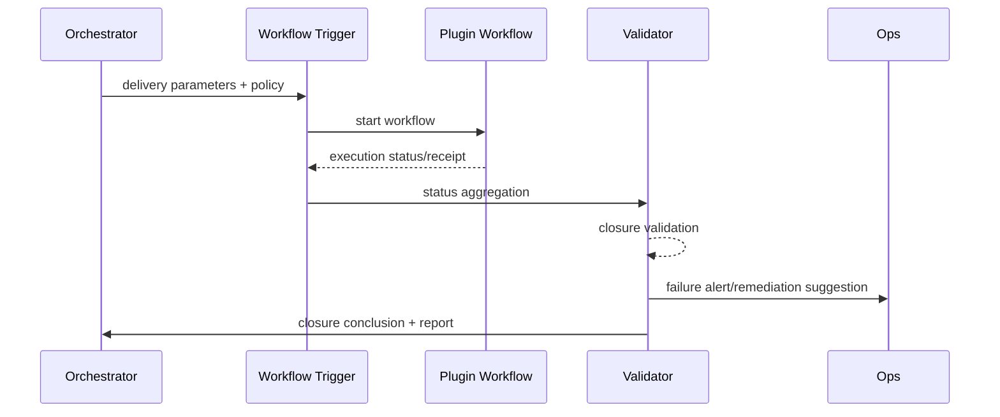

# PowerX (ops) - Plugin Workflow Closure Verification
## Usecase Overview
- **Business Goal**: After task execution, trigger complex business actions through plugin workflows, complete notifications, reconciliation, approvals and other closures, generating traceable delivery reports.
- **Success Metrics**: Closure pass rate ≥98%; notification/reconciliation failures trigger remediation within 2 minutes; monitoring and audit record coverage 100%.
- **Scenario Linkage**: Corresponds to Stage 4「Workflow Closure & Reporting」, key to task delivery value and compliance traceability.
> Through closure validation and remediation strategies, ensure every task provides clear outcomes and audit traces, avoiding "execution completed but business unaware".
## Context & Assumptions
- **Prerequisites**
  - Plugin workflows support traceable node status, receipts and remediation interfaces.
  - `workflow-trigger-kit` and `closure-verification` Feature Flags enabled.
  - Monitoring panels and audit warehouse have write permissions.
  - Notification channels (email/IM/Webhook) configured.
- **Inputs/Outputs**
  - Input: Task execution results, workflow trigger parameters, reconciliation/notification policies, tenant and user context.
  - Output: Plugin workflow execution status, closure validation results, remediation tasks, user/ops notifications, audit reports.
- **Boundaries**
  - Does not cover implementation details of each workflow node within plugins.
  - Not responsible for cross-system fund settlement, only provides reconciliation validation interfaces.
## Solution Blueprint
### System Decomposition
| Module | Responsibility | Description |
|--------|---------------|-------------|
| Workflow Trigger | Invoke plugin or external workflows | Support sync/async triggering, parameter mapping, idempotency keys. |
| Closure Validator | Validate receipts, reconciliation, notification results | Check mandatory nodes and determine success/failure levels. |
| Remediation Orchestrator | Trigger remediation processes or human approval | Resend notifications, rebuild tasks, escalate to human. |
| Reporting Builder | Aggregate execution, closure, remediation logs and generate reports | Output to users, Ops, and audit systems. |
| Metrics & Alerting | Collect closure metrics, set thresholds | Trigger Grafana/Slack alerts. |
### Process & Sequence
1. **Step 1 – Workflow Trigger**: Main Agent calls Workflow Trigger, converts execution results to plugin workflow input with reconciliation/notification policies.
2. **Step 2 – Status Callback**: Plugin nodes execute approval, writing, notification and return `workflow.callback` events or polling interfaces.
3. **Step 3 – Closure Validation**: Closure Validator checks if all mandatory nodes succeed, including notification receipts, data reconciliation, balance consistency.
4. **Step 4 – Remediation or Closure**: If validation fails, Remediation Orchestrator triggers remediation; if success, generate delivery report and notify users.
5. **Step 5 – Metrics & Audit**: Metrics module writes closure metrics, Audit builds reports and archives.

## Contracts & Interfaces
- **Inbound**: `POST /internal/agent/workflow/trigger`; `EVENT agent.task.completed` (carrying task output).
- **Outbound**: `POST /plugins/{pluginId}/workflow`; `EVENT plugin.workflow.completed`; `POST /notifications/agent-delivery`; `EVENT agent.workflow.closure.failed`; `POST /audit/agent-closure-report`.
- **Configuration/Scripts**: `config/agent/workflow_templates/*.yaml`, `config/agent/closure_rules.yaml`, `scripts/ops/closure-validation.mjs`.
## Implementation Checklist
| Item | Description | Status | Owner |
|------|-------------|--------|-------|
| Workflow templates | Template library for common tasks (reports, notifications, approvals) | [ ] | Plugin Guild |
| Closure rules | Mandatory nodes, reconciliation logic, notification matrix configuration | [ ] | Agent Platform Guild |
| Remediation strategy | Resend, human confirmation, escalation alert process scripts | [ ] | Ops Reliability Center |
| Report generation | Delivery reports, audit attachments, user notifications | [ ] | Agent Platform Guild |
| Metrics+Alerts | `plugin.workflow.closure_rate`, remediation count | [ ] | Ops Reliability Center |
## Testing Strategy
- **Unit**: Workflow trigger parameter mapping, closure rule engine, remediation strategy selection.
- **Integration**: Integrate with report/notification plugins, verify sync and async receipt paths; simulate reconciliation failure trigger remediation.
- **End-to-End**: Execute complete tasks (reports+notifications), check closure events, user notifications, audit reports.
- **Disaster**: Simulate plugin callback delays, notification failures, reconciliation differences, confirm remediation and alerts take effect.
## Observability & Ops
- **Metrics**: `plugin.workflow.closure_rate`, `agent.workflow.remediation_total`, `agent.workflow.callback_latency`, `agent.workflow.audit_delay`.
- **Logs**: Record `workflow_id`, `required_nodes`, `closure_status`, `remediation_action`, `user_notified`.
- **Alerts**: 3 consecutive closure failures, remediation time >5 minutes, audit report write failure; push to Ops on-call and business owners.
- **Dashboard**: Grafana「Agent Closure」, Ops closure board, Audit report warehouse.
## Rollback & Failure Handling
- Workflow trigger deployment supports blue-green; rollback and pause new templates if new version fails.
- Callback timeout can switch to polling or directly trigger remediation.
- When report generation fails, preserve original data and mark task as "pending supplement".
## Follow-ups & Risks
| Risk | Impact | Mitigation | ETA |
|------|--------|------------|-----|
| Inconsistent plugin callback protocols | Closure validation difficulties | Define standard callback schema and provide adapters | 2025-03-12 |
| Reconciliation logic not aligned with financial systems | False positives/negatives | Define reconciliation fields with financial interfaces and gray-validate | 2025-03-20 |
## References & Links
- Scenario Document: `docs/scenarios/agent-orchestration/SCN-AGENT-TASK-EXEC-001.md`
- Plugin Contract: `docs/standards/powerx-plugin/contract/agent_contract.md`
- Process Guide: `docs/website/zh/scenarios/meta/powerx/agent-and-automation/agent-orchestration/agent-task-execution/primary.md`
