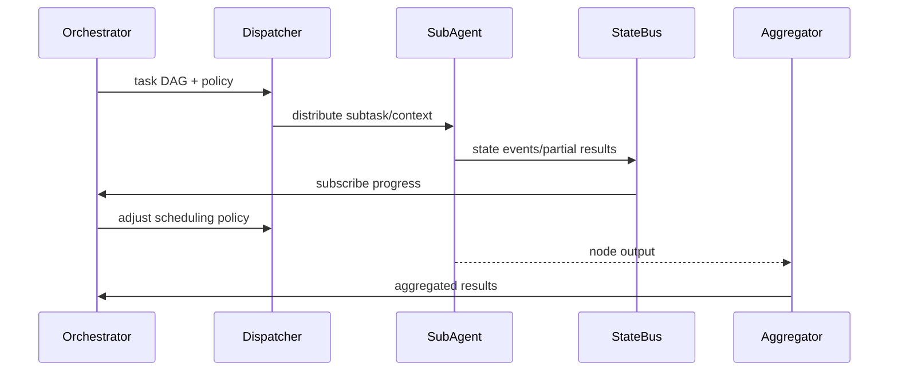

# PowerX (integration) - Multi-Agent Parallel Execution & State Coordination
## Usecase Overview
- **Business Goal**: Enable main Agent to split task DAGs to multiple sub-Agents for parallel execution, real-time status reporting and partial results, ensuring high throughput, low latency, and supporting dynamic scheduling.
- **Success Metrics**: Parallel subtask success rate ≥95%; state sync latency <1 second; blocked tasks detectable and processed within SLA; result aggregation trackable.
- **Scenario Linkage**: Implements Stage 2「Parallel Execution & State Coordination」, provides real-time status and context for subsequent failure recovery and closure validation.
> The key is the linkage between DAG and state bus, ensuring the scheduler can perform reordering, scaling, and throttling based on real-time signals.
## Context & Assumptions
- **Prerequisites**
  - State bus (Kafka/SQS or equivalent) available with `statebus-stream` Flag enabled.
  - Sub-Agent registry contains tenant, permissions, tool list and throttling policies.
  - Plugin call quotas, credentials, and trace IDs injected.
- **Inputs/Outputs**
  - Input: Task DAG from Planner, tenant context, sub-Agent pool, execution policies (priority, parallelism, throttling, idempotency keys).
  - Output: State event stream, stage results, context snapshots, blocking alerts, final merged task deliverables.
- **Boundaries**
  - Not responsible for retry strategies after failure (handled by recovery usecase).
  - Does not directly handle human collaboration.
  - Does not cover plugin internal execution logic.
## Solution Blueprint
### System Decomposition
| Component | Responsibility | Description |
|-----------|---------------|-------------|
| DAG Runtime | Parse DAG, manage dependencies and priorities | Support parallel, serial, mutex nodes and max concurrency. |
| Sub-Agent Dispatcher | Sub-Agent task distribution, context injection | Ensure tenant isolation, tool availability validation, idempotent task claiming. |
| State Bus Streamer | State event write/subscribe | Publish `agent.task.status.updated` for scheduler and monitoring consumption. |
| Rebalance Manager | Dynamic scheduling, scaling, replica coordination | Adjust task allocation based on latency, blocking, and failure rates. |
| Result Aggregator | Aggregate partial results, context and final deliverables | Output to main Agent and subsequent closure usecases. |
### Process & Sequence
1. **Step 1 – DAG Loading**: Orchestrator reads task DAG, computes initial topology order and resource requirements.
2. **Step 2 – Subtask Distribution**: Dispatcher distributes work based on tenant context and sub-Agent capabilities, inject Trace/idempotency keys.
3. **Step 3 – Status Reporting**: Sub-Agents write progress, latency, and partial results to state bus at key nodes.
4. **Step 4 – Scheduling Optimization**: Rebalance Manager consumes state events, detects blocking/timeout and performs reordering or scaling.
5. **Step 5 – Result Aggregation**: After all subtasks complete, Result Aggregator merges data and outputs.

## Contracts & Interfaces
- **Inbound**:
  - `POST /internal/agent/dag/{dag_id}/execute` — Called by Planner, receives DAG, policies, context.
  - `EVENT agent.plan.created` — Trigger auto-loading.
- **Outbound**:
  - `EVENT agent.task.status.updated` — State events, including `task_id`, `node_id`, `status`, `progress`, `latency`.
  - `POST /internal/plugins/{pluginId}/invoke` — Sub-Agent calls plugins with tenant and Trace.
  - `EVENT agent.task.blocked` — Notify Ops/scheduler layer to handle blocking.
- **Configuration/Scripts**:
  - `config/agent/subagents.yaml` — Sub-Agent capability registry.
  - `config/agent/scheduler_policies.yaml` — Parallelism, throttling, timeout policies.
  - `scripts/qa/dag-simulator.mjs` — DAG execution simulator.
## Implementation Checklist
| Item | Description | Status | Owner |
|------|-------------|--------|-------|
| DAG topology validation | Cycle detection, resource inference | [ ] | Agent Platform Guild |
| Sub-Agent authentication | Enforce tenant validation for task claiming | [ ] | Ops Reliability Center |
| State bus schema | Unified `agent.task.status.updated` payload | [ ] | Agent Platform Guild |
| Scheduling policy | Dynamic optimization based on latency/failure rate | [ ] | Agent Platform Guild |
| Aggregation logging | Result aggregation and context snapshots to audit | [ ] | Ops Reliability Center |
## Testing Strategy
- **Unit**: DAG topological sorting, priority decisions, state machine transitions, idempotent claiming.
- **Integration**: Dispatcher + real sub-Agents + state bus, verify parallel execution, blocking detection, reordering logic.
- **End-to-End**: Sandbox tasks trigger multi-plugin parallel, observe Grafana status curves and result aggregation.
- **Pressure/Chaos**: Inject partial sub-Agent failures, state event delays >3s, check scheduling degradation and throttling policies.
## Observability & Ops
- **Metrics**: `agent.statebus.lag_ms`, `agent.task.parallelism`, `agent.task.blocked_total`, `agent.task.repeat_total`, `agent.result.generation_latency`.
- **Logs**: Distribution decisions, rebalancing actions, sub-Agent allocation history, blocking reasons.
- **Alerts**: State latency >1s, blocked tasks >20, duplicate execution rate >0.5%; notify Ops on-call.
- **Dashboard**: Grafana「Agent Execution」, Ops console task board, Datadog `agent.statebus.*`.
## Rollback & Failure Handling
- DAG Runtime upgrades via blue-green switching, rollback to old version and pause new tasks on anomalies.
- State bus unavailable degrade to database polling and limit max concurrency.
- Sub-Agent batch failures trigger `agent-exec-pause` Flag, block new tasks from entering.
## Follow-ups & Risks
| Risk | Impact | Mitigation | ETA |
|------|--------|------------|-----|
| Sub-Agent registry not linked with plugin publishing | Task claiming failure | Integrate plugin health signals and version events | 2025-03-08 |
| State event schema changes not notified downstream | Metric panels affected | Publish schema versions and compatibility layers | 2025-03-01 |
## References & Links
- Scenario Document: `docs/scenarios/agent-orchestration/SCN-AGENT-TASK-EXEC-001.md`
- Plugin Health Standards: `docs/standards/powerx/backend/integration/09_agent/Agent_Metrics_and_Observability.md`
- Scheduling Runbook: `scripts/qa/workflow-metrics.mjs`
