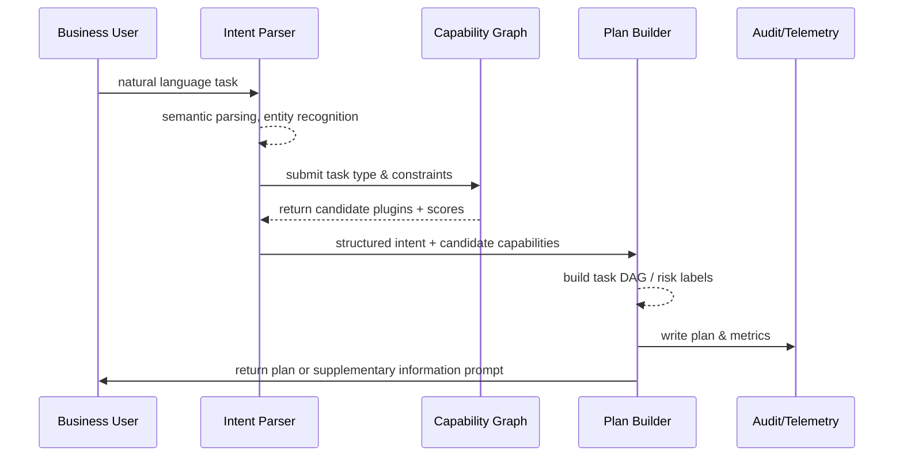

# PowerX (service) - Natural Language Task Parsing & Plugin Matching

## Usecase Overview

- **Business Goal**: Quickly convert business users' natural language instructions into structured task plans, automatically match appropriate plugin/tool combinations, and provide traceable context for subsequent parallel execution and risk control.
- **Success Metrics**: Return executable plans within 2 seconds on average; plugin matching accuracy ≥ 90%; low-confidence prompts accurately guide supplementary information; all plans written to audit.
- **Scenario Linkage**: Corresponds to main scenario Stage 1「Intent Parsing & Capability Planning」, the entry point of the task chain, directly determining subsequent execution efficiency and security boundaries.

> The Planner needs to balance NLU accuracy with capability coverage, maintaining second-level response experience while outputting auditable and controllable task DAGs.

## Context & Assumptions

- **Prerequisites**
  - `agent-orchestrator-v2` and `capability-graph-service` Feature Flags enabled.
  - Plugin metadata (version, input/output, tenant availability, sensitivity level) registered in capability graph.
  - Conversation/instruction center can provide tenant, user, language and other context fields.
  - Audit and metrics pipeline available to record Planner output and risk prompts.
- **Inputs/Outputs**
  - Input: Natural language instructions, context entities (customer, billing period, channel), historical conversation snippets, tenant policies, Feature Flags.
  - Output: Task DAG (nodes, dependencies, parameter mapping), candidate plugin list, plugin scores/confidence, risk and approval suggestions, audit record ID.
- **Boundaries**
  - Not responsible for plugin capability implementation or testing.
  - Does not cover ReAct Prompt design (handled by ReAct scenario).
  - Does not handle execution retries or human collaboration in this usecase.

## Solution Blueprint

### System Decomposition

| Component | Responsibility | Description |
|-----------|---------------|-------------|
| Intent Parser | NLU, entity extraction, confidence evaluation | Structured processing of input statements based on multi-language models + rules. |
| Constraint Extractor | Constraint identification, context merging | Extract SLA, budget, sensitivity level and other constraints, merge with tenant policies. |
| Capability Graph Service | Plugin capability retrieval and scoring | Multi-dimensional scoring based on task type, data requirements, plugin health. |
| Plan Builder | Build task DAG and step descriptions | Output node dependencies, input/output mapping, risk labeling, approval strategy. |
| Audit & Telemetry Writer | Record plans and risk metrics | Write to `agent_plan` table, publish `agent.plan.created` event. |

### Process & Sequence

1. **Step 1 – Input Parsing**: Intent Parser performs semantic analysis, entity extraction, and confidence calculation on natural language.
2. **Step 2 – Constraint Merge**: Constraint Extractor merges input constraints with tenant policies, filling missing fields.
3. **Step 3 – Capability Retrieval**: Capability Graph loads plugin candidates based on task type and context, scoring with health signals and historical success rates.
4. **Step 4 – Plan Generation**: Plan Builder generates task DAG, determines node order, call parameters, callbacks, approval strategy and risk labels.
5. **Step 5 – Output & Audit**: Planner returns plan to Orchestrator, writes to audit, metrics and risk prompts; requests user to supplement information if confidence is low.

## Contracts & Interfaces

- **Inbound**:
  - `POST /internal/agent/intents:parse` — Called by conversation/command center, includes `tenant`, `user`, `utterance`, `context`.
  - `EVENT agent.intent.created` — Prompt asynchronous Planner processing, suitable for batch requests.
- **Outbound**:
  - `POST /internal/capabilities/search` — Retrieve plugin capabilities based on task tags, data domain, tenant availability.
  - `POST /audit/agent-plan` — Write plans, risks, plugin lists.
  - `POST /notifications/agent/need-context` — Request supplementary information when confidence is too low.
- **Configuration/Scripts**:
  - `config/agent/intent_rules.yaml` — Intent templates and fallback rules.
  - `config/agent/capability_weights.yaml` — Plugin scoring factors.
  - `scripts/qa/intent-regression.mjs` — Parser regression test script.

## Implementation Checklist

| Item | Description | Status | Owner |
|------|-------------|--------|-------|
| Parser multi-language support | Introduce multi-language models and fallback rules | [ ] | Agent Platform Guild |
| Capability graph scoring | Integrate health signals, tenant whitelists | [ ] | Plugin Guild |
| Risk annotation | Support sensitive task approval prompts | [ ] | Ops Reliability Center |
| Audit output | Write plans, plugins, constraints to unified audit channel | [ ] | Agent Platform Guild |
| Low confidence supplementation | Auto-generate clarification questions and notify users | [ ] | Agent Platform Guild |

## Testing Strategy

- **Unit**: Intent parsing, entity extraction, scoring functions, DAG dependency topology validation.
- **Integration**: End-to-end Parser + Capability Graph + Plan Builder, verify normal tasks, sensitive tasks, no available plugins three paths.
- **End-to-End**: Initiate real tasks from sandbox conversation entry, check Planner output, audit logs, alert prompts.
- **Non-functional**: 200 QPS pressure test; inject Graph slow queries to verify timeout protection; Chaos simulate partial plugin health signal loss.

## Observability & Ops

- **Metrics**: `agent.plan.latency_p95`, `agent.plan.success_rate`, `agent.plan.low_confidence_total`, `agent.plan.audit_write_total`.
- **Logs**: Record `plan_id`, `intent`, `confidence`, `selected_plugins`, `risk_flags`; mask PII.
- **Alerts**: Plan time >5s (5-minute window), matching failure rate >5%, audit write failure >1%; push through Grafana + PagerDuty.
- **Dashboard**: Grafana「Agent Planner」, Datadog Trace「planner.*」, internal audit replay panel.

## Rollback & Failure Handling

- When Planner upgrade fails, can rollback to previous container image and restore old weight configuration.
- If capability graph unavailable, degrade to rule table matching or prompt manual process.
- When widespread low confidence alerts occur, enable `planner-safe-mode` to only allow whitelisted tasks through.

## Follow-ups & Risks

| Risk | Impact | Mitigation | ETA |
|------|--------|------------|-----|
| Plugin health signals not fully integrated, affecting scoring stability | Plan selection errors | Align metric fields with Plugin Guild, publish health signal SDK | 2025-03-10 |
| Insufficient multi-language support | Parsing failures for some tenants | Expand example corpus, gray launch by region | 2025-03-05 |

## References & Links

- Scenario Document: `docs/scenarios/agent-orchestration/SCN-AGENT-TASK-EXEC-001.md`
- Design Draft: `docs/meta/scenarios/powerx/agent-and-automation/agent-orchestration/agent-task-execution/primary.md`
- Related Standards: `docs/standards/powerx/backend/integration/09_agent/Agent_Adaptor_and_Transport_Spec.md`
