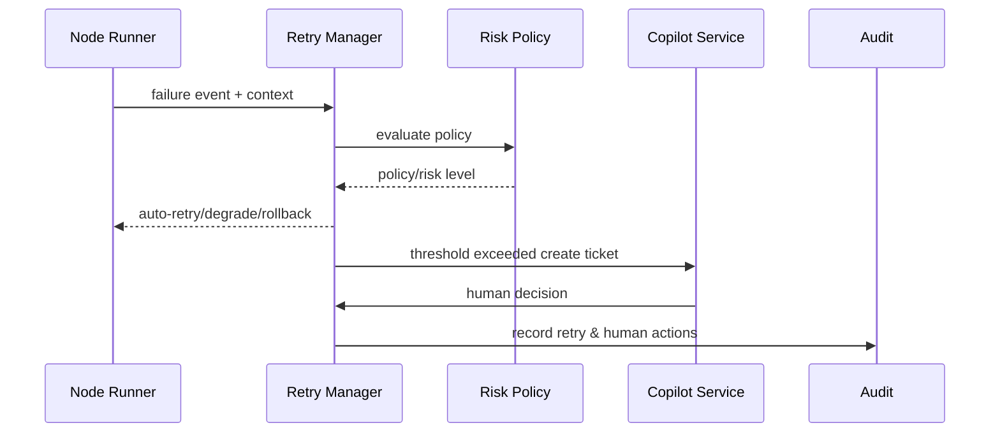

# PowerX (ops) - Failure Recovery & Copilot Collaboration

## Usecase Overview

- **Business Goal**: When subtasks fail or hit risk policies, provide governable automatic retry, rollback, degradation, and human collaboration processes to shorten recovery time and maintain full-chain audit.
- **Success Metrics**: Auto-retry success rate ≥80%; human takeover response <5 minutes; infinite retry protection effective; all actions trackable in audit.
- **Scenario Linkage**: Supports Stage 3「Failure Recovery & Human Handoff」, ensuring task execution robustness and customer experience.

> Through standardized Retry/Degrade strategies and Copilot processes, complex recovery operations are precipitated into configurable, auditable automation chains.

## Context & Assumptions

- **Prerequisites**
  - `retry-manager-v2` and `copilot-handoff` Feature Flags enabled.
  - Downstream plugins provide idempotent interfaces and callable compensation operations.
  - Ops/Copilot platform can receive auto-created tickets.
  - Audit stream `agent.failure.*` connected.
- **Inputs/Outputs**
  - Input: Failed task context (task_id, node_id, payload, error_code, retries), risk level, policy configuration.
  - Output: Auto-retry tasks, degrade/rollback actions, Copilot tickets, human decisions and audit records.
- **Boundaries**
  - Does not cover human ticket processing workflow details.
  - Not responsible for cross-tenant data repair (handled by data team).

## Solution Blueprint

### System Decomposition

| Module | Responsibility | Description |
|--------|---------------|-------------|
| Retry Manager | Auto-retry, backoff, threshold management | Support exponential backoff, priority scheduling, max attempt limits. |
| Degrade & Rollback Coordinator | Invoke compensation scripts, switch to backup flows | Can execute fallback plugins, rollback databases, initiate human confirmation. |
| Risk Policy Engine | Evaluate failure risk levels | Output handling strategy based on error codes, plugin sensitivity, tenant SLA. |
| Copilot Handoff Service | Ticket creation & collaboration | Package context, suggest actions, permission validation & notification. |
| Audit & Telemetry | Record failure events, retries, human actions | Write to `agent.failure.log` and metrics. |

### Process & Sequence

1. **Step 1 – Failure Capture**: Sub-Agent reports failure, Orchestrator pushes context to Retry Manager.
2. **Step 2 – Policy Evaluation**: Risk Policy Engine determines whether auto-retry or direct human intervention needed.
3. **Step 3 – Automated Actions**: Retry Manager executes retry/degrade/rollback per policy and records results.
4. **Step 4 – Copilot Handoff**: Threshold exceeded or high-risk triggers, Handoff Service creates tickets and notifies responsible roles.
5. **Step 5 – Approval & Convergence**: Human chooses continue, skip, or terminate, result written back to Orchestrator and update audit.

## Contracts & Interfaces

- **Inbound**: `EVENT agent.task.failed`; `POST /internal/agent/tasks/{task_id}/recover` (manually trigger recovery).
- **Outbound**: `POST /internal/plugins/{pluginId}/rollback`; `POST /ops/copilot/handoffs`; `EVENT agent.retry.executed`; `EVENT agent.task.degraded`.
- **Configuration/Scripts**: `config/agent/retry_policies.yaml`, `config/agent/degrade_routes.yaml`, `scripts/runbooks/agent-retry-drills.mjs`.

## Implementation Checklist

| Item | Description | Status | Owner |
|------|-------------|--------|-------|
| Policy matrix | Distinguish retryable/needs human/terminate error codes | [ ] | Agent Platform Guild |
| Backoff algorithm | Implement exponential backoff + jitter + max window | [ ] | Agent Platform Guild |
| Rollback script library | Key plugin compensation scripts into repository | [ ] | Plugin Guild |
| Copilot templates | Ticket templates + masked field lists | [ ] | Ops Reliability Center |
| Audit events | `agent.retry.*`, `agent.degrade.*` metrics to warehouse | [ ] | Ops Reliability Center |

## Testing Strategy

- **Unit**: Policy matrix parsing, backoff calculation, threshold counting.
- **Integration**: Simulate plugin failures, verify retry/rollback/degrade call chains; simulate Copilot approval of different operations.
- **Drills**: Quarterly execution of recovery drill scripts `agent-retry-drills.mjs`, covering key report tasks and notification tasks.
- **Chaos**: Force trigger consecutive failures, confirm no infinite retry and can auto-create tickets.

## Observability & Ops

- **Metrics**: `agent.retry.total`, `agent.retry.success_rate`, `agent.copilot.handoff_total`, `agent.failure.mtt_recovery`, `agent.degrade.trigger_total`.
- **Logs**: Record `failure_id`, `task_id`, `retry_count`, `action`, `copilot_decision`, mask sensitive payloads.
- **Alerts**: Auto-retry success rate <80%, Copilot ticket backlog >10, rollback script failures >1; notify via Ops on-call group.
- **Dashboard**: Grafana「Agent Recovery」, Ops ticket panel, Audit replay tool.

## Rollback & Failure Handling

- When Retry service anomalies, can rollback to old image or switch to conservative strategy (only record failures, no automatic actions).
- When Copilot service unavailable, issue high-priority alerts and auto-degrade to SMS/email notifications.
- When too many pending tickets, auto-enable throttling, pause new tasks from entering recovery process.

## Follow-ups & Risks

| Risk | Impact | Mitigation | ETA |
|------|--------|------------|-----|
| Copilot templates not masked | Data leakage risk | Introduce field whitelist and audit at template level | 2025-02-28 |
| Compensation scripts distributed across teams | Inconsistent rollback | Establish unified rollback script repository with automated testing | 2025-03-15 |

## References & Links

- Scenario Document: `docs/scenarios/agent-orchestration/SCN-AGENT-TASK-EXEC-001.md`
- Runbook: `scripts/qa/workflow-metrics.mjs`, `scripts/runbooks/agent-retry-drills.mjs`
- Security Standards: `docs/standards/powerx/backend/integration/09_agent/Agent_Metrics_and_Observability.md`
