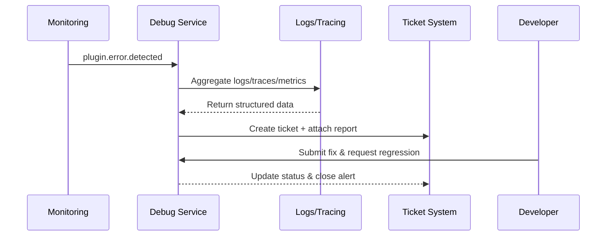

# Executive Summary

This scenario ensures that when a plugin fails, the debug tooling can aggregate cross-environment logs, traces, and context within one minute, produce a structured report, and automatically link it to the ticketing system. Sensitive fields must be masked, fallback download channels provided, and regression verification orchestrated to keep diagnostics efficient and compliant.

# Scope & Guardrails

- **In Scope**: Error capture, log/trace aggregation, report generation, ticket synchronisation, regression validation, masking and auditing.
- **Out of Scope**: Local hot-reload, sandbox dataset loading, production-grade monitoring strategy configuration.
- **Environment & Flags**: `debug-observability-v2`, `debug-ticket-bridge`; depends on logging platforms, tracing, metrics pipelines, ticketing, and audit databases.

# Participants & Responsibilities

| Scope | Repository | Layer | Responsibility | Owners |
|-------|------------|-------|----------------|--------|
| core-platform | powerx | ops | Debug tooling service, log collection, report generation, ticket synchronisation | Michael Hu (Plugin Tech Lead / tech@artisan-cloud.com) |
| security | powerx | security | Sensitive data detection & masking, access control, audit logging | Grace Lin (Security & Compliance Lead / compliance@artisan-cloud.com) |
| plugin-ecosystem | powerx-plugin | proto | Local diagnostic scripts, regression triggers, CLI integration | Michael Hu (Plugin Tech Lead / tech@artisan-cloud.com) |

# End-to-End Flow

1. **Stage 1 – Detection & trigger**: Monitoring or developers initiate a diagnostic task; the tool locates the instance and time window.
2. **Stage 2 – Data aggregation & masking**: Collect logs, traces, and metrics while applying masking and permission checks.
3. **Stage 3 – Report & ticket sync**: Generate structured reports with attachments/links and create or update the ticket automatically.
4. **Stage 4 – Regression & closure**: Developers submit fixes; the tool runs regression scripts and closes the alert once success is confirmed.

# Key Interactions & Contracts

- **APIs / Events**: `POST /internal/debug/report`, `POST /internal/debug/logs/export`, `EVENT plugin.debug.alert`, `POST /internal/ticket/create`.
- **Configs / Schemas**: `config/plugins/debug/report_template.yaml`, `config/security/data_masking_rules.yaml`.
- **Security / Compliance**: Enforce masking for sensitive fields, restrict report access, retain audit logs ≥180 days, audit fallback downloads.

# Usecase Links

- `UC-DEV-PLUGIN-ERROR-DIAGNOSTICS-001` — Debug tool error capture & log reporting.

# Acceptance Criteria

1. Diagnostic tasks yield reports within one minute, containing stack traces, request payloads, and environment context.
2. Sensitive data masking rate is 100%; log collection failures fall back to alternate channels with expiry notices.
3. Tickets auto-link to plugin, tenant, and owner; successful regression automatically closes the alert.

# Telemetry & Ops

- Metrics: `debug.report.generate_ms`, `debug.report.failure_total`, `debug.masking.violation_total`, `debug.ticket.autoclose_rate`.
- Alert thresholds: Report generation >60 seconds or masking failures trigger P1; spikes in fallback usage alert the security on-call.
- Observability sources: Debug telemetry, audit logs, ticket system webhooks, `workflow-metrics.mjs`.

# Open Issues & Follow-ups

| Risk / Item | Impact | Owner | ETA |
|-------------|--------|-------|-----|
| Timestamp skew between tracing and logs leads to missing context | Diagnostic accuracy | Michael Hu | 2025-12-10 |
| Masking rules must cover AI-generated content | Compliance risk | Grace Lin | 2025-12-18 |

# Appendix

- `docs/meta/scenarios/powerx/plugin-ecosystem/plugin-lifecycle/plugin-dev-and-debug/primary.md#子场景-c`
- `docs/standards/powerx-plugin/integration/04_security_and_compliance/Plugin_Security_Checklist.md`
