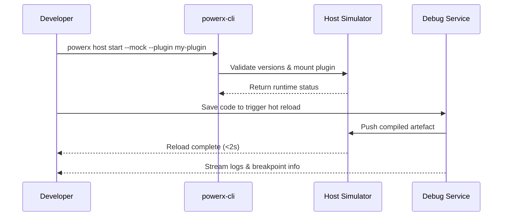

# Executive Summary

This scenario focuses on the end-to-end workflow for developers to run hot-reload and breakpoint debugging inside the official host simulator on their local machines. The objective is to make code changes effective within two seconds while capturing failures immediately. Unified CLI commands, simulator images, and debug extensions keep plugin and host APIs in sync while blocking production resource access or sensitive data leakage.

# Scope & Guardrails

- **In Scope**: Host simulator bootstrap, plugin mounting, hot-reload loop, breakpoint synchronisation, real-time logging and telemetry.
- **Out of Scope**: Sandbox deployments, dataset management, ticket workflows, production runtime monitoring.
- **Environment & Flags**: `PX_PLUGIN_HOST_SIMULATOR`, `debug-observability-v2`; relies on the simulator image registry, local log proxy, and authenticated CLI sessions.

# Participants & Responsibilities

| Scope | Repository | Layer | Responsibility | Owners |
|-------|------------|-------|----------------|--------|
| plugin-ecosystem | powerx-plugin | proto | Simulator image, hot-reload watcher, breakpoint adapters, developer CLI | Michael Hu (Plugin Tech Lead / tech@artisan-cloud.com) |
| core-platform | powerx | service | Debug event routing, permission checks, telemetry and log aggregation | Michael Hu (Plugin Tech Lead / tech@artisan-cloud.com) |

# End-to-End Flow

1. **Stage 1 – Simulator bootstrap & plugin mounting**: Developer runs `powerx host start --mock`; the system validates host version and the plugin manifest.
2. **Stage 2 – Hot-reload loop**: Debug service watches source changes, triggers incremental build, and pushes artefacts to the simulator.
3. **Stage 3 – Debugging & log capture**: Developer interacts via browser/CLI while the tool synchronises breakpoints, variable snapshots, and traces.
4. **Stage 4 – Safety guard & rollback**: Any production access or version mismatch is blocked with guidance to remediate, with rollback to the last successful artefact.

# Key Interactions & Contracts

- **APIs / Events**: `powerx host start --mock`, `powerx debug attach`, `EVENT plugin.debug.hot_reload`, `POST /internal/debug/telemetry`.
- **Configs / Schemas**: `config/plugins/debug/host_simulator.yaml`, `config/plugins/debug/hot_reload_limits.yaml`.
- **Security / Compliance**: Block production API calls, audit debug actions, mask sensitive log fields.

# Usecase Links

- `UC-DEV-PLUGIN-HOT-RELOAD-001` — Local host simulator hot-reload debugging.

# Acceptance Criteria

1. Hot-reload latency ≤2 seconds with ≥98% success rate; breakpoints are synchronised to IDEs automatically.
2. Host-plugin version mismatches abort loading and surface upgrade guidance.
3. Logs and telemetry become visible within five seconds; production resource access triggers immediate block and alert.

# Telemetry & Ops

- Metrics: `debug.hot_reload.duration_ms`, `debug.hot_reload.failure_total`, `debug.host.version_mismatch_total`.
- Alert thresholds: Hot-reload failure rate >5% notifies `plugin-dev-oncall`; repeated version mismatches prompt upgrade notices.
- Observability sources: Debug telemetry, host simulator logs, `workflow-metrics.mjs` reports.

# Open Issues & Follow-ups

| Risk / Item | Impact | Owner | ETA |
|-------------|--------|-------|-----|
| File watchers on Windows are unstable and affect reload success | Cross-platform support | Michael Hu | 2025-12-06 |
| Breakpoint sync still lacks full multi-language coverage | Debug productivity | Michael Hu | 2025-12-15 |

# Appendix

- `docs/meta/scenarios/powerx/plugin-ecosystem/plugin-lifecycle/plugin-dev-and-debug/primary.md#子场景-a`
- `docs/standards/powerx-plugin/integration/08_dev_console_and_ui/Common_Tasks_and_Troubleshooting.md`
