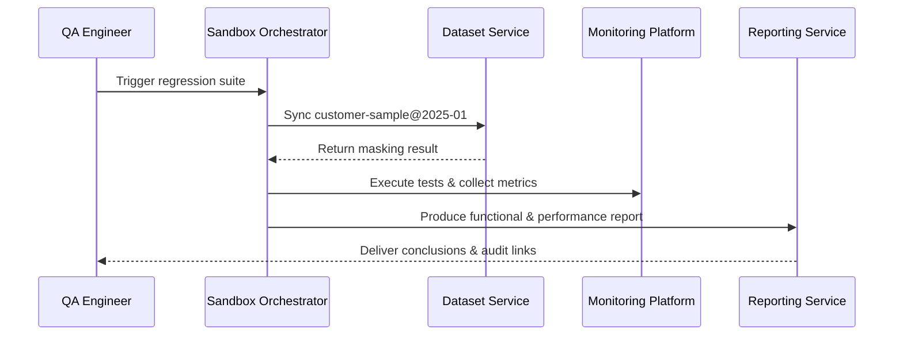

# Executive Summary

This scenario covers how plugins load desensitised datasets in sandbox tenants, run regression scripts, and produce performance and compliance reports. The goal is to finish deployment and data preparation within five minutes, achieve ≥95% coverage on critical test cases, and leave auditable traces for sensitive actions so the pre-release validation is repeatable.

# Scope & Guardrails

- **In Scope**: Sandbox resource provisioning, dataset sync and masking, automated regression execution, performance metric collection, reporting and auditing.
- **Out of Scope**: Local hot-reload, production stress tests, ticket closure, Marketplace reviews.
- **Environment & Flags**: `plugin-sandbox-suite`, `sandbox-dataset-v2`, `debug-observability-v2`; depends on sandbox resource pools, data masking services, and monitoring/logging platforms.

# Participants & Responsibilities

| Scope | Repository | Layer | Responsibility | Owners |
|-------|------------|-------|----------------|--------|
| core-platform | powerx | service | Sandbox deployment orchestration, dataset loading, automated script execution, performance monitoring | Matrix Ops (Platform Ops Lead / ops@artisan-cloud.com) |
| plugin-ecosystem | powerx-plugin | proto | Test script templates, data adapters, CLI guidance | Michael Hu (Plugin Tech Lead / tech@artisan-cloud.com) |
| security | powerx | security | Data masking policies, access control, audit logging & compliance reporting | Grace Lin (Security & Compliance Lead / compliance@artisan-cloud.com) |

# End-to-End Flow

1. **Stage 1 – Sandbox pre-check & resource provisioning**: Validate tenant quota and feature flags, pre-warm required resources.
2. **Stage 2 – Dataset sync & masking**: Load the target dataset version, perform masking/validation, and record the dataset revision.
3. **Stage 3 – Automated test execution**: Deploy the plugin, run scripted scenarios and performance baselines, collect logs and metrics.
4. **Stage 4 – Reporting & auditing**: Generate structured reports, persist audit logs, and provide rollback/retry when failures occur.

# Key Interactions & Contracts

- **APIs / Events**: `POST /internal/sandbox/deploy`, `POST /internal/sandbox/dataset/load`, `POST /internal/sandbox/test/run`, `EVENT sandbox.test.completed`.
- **Configs / Schemas**: `config/plugins/debug/data_suite.yaml`, `config/sandbox/resource_policies.yaml`, `docs/standards/powerx-plugin/integration/04_security_and_compliance/Plugin_Security_Checklist.md`.
- **Security / Compliance**: Masking failures trigger automatic rollback, audit logs retained ≥180 days, access enforced with least privilege.

# Usecase Links

- `UC-DEV-PLUGIN-SANDBOX-VALIDATION-001` — Sandbox dataset functional validation.

# Acceptance Criteria

1. Deployment plus dataset loading completes within ≤5 minutes with ≥95% pass rate on critical cases.
2. Reports include dataset version, performance metrics, and anomalies; sensitive fields are 100% masked.
3. Sandbox over-capacity or masking failures rollback automatically and notify security/ops teams.

# Telemetry & Ops

- Metrics: `sandbox.deploy.duration_ms`, `sandbox.dataset.load_failure_total`, `sandbox.test.pass_rate`, `sandbox.audit.records_total`.
- Alert thresholds: Deployment failure rate >5% or masking failures trigger P1; performance threshold breaches auto-create tickets.
- Observability sources: Sandbox orchestration logs, monitoring dashboards, `workflow-metrics.mjs`, audit services.

# Open Issues & Follow-ups

| Risk / Item | Impact | Owner | ETA |
|-------------|--------|-------|-----|
| High maintenance cost for mixed-language test scripts | Test efficiency | Michael Hu | 2025-12-12 |
| Masking policies must cover newly introduced fields | Compliance risk | Grace Lin | 2025-12-20 |

# Appendix

- `docs/meta/scenarios/powerx/plugin-ecosystem/plugin-lifecycle/plugin-dev-and-debug/primary.md#子场景-b`
- `docs/standards/powerx-plugin/integration/08_dev_console_and_ui/Common_Tasks_and_Troubleshooting.md`
