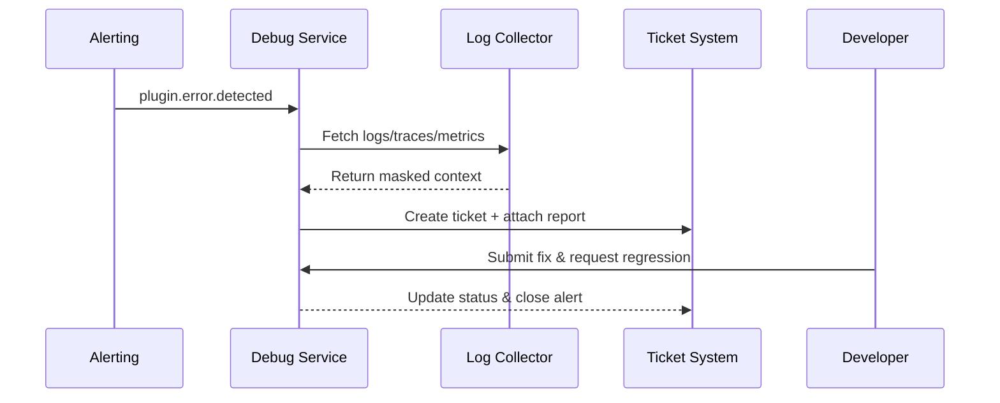

# Usecase Overview

- **Business Goal**: Automatically capture cross-environment logs, traces, and context within one minute when plugin errors occur, produce structured reports, and integrate with ticketing to give developers reproducible diagnostics.
- **Success Metrics**: Report generation time ≤60 seconds; success rate ≥98%; sensitive data masking rate 100%; automatic ticket closure rate ≥95%.
- **Scenario Alignment**: Supports Stages 3/4 of the master scenario to close the loop between diagnostics, compliance masking, and regression verification.

> Automated diagnostics plus ticket hand-off significantly shortens time-to-resolution while keeping debug data compliant.

# Context & Assumptions

- **Prerequisites**
  - Feature flags `debug-observability-v2` and `debug-ticket-bridge` are enabled.
  - Logging, tracing, and metrics platforms are available with historical retention.
  - Ticketing system exposes APIs with alert routing and owner configuration.
  - Diagnostic accounts can read sandbox/local logs under policy controls.
- **Inputs / Outputs**
  - Inputs: Error event ID, plugin/tenant metadata, diagnostic time window, regression strategy.
  - Outputs: Structured diagnostic report, masked log bundle, ticket status, regression outcome.
- **Boundaries**
  - Excludes local hot-reload and sandbox deployment flows.
  - Production monitoring strategy remains owned by Ops scenarios.

# Solution Blueprint

## Architecture Breakdown

| Layer | Key Module | Responsibility | Code Entry |
|-------|------------|----------------|-----------|
| Trigger & orchestration | `internal/debug/report/generator.go` | Accept events, create tasks, orchestrate steps | `services/debug/report` |
| Log collection | `internal/debug/logcollect/collector.go` | Aggregate logs/traces/metrics and apply masking | `services/debug/logcollect` |
| Ticket integration | `internal/debug/ticket/integrator.go` | Create/update tickets, sync status, notify owners | `services/debug/ticket` |
| Regression validation | `packages/cli/src/commands/plugin/debug.ts` | Trigger regression scripts and verify fixes | `packages/cli` |
| Telemetry & audit | `internal/debug/telemetry/report_metrics.go` | Record latency, success rate, masking compliance | `services/debug/telemetry` |

## Flow & Sequence

1. **Step 1 – Trigger diagnostic task**: Monitoring or developer API call creates a diagnostic task and confirms scope.
2. **Step 2 – Aggregate & mask data**: Collect logs, traces, and metrics, enforce masking, and validate permissions.
3. **Step 3 – Generate report & sync ticket**: Produce structured reports with attachments/links, create or update tickets, and notify owners.
4. **Step 4 – Regression & closure**: Developer submits fix; automated regression runs and, on success, closes the alert and archives audit data.

# Contracts & Interfaces

- **Inbound APIs / Events**
  - `POST /internal/debug/report` — Create diagnostic tasks.
  - `EVENT plugin.debug.alert` — Alerts that trigger diagnostics.
- **Outbound Calls**
  - `POST /internal/debug/logs/export` — Pull logs/traces from observability services.
  - `POST /internal/ticket/create`, `POST /internal/ticket/update` — Integrate with ticketing.
  - `POST /internal/debug/regression/run` — Trigger regression scripts.
- **Configs / Scripts**
  - `config/plugins/debug/report_template.yaml` — Report fields and masking policies.
  - `scripts/workflows/debug-report-smoke.mjs` — Automated diagnostic & regression script.

# Implementation Checklist

| Item | Description | Status | Owner |
|------|-------------|--------|-------|
| Log aggregation | Aggregate cross-env logs, merge traces, support fallback channels | [ ] | Michael Hu |
| Report template | Define structured fields, context attachments, masking rules | [ ] | Grace Lin |
| Ticket bridge | Auto-create/update tickets, sync status, notify owners | [ ] | Michael Hu |
| Regression automation | Wire regression scripts, validate fixes, update alerts | [ ] | Michael Hu |
| Audit & compliance | Enforce masking policies, retain audit logs, control access | [ ] | Grace Lin |

# Testing Strategy

- **Unit**: Diagnostic task state machine, log merge, masking rules, ticket API calls.
- **Integration**: Run `scripts/workflows/debug-report-smoke.mjs` to cover normal and fallback paths.
- **End-to-End**: Replay meta usecases C-1/C-2 to confirm report content, masking, and ticket closure.
- **Non-functional**: Stress-test concurrent diagnostics, observability degradation, fallback switching, long-trace replay.

# Observability & Ops

- **Metrics**: `debug.report.generate_ms`, `debug.report.failure_total`, `debug.masking.violation_total`, `debug.ticket.autoclose_rate`.
- **Logs**: Capture task ID, plugin, tenant, data sources, masking results; encrypt sensitive values.
- **Alerts**: Report latency >60 seconds or masking failures trigger P1; fallback usage spikes alert security on-call.
- **Dashboards**: Debug Diagnostics Dashboard, Ticket SLA view, audit explorer.

# Rollback & Failure Handling

- **Rollback**: Disable `debug-ticket-bridge` to revert to manual tickets; enable fallback log channels; pause automated regression.
- **Remediation**: Allow report retries, manual log bundle download, notify owners for manual investigation.
- **Data Repair**: Run `scripts/workflows/debug-report-reconcile.mjs` to reconcile diagnostic tasks and ticket states.

# Follow-ups & Risks

| Risk / Item | Impact | Mitigation | Owner | ETA |
|-------------|--------|------------|-------|-----|
| Timestamp skew between logs and traces causes missing context | Diagnostic accuracy | Introduce clock sync & alignment algorithms | Michael Hu | 2025-12-10 |
| Masking rules lag behind AI-generated content | Compliance risk | Update masking models & add manual sampling | Grace Lin | 2025-12-18 |

# References & Links

- Scenario: `docs/scenarios/plugin-lifecycle/SCN-DEV-PLUGIN-ERROR-DIAGNOSTICS-001.md`
- Master scenario: `docs/scenarios/plugin-lifecycle/SCN-DEV-PLUGIN-DEBUG-001.md`
- Background: `docs/meta/scenarios/powerx/plugin-ecosystem/plugin-lifecycle/plugin-dev-and-debug/primary.md`
- Standards: `docs/standards/powerx-plugin/integration/04_security_and_compliance/Plugin_Security_Checklist.md`
