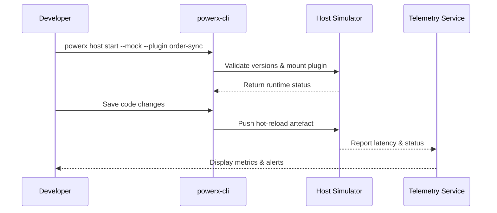

# Usecase Overview

- **Business Goal**: Enable plugin developers to achieve sub-second hot reload, breakpoint debugging, and log streaming within the local host simulator so features can be validated and defects located quickly.
- **Success Metrics**: Hot-reload latency ≤2 seconds with ≥98% success rate; breakpoint sync supports primary languages; version mismatch block rate 100%.
- **Scenario Alignment**: Supports Stage 1 “Local simulation & hot reload” of the master scenario, safeguarding iteration speed and control.

> This usecase delivers a consistent local debugging experience so changes can be verified rapidly before moving to sandbox or CI pipelines.

# Context & Assumptions

- **Prerequisites**
  - Feature flags `PX_PLUGIN_HOST_SIMULATOR` and `debug-observability-v2` are enabled.
  - Developer has logged in via CLI and holds the `plugin:debug` permission.
  - Host simulator image is version-compatible with the plugin manifest.
  - Required runtimes (Node 18, Python 3.11, etc.) are installed locally.
- **Inputs / Outputs**
  - Inputs: Plugin source code, debug configuration, host simulator version.
  - Outputs: Hot-reload result, debug logs, telemetry metrics, version validation report.
- **Boundaries**
  - Excludes sandbox deployment, dataset loading, and ticket closure flows.
  - Does not cover production stress tests or runtime monitoring.

# Solution Blueprint

## Architecture Breakdown

| Layer | Key Module | Responsibility | Code Entry |
|-------|------------|----------------|-----------|
| CLI command layer | `packages/cli/src/commands/plugin/debug.ts` | Start simulator, connect to debug service, expose commands | `packages/cli` |
| Hot-reload executor | `packages/cli/src/executors/hotReload.ts` | Watch sources, incremental compile, push artefacts | `packages/cli` |
| Simulator control | `internal/debug/host/simulator_controller.go` | Version checking, plugin mounting, permission isolation | `services/debug/host` |
| Telemetry & logging | `internal/debug/telemetry/hot_reload_metrics.go` | Capture latency/failures & raise alerts | `services/debug/telemetry` |

## Flow & Sequence

1. **Step 1 – Start simulator**: CLI validates host version, permissions, and plugin manifest, then boots the simulator and mounts the plugin.
2. **Step 2 – Hot-reload loop**: Watch source changes, run incremental build, push artefacts to the simulator, and return latency.
3. **Step 3 – Debug interaction**: Debugger syncs breakpoints, variable snapshots, and logs; developer verifies via browser/CLI.
4. **Step 4 – Audit & rollback**: Record debug events and telemetry; block and prompt fixes on version mismatches or production API calls.

# Contracts & Interfaces

- **Inbound APIs / Events**
  - CLI commands: `powerx host start --mock`, `powerx debug attach`.
  - `POST /internal/debug/hot-reload` — Accept compiled artefacts and validate version compatibility.
- **Outbound Calls**
  - `POST /internal/debug/telemetry` — Submit latency, failure reasons, breakpoint sync stats.
  - `EVENT plugin.debug.hot_reload` — Notify monitoring of hot-reload status.
- **Configs / Scripts**
  - `config/plugins/debug/host_simulator.yaml` — Host image, ports, permission policy.
  - `scripts/workflows/hot-reload-smoke.mjs` — Automated drill and regression script.

# Implementation Checklist

| Item | Description | Status | Owner |
|------|-------------|--------|-------|
| Simulator versioning | Align host API versions and surface upgrade prompts | [ ] | Michael Hu |
| Hot-reload pipeline | Implement incremental build, caching, failure rollback | [ ] | Michael Hu |
| Telemetry metrics | Capture latency, failures, block reasons and report | [ ] | Michael Hu |
| Audit & security | Block production resources, record debug actions | [ ] | Grace Lin |
| Documentation | Update developer guide and CLI help docs | [ ] | Michael Hu |

# Testing Strategy

- **Unit**: Hot-reload executor, version checks, error handling, permission blocking.
- **Integration**: Run `scripts/workflows/hot-reload-smoke.mjs` for positive and version-mismatch paths.
- **End-to-End**: Replay meta scenarios A-1/A-2 to verify browser interaction and audit logs.
- **Non-functional**: Concurrent hot reload across repos, cross-platform file systems, network retry handling.

# Observability & Ops

- **Metrics**: `debug.hot_reload.duration_ms`, `debug.hot_reload.failure_total`, `debug.host.version_mismatch_total`.
- **Logs**: Record plugin, tenant, version, latency, failure reason; mask sensitive fields.
- **Alerts**: Hot-reload failure rate >5% or repeated mismatches trigger alerts.
- **Dashboards**: Hot Reload Dashboard, debug telemetry panel, `workflow-metrics.mjs`.

# Rollback & Failure Handling

- **Rollback**: Disable `PX_PLUGIN_HOST_SIMULATOR` or revert to previous stable image; clear hot-reload cache.
- **Remediation**: Provide `powerx host rollback` to restore last successful artefact; document manual upgrade steps.
- **Data Repair**: Run `scripts/workflows/hot-reload-reconcile.mjs` to reconcile telemetry and audit records.

# Follow-ups & Risks

| Risk / Item | Impact | Mitigation | Owner | ETA |
|-------------|--------|------------|-------|-----|
| Unstable file watchers on Windows | Lower hot-reload success | Add polling fallback & docs | Michael Hu | 2025-12-06 |
| Limited multi-language breakpoint support | Reduced debug efficiency | Expand adapters & sample projects | Michael Hu | 2025-12-15 |

# References & Links

- Scenario: `docs/scenarios/plugin-lifecycle/SCN-DEV-PLUGIN-HOT-RELOAD-001.md`
- Master scenario: `docs/scenarios/plugin-lifecycle/SCN-DEV-PLUGIN-DEBUG-001.md`
- Background: `docs/meta/scenarios/powerx/plugin-ecosystem/plugin-lifecycle/plugin-dev-and-debug/primary.md`
- Standards: `docs/standards/powerx-plugin/integration/08_dev_console_and_ui/Common_Tasks_and_Troubleshooting.md`
