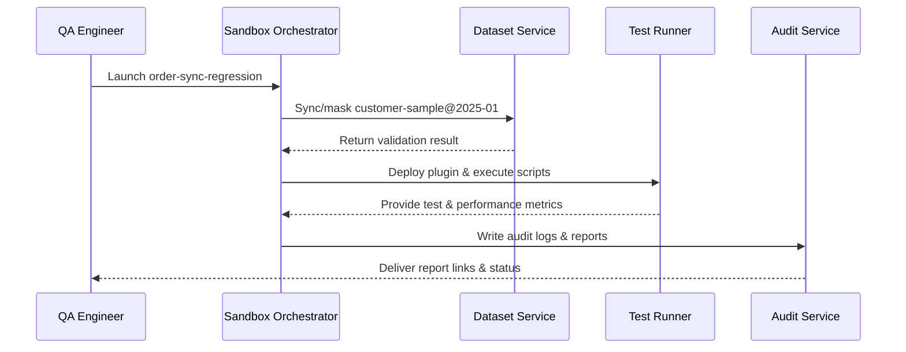

# Usecase Overview

- **Business Goal**: Provide one-click sandbox deployment and dataset loading so QA engineers can complete end-to-end regression within five minutes, cover ≥95% critical cases, and produce traceable reports.
- **Success Metrics**: Deployment + dataset loading ≤5 minutes; test pass rate ≥95%; masking failure block rate 100%; audit log completeness ≥99%.
- **Scenario Alignment**: Supports Stage 2 of the master scenario to ensure consistent data assets, performance monitoring, and compliance safeguards in sandbox validation.

> A standardised sandbox suite allows engineering teams to mirror production scenarios quickly, reduce release risk, and build performance baselines.

# Context & Assumptions

- **Prerequisites**
  - Feature flags `plugin-sandbox-suite` and `sandbox-dataset-v2` are enabled.
  - Sandbox tenant has sufficient quota and the QA account holds `sandbox:execute`.
  - Dataset service maintains the latest masked version and passes compliance checks.
  - Monitoring, logging, and audit systems are available.
- **Inputs / Outputs**
  - Inputs: Test plan ID, target plugin version, dataset version, performance thresholds.
  - Outputs: Deployment status, test report, performance metrics, audit links.
- **Boundaries**
  - Excludes local hot-reload or production load testing.
  - Ticket automation is handled by the error-diagnostics scenario.

# Solution Blueprint

## Architecture Breakdown

| Layer | Key Module | Responsibility | Code Entry |
|-------|------------|----------------|-----------|
| Deployment orchestration | `internal/sandbox/deployer/pipeline.go` | Allocate resources, deploy plugin, manage lifecycle | `services/sandbox/deployer` |
| Dataset management | `internal/sandbox/dataset/loader.go` | Sync dataset, mask data, validate versions | `services/sandbox/dataset` |
| Test execution | `internal/sandbox/testsuite/runner.go` | Run scripts, collect results, push metrics | `services/sandbox/testsuite` |
| Audit & compliance | `internal/compliance/audit/log_writer.go` | Record data access, sensitive fields, compliance reports | `services/compliance/audit` |
| CLI / Console | `packages/cli/src/commands/plugin/sandbox.ts` | Launch sandbox jobs, view reports, export logs | `packages/cli` |

## Flow & Sequence

1. **Step 1 – Sandbox job initialisation**: Validate feature flags, quota, plugin version, and test plan.
2. **Step 2 – Dataset loading & masking**: Sync target dataset version, mask data, and produce validation report.
3. **Step 3 – Automated regression execution**: Deploy plugin, run scripts, collect API and performance metrics.
4. **Step 4 – Reporting & auditing**: Generate structured reports, persist audit logs, provide download links, and support rollback/retry on failure.

# Contracts & Interfaces

- **Inbound APIs / Events**
  - `POST /internal/sandbox/deploy` — Start deployment and tests.
  - `POST /internal/sandbox/dataset/load` — Sync the specified dataset version.
- **Outbound Calls**
  - `POST /internal/monitoring/metrics` — Push performance metrics.
  - `POST /internal/compliance/audit` — Write audit records.
  - `EVENT sandbox.test.completed` — Publish results and report links.
- **Configs / Scripts**
  - `config/plugins/debug/data_suite.yaml` — Dataset/script mapping and thresholds.
  - `scripts/workflows/sandbox-regression.mjs` — Automated execution & validation script.

# Implementation Checklist

| Item | Description | Status | Owner |
|------|-------------|--------|-------|
| Deployment orchestration | Support multi-tenant queuing, quota checks, rollback | [ ] | Matrix Ops |
| Data masking | Extend template fields, detect unlabelled sensitive data | [ ] | Grace Lin |
| Test scripts | Maintain regression suites and performance baselines | [ ] | Michael Hu |
| Reporting | Produce structured reports with monitoring & audit links | [ ] | Matrix Ops |
| CLI / Console | Show progress, download reports, allow retries | [ ] | Michael Hu |

# Testing Strategy

- **Unit**: Deployment orchestration, masking validation, script scheduler, audit writer.
- **Integration**: Run `scripts/workflows/sandbox-regression.mjs` for normal and masking-failure scenarios.
- **End-to-End**: Replay meta usecases B-1/B-2 to confirm thresholds and audit logs.
- **Non-functional**: Execute 10 concurrent sandbox jobs, handle over-quota queuing, dataset version rollback.

# Observability & Ops

- **Metrics**: `sandbox.deploy.duration_ms`, `sandbox.dataset.load_failure_total`, `sandbox.test.pass_rate`, `sandbox.audit.records_total`.
- **Logs**: Capture job ID, tenant, dataset version, outcomes, exceptions; mask sensitive values.
- **Alerts**: Deployment failure rate >5% or masking failure triggers P1; pass rate below threshold creates tickets.
- **Dashboards**: Sandbox Regression Dashboard, audit explorer, `workflow-metrics.mjs`.

# Rollback & Failure Handling

- **Rollback**: Stop job, release resources, roll back dataset; provide `sandbox resume` for rerun.
- **Remediation**: Export failure report, notify data owners, allow manual data patching.
- **Data Repair**: Run `scripts/workflows/sandbox-reconcile.mjs` to reconcile jobs and audit logs.

# Follow-ups & Risks

| Risk / Item | Impact | Mitigation | Owner | ETA |
|-------------|--------|------------|-------|-----|
| High maintenance for multi-language scripts | Test efficiency | Standardise templates & sample repos | Michael Hu | 2025-12-12 |
| Masking coverage gaps | Compliance risk | Periodic field audits & automated detection | Grace Lin | 2025-12-20 |

# References & Links

- Scenario: `docs/scenarios/plugin-lifecycle/SCN-DEV-PLUGIN-SANDBOX-VALIDATION-001.md`
- Master scenario: `docs/scenarios/plugin-lifecycle/SCN-DEV-PLUGIN-DEBUG-001.md`
- Background: `docs/meta/scenarios/powerx/plugin-ecosystem/plugin-lifecycle/plugin-dev-and-debug/primary.md`
- Standards: `docs/standards/powerx-plugin/integration/04_security_and_compliance/Plugin_Security_Checklist.md`
