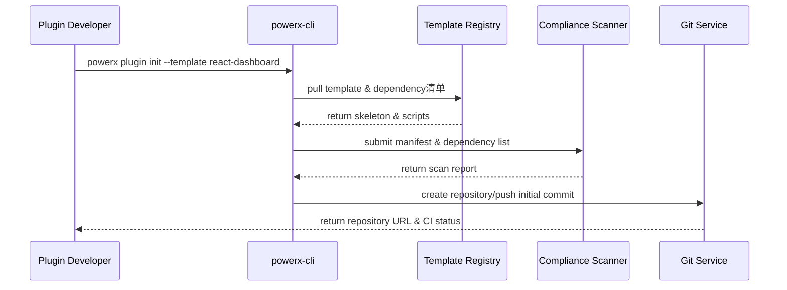

# Executive Summary

This sub-scenario describes the end-to-end experience for developers to select templates via `powerx plugin init` on the command line, generate standard projects, complete dependency installation and Git registration. The process must complete directory structure, manifest, permission declarations, test samples and CI configuration generation within 1 minute, and simultaneously trigger license and vulnerability scans. After successful execution, developers immediately obtain a base project that can be pushed to remote repositories, with unified lint/test configurations and audit records.

# Scope & Guardrails

- **In Scope**: CLI version validation, template pulling, project skeleton generation, dependency installation, Git initialization with first commit, basic scan and report output.
- **Out of Scope**: subsequent feature development, team collaborative cloning, third-party source import, Marketplace publishing.
- **Environment & Flags**: `PX_PLUGIN_SCAFFOLD_V2`, `plugin-import-audit`; requires access to template registry, npm/pip mirror, compliance scan service and Git registration API.

# Participants & Responsibilities

| Scope | Repository | Layer | Responsibilities & Deliverables | Owners |
|-------|------------|-------|--------------------------------|--------|
| plugin-ecosystem | powerx-plugin | proto | CLI parameter parsing, template version management, dependency installation scripts, example code generation | Michael Hu (Plugin Tech Lead / tech@artisan-cloud.com) |
| core-platform | powerx | service | initialization validation, Git registration, CI template distribution, audit logs & telemetry | Michael Hu (Plugin Tech Lead / tech@artisan-cloud.com) |
| security | powerx | security | license & dependency scanning, risk report generation, exemption channel management | Grace Lin (Security & Compliance Lead / compliance@artisan-cloud.com) |

# End-to-End Flow

1. **Stage 1 – CLI Environment Validation**: Developer executes `powerx plugin init`, CLI checks local version, template index and credential validity.
2. **Stage 2 – Template Selection & Project Generation**: CLI pulls template based on selected language and capabilities, generating directory structure, configuration files, example code and scripts.
3. **Stage 3 – Dependency Installation & Scan**: Automatically executes dependency installation, triggers license/vulnerability scans and returns reports,提示潜在风险与修复建议。
4. **Stage 4 – Git Registration & First Commit**: CLI initializes Git repository, creates first commit and calls platform API to register remote repository, generates CI configuration and initial branch.

# Key Interactions & Contracts

- **APIs / Events**: `powerx plugin init <template>`, `powerx plugin init --check`, `POST /internal/plugins/bootstrap/validate`, `POST /internal/compliance/licensescan`, `POST /internal/git/register`.
- **Configs / Schemas**: `config/plugins/templates/index.yaml`, `docs/standards/powerx-plugin/lifecycle/manifest-mapping.md`, `.powerxci/pipeline.yaml`.
- **Security / Compliance**: CLI requires HMAC signature verification; scan blocks high-risk dependencies; Git registration enforces minimum privilege PAT; audit events written to `audit.plugin.bootstrap`.

# Usecase Links

- `UC-DEV-PLUGIN-CLI-INIT-001` — CLI initialization of standard project with Git registration completion.

# Acceptance Criteria

1. Project generation time ≤60 seconds, directory structure and manifest meet standard validation.
2. Dependency installation & basic test scripts execute successfully, scan report shows no high-risk items or exemptions issued.
3. After Git initialization, automatically create `main` and `develop` branches, CI pipeline in ready state.

# Telemetry & Ops

- **Metrics**: `cli.init.duration_ms`, `cli.init.failure_rate`, `cli.init.template_id`, `cli.init.scan_block_count`.
- **Alert Thresholds**: initialization failure rate >5% or scan block count for 3 consecutive times triggers alert; Git registration timeout >120 seconds escalates to P1.
- **Observability Sources**: CLI telemetry, `workflow-metrics.mjs` report, compliance scan dashboard, Git Webhook audit.

# Open Issues & Follow-ups

| Risk/Issue | Impact Scope | Owner | ETA |
|-----------|--------------|-------|-----|
| Template dependency mirror unstable in offline environment, initialization prone to failure | offline/restricted network | Michael Hu | 2025-12-08 |
| Scan exemption process not fully integrated with CLI, requires manual synchronization | compliance audit | Grace Lin | 2025-12-15 |

# Appendix

- `docs/meta/scenarios/powerx/plugin-ecosystem/plugin-lifecycle/plugin-create-and-init/primary.md#sub-scenario-a`
- `docs/standards/powerx-plugin/integration/08_dev_console_and_ui/Common_Tasks_and_Troubleshooting.md`
- `docs/standards/powerx-plugin/integration/04_security_and_compliance/Plugin_Security_Checklist.md`
