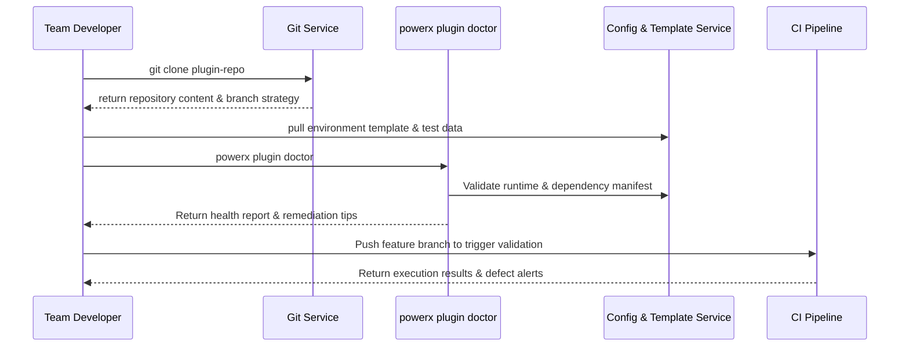

# Executive Summary

This sub-scenario focuses on team members completing dependency installation, environment variable configuration and debugging preparation within 10 minutes after cloning existing plugin repositories. Developers use `powerx plugin doctor` to automatically check language runtime, dependency locks, environment variable templates and permission configurations. The platform synchronously shares test data and coding standards, and validates whether initialization scripts were executed during first commit. The goal is to ensure consistent engineering baselines and quality assurance across member development.

# Scope & Guardrails

- **In Scope**: repository cloning, environment variable template sync, dependency installation, `plugin doctor` health check, initial branch & CI hook configuration, collaboration guard reminders.
- **Out of Scope**: CLI new project creation, third-party source import, Marketplace publishing & operational monitoring.
- **Environment & Flags**: `PX_PLUGIN_TEAM_SYNC`, `plugin-doctor-v2`; depends on internal package management, secrets management service, CI validation hooks.

# Participants & Responsibilities

| Scope | Repository | Layer | Responsibilities & Deliverables | Owners |
|-------|------------|-------|--------------------------------|--------|
| core-platform | powerx | service | `plugin doctor` checks, dependency & runtime sync, CI guard strategy, first-commit audit | Matrix Ops (Platform Ops Lead / ops@artisan-cloud.com) |
| plugin-ecosystem | powerx-plugin | proto | environment templates, sample datasets, debugging scripts, team standard prompts | Michael Hu (Plugin Tech Lead / tech@artisan-cloud.com) |

# End-to-End Flow

1. **Stage 1 – Repository Clone & Credential Validation**: Member obtains repository address, system validates permissions and synchronizes branch strategy & commit standards.
2. **Stage 2 – Environment Template Sync**: Execute `npm install` or language-specific installation scripts, while copying `.env.example`, test data and debugging scripts.
3. **Stage 3 – `plugin doctor` Check**: The CLI scans runtime versions, dependency integrity, environment variables, CLI plugins, and lint/test availability, then outputs a health report.
4. **Stage 4 – Collaboration Baseline Integration**: Generate feature branch, enable pre-commit hooks, CI validation, and push standard/risk prompts to members.

# Key Interactions & Contracts

- **APIs / Events**: `powerx plugin doctor`, `POST /internal/plugins/environments/check`, `GET /internal/config/templates/.env`, `EVENT plugin.init.audit`.
- **Configs / Schemas**: `config/plugins/team/onboarding.yaml`, `.powerxci/pre-commit.yaml`, `docs/standards/powerx-plugin/lifecycle/team-handbook.md`.
- **Security / Compliance**: cloning requires RBAC & PAT validation; environment template sensitive fields only distributed via secure channels; health check results written to audit logs and retained for 30 days.

# Usecase Links

- `UC-DEV-PLUGIN-TEAM-CLONE-001` — Team members clone plugin repository and complete environment health check.

# Acceptance Criteria

1. Clone to first `plugin doctor` completion ≤10 minutes, all critical items in report (runtime/dependency/config) pass.
2. Failed items provide executable repair suggestions and block commits (pre-commit hook takes effect).
3. CI validation triggered by first push has ≥95% pass rate, audit logs contain execution records.

# Telemetry & Ops

- **Metrics**: `doctor.run.duration_ms`, `doctor.failure_rate`, `doctor.missing_dependency_count`, `doctor.env_template_sync`.
- **Alert Thresholds**: health check failure rate >10% or missing template sync failure count >5 times/hour triggers alert; CI first failure rate >15% escalates to project owner.
- **Observability Sources**: CLI telemetry, Git Webhook, `workflow-metrics.mjs` report, CI dashboard.

# Open Issues & Follow-ups

| Risk/Issue | Impact Scope | Owner | ETA |
|-----------|--------------|-------|-----|
| `plugin doctor` detection coverage insufficient for multi-language plugins | mixed-language projects | Michael Hu | 2025-12-10 |
| Environment template updates not synchronized by members in time cause validation false positives | team collaboration experience | Matrix Ops | 2025-12-18 |

# Appendix

- `docs/meta/scenarios/powerx/plugin-ecosystem/plugin-lifecycle/plugin-create-and-init/primary.md#sub-scenario-b`
- `docs/standards/powerx-plugin/integration/08_dev_console_and_ui/Common_Tasks_and_Troubleshooting.md#doctor`
- `docs/standards/powerx-plugin/integration/03_runtime_and_ops/Quotas_RateLimits_and_Costs.md`
