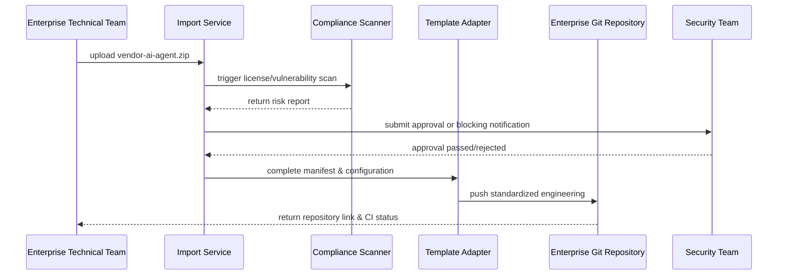

# Executive Summary

This sub-scenario addresses enterprises importing third-party vendor-provided plugin source packages within the intranet, requiring completion of upload, unpacking, license & security scans, compliance approval and template-based adaptation within 15 minutes. The platform must automatically complete PowerX-required manifest, permission configuration & CI script generation, and generate risk assessment reports. If high-risk licenses or malicious dependencies are detected, the process must forcefully block and notify the security team, ensuring imported projects are纳入统一治理与审计体系。

# Scope & Guardrails

- **In Scope**: source package upload, unpacking, license/vulnerability scanning, risk report, template refactoring, API version adaptation, Git repository registration & audit.
- **Out of Scope**: CLI local initialization, team cloning, self-developed plugin development & Marketplace publishing.
- **Environment & Flags**: `PX_PLUGIN_IMPORT`, `plugin-import-audit`, `compliance-workflow-v2`; depends on security scan service, license database, approval & notification system, enterprise Git repositories.

# Participants & Responsibilities

| Scope | Repository | Layer | Responsibilities & Deliverables | Owners |
|-------|------------|-------|--------------------------------|--------|
| security | powerx | security | source package unpacking, license & vulnerability scanning, risk assessment, approval & blocking strategy | Grace Lin (Security & Compliance Lead / compliance@artisan-cloud.com) |
| core-platform | powerx | service | adaptation wizard, manifest completion, API compatibility detection, Git registration & audit | Michael Hu (Plugin Tech Lead / tech@artisan-cloud.com) |
| plugin-ecosystem | powerx-plugin | proto | template mapping rules, missing scaffold completion, CI & test script generation | Michael Hu (Plugin Tech Lead / tech@artisan-cloud.com) |

# End-to-End Flow

1. **Stage 1 – Source Package Upload & Pre-check**: Enterprise technical team uploads `.zip` or configures repository address, system validates file source, signature & size limits.
2. **Stage 2 – Compliance Scan & Risk Assessment**: Automatically executes license, dependency vulnerability, malicious code scans, generates risk report and decides whether to enter approval.
3. **Stage 3 – Template-based Adaptation**: Refactors directory according to scan results & PowerX standards, completes manifest/permission declarations/scripts, prompts compatibility items requiring manual confirmation.
4. **Stage 4 – Repository Registration & Delivery**: After approval, automatically pushes to enterprise Git repository, generates CI configuration & audit records, and sends import summary to responsible party.

# Key Interactions & Contracts

- **APIs / Events**: `POST /internal/plugins/import`, `POST /internal/compliance/licensescan`, `POST /internal/compliance/vulnscan`, `EVENT plugin.import.blocked`, `POST /internal/git/register`.
- **Configs / Schemas**: `config/compliance/external_source_policy.yaml`, `docs/standards/powerx-plugin/lifecycle/import-checklist.md`, `docs/standards/powerx-plugin/integration/04_security_and_compliance/Plugin_Security_Checklist.md`.
- **Security / Compliance**: high-risk license/vulnerability blocked by default; approval requires dual review; audit logs retained ≥180 days; all external resources must be downloaded through whitelist.

# Usecase Links

- `UC-DEV-PLUGIN-THIRD-PARTY-IMPORT-001` — Enterprise imports third-party plugin source and completes compliance adaptation.

# Acceptance Criteria

1. Import process (upload to repository registration) ≤15 minutes, high-risk = 0 or approved exemptions provided.
2. Auto-generated engineering can directly run `npm test`, `npm run lint` (or corresponding language commands) and pass.
3. Audit records contain package source, scan results, approval chain and final repository address.

# Telemetry & Ops

- **Metrics**: `import.duration_ms`, `import.scan.block_rate`, `import.adapter.fix_count`, `import.approval.duration_ms`.
- **Alert Thresholds**: high-risk block count ≥1 triggers immediate notification to `security-oncall`; approval exceeds 30 minutes triggers escalation; template adaptation failure rate >10% requires RCA initiation.
- **Observability Sources**: compliance scan dashboard, `workflow-metrics.mjs`, Git import logs, approval system reports.

# Open Issues & Follow-ups

| Risk/Issue | Impact Scope | Owner | ETA |
|-----------|--------------|-------|-----|
| Vendor not providing SPDX清单 causing scan time too long | import efficiency | Grace Lin | 2025-12-06 |
| Auto-adaptation insufficient support for Python+Go mixed repositories, scripts need extension | template adaptation accuracy | Michael Hu | 2025-12-14 |

# Appendix

- `docs/meta/scenarios/powerx/plugin-ecosystem/plugin-lifecycle/plugin-create-and-init/primary.md#sub-scenario-c`
- `docs/standards/powerx-plugin/lifecycle/import-checklist.md`
- `docs/standards/powerx-plugin/integration/04_security_and_compliance/Vulnerability_Response.md`
