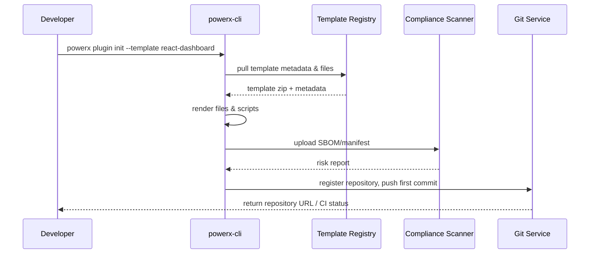

# Usecase Overview

- **Business Goal**: Provide unified CLI initialization experience for plugin developers, automatically generate standardized project skeletons, install core dependencies, integrate compliance scanning and complete Git registration, enabling new projects to enter developable state within 1 minute.
- **Success Metrics**: initialization time ≤ 60 seconds; dependency installation success rate ≥ 98%; scan block rate < 2%; first commit auto-push success rate ≥ 95%.
- **Scenario Association**: covers master scenario `SCN-DEV-PLUGIN-INIT-001` Stage 1-3, supporting CLI initialization path and providing base templates & security defense for team collaboration & third-party import.

> By linking templates, scanning and repository registration into an automated process, significantly shorten plugin project kickoff cycle and reduce compliance risks.

# Context & Assumptions

- **Prerequisites**
  - `powerx-cli` ≥ v3.2 installed, with `PX_PLUGIN_SCAFFOLD_V2` & `plugin-import-audit` Feature Flags enabled.
  - Template registry `packages/template-registry` accessible, synchronized with latest template/dependency清单。
  - Compliance scan service and Git registration API available, developer has `plugin:bootstrap` permission.
  - Node 18, Python 3.11 and other base runtimes pre-installed according to template requirements.
- **Input/Output**
  - Input: template ID, plugin name, target path, tenant/organization, language & capability options, optional third-party dependency whitelist.
  - Output: standardized directory structure, manifest/permission declarations, dependency installation results, scan report, initial Git repository & branches.
- **Boundaries**
  - Does not handle subsequent feature development, testing & deployment; does not handle third-party source import (see `UC-DEV-PLUGIN-THIRD-PARTY-IMPORT-001`).
  - Does not cover team member environment checks (handled by `UC-DEV-PLUGIN-TEAM-CLONE-001`).
  - If user refuses Git registration, only provides local initialization but does not guarantee collaboration baseline.

# Solution Blueprint

## System Decomposition

| Layer | Main Components/Modules | Responsibility | Code Entry Point |
|-------|-------------------------|----------------|------------------|
| CLI Command Layer | `packages/cli/src/commands/plugin/init.ts` | parse parameters, validate CLI version, orchestrate executors & report rendering | `packages/cli` |
| Template Management Layer | `packages/template-registry/index.yaml` | template metadata, dependency locking, post-hook definition | `packages/template-registry` |
| Executor Layer | `packages/cli/src/executors/scaffold.ts` | download/render templates, write configuration, execute hooks | `packages/cli` |
| Compliance Scan Layer | `internal/compliance/scanner/license_scanner.go` | generate SBOM, execute license/vulnerability scans, output reports | `services/compliance` |
| Repository Registration Layer | `internal/plugins/bootstrap/service/bootstrap_handler.go` | create remote repository, push first commit, generate CI configuration | `services/bootstrap` |

## Process & Sequence

1. **Step 1 – CLI Pre-check**: validate CLI version, template availability, whether target directory is empty, output repair suggestions if check fails.
2. **Step 2 – Template Rendering**: pull templates, render variables, generate manifest/permission declarations, scripts & example code.
3. **Step 3 – Dependency Installation & Scan**: execute `npm install`/`pip install` commands, generate SBOM and submit compliance scan, return risk report.
4. **Step 4 – Git Registration**: initialize Git, create initial commit, call `bootstrap_handler` to register remote repository & CI, return repository info & follow-up guidance.

# Contracts & Interfaces

- **Inbound APIs / Events**
  - CLI command: `powerx plugin init [template] [name] --lang <lang> --features ...`
  - `POST /internal/plugins/bootstrap/validate` — validate templates & tenant quotas, name conflicts, directory access.
- **Outbound Calls**
  - `POST /internal/compliance/licensescan` — submit SBOM, fields include `artifact_url`, `template_id`, `language`.
  - `POST /internal/git/register` — create remote repository & initial branch, return `repo_url`, `access_token`, `ci_config`.
  - `POST /internal/plugins/bootstrap/telemetry` — write initialization telemetry & audit.
- **Configuration & Scripts**
  - `config/plugins/templates/index.yaml` — template mapping, dependencies, language requirements.
  - `scripts/workflows/scaffold-smoke.mjs` — automatically validate initialization process & dependency installation.

# Implementation Checklist

| Item | Description | Status | Owner |
|------|-------------|--------|-------|
| Template Index Governance | establish template version & dependency locking strategy, support rollback & phased release | [ ] | Michael Hu |
| CLI Execution Chain Refactoring | modularize initialization executor, support failure rollback & idempotent retry | [ ] | Michael Hu |
| Compliance Scan Integration | complete SBOM generation, scan API integration & error fallback | [ ] | Grace Lin |
| Git Registration Pluginization | support multiple Git platforms, PAT rotation & minimum privileges | [ ] | Grace Lin |
| Telemetry & Audit | unified record of initialization time, template ID, failure categories | [ ] | Michael Hu |

# Testing Strategy

- **Unit Tests**: template variable rendering, parameter validation, error prompts; scan API call error handling.
- **Integration Tests**: execute `scripts/workflows/scaffold-smoke.mjs` in sandbox environment, validate template download, dependency installation, Git registration & scan process.
- **End-to-End Validation**: follow meta document use cases A-1/A-2 operations, confirm offline template & version-too-old fallback paths.
- **Non-functional Tests**: stress test 20 concurrent initializations, ensure CLI internal cache/lock no deadlocks; simulate network fluctuations to verify retries.

# Observability & Ops

- **Metrics**: `cli.init.duration_ms`, `cli.init.failure_total`, `cli.init.template_usage{template}`, `cli.init.scan_blocked_total`.
- **Logs**: record CLI execution phase, time consumed, template used, failure stack traces, scan result summaries; sensitive fields masked.
- **Alerts**: initialization failure rate >5% sent to `plugin-dev-oncall`; scan blocks for 3 consecutive times trigger compliance oncall notification.
- **Dashboards**: `reports/_state/workflow_metrics.json`, CLI Telemetry Dashboard, compliance scan panels.

# Rollback & Failure Handling

- **Rollback Steps**: disable `PX_PLUGIN_SCAFFOLD_V2`, rollback to previous stable template index; revoke Git registration changes and clean up audit.
- **Remediation Measures**: provide `powerx plugin init --resume` command to continue from failure stage; provide offline template package download links.
- **Data Repair**: run `scripts/workflows/scaffold-reconcile.mjs` to compare failure records with Git registration status, supplement missing repositories or clean up dirty directories.

# Follow-ups & Risks

| Risk/Issue | Impact | Mitigation | Owner | ETA |
|-----------|--------|------------|-------|-----|
| Template dependencies not friendly to domestic mirrors causing installation failures | initialization success rate decline | establish mirror proxy, add offline cache strategy | Michael Hu | 2025-12-05 |
| Scan exemption process not automatically written back to CLI | developers need manual retry | write approval results back to CLI retry queue via Webhook | Grace Lin | 2025-12-15 |

# References & Links

- Scenario Document: `docs/scenarios/plugin-lifecycle/SCN-DEV-PLUGIN-CLI-INIT-001.md`
- Master Scenario: `docs/scenarios/plugin-lifecycle/SCN-DEV-PLUGIN-INIT-001.md`
- Background Material: `docs/meta/scenarios/powerx/plugin-ecosystem/plugin-lifecycle/plugin-create-and-init/primary.md`
- Standards Document: `docs/standards/powerx-plugin/lifecycle/manifest-mapping.md`
