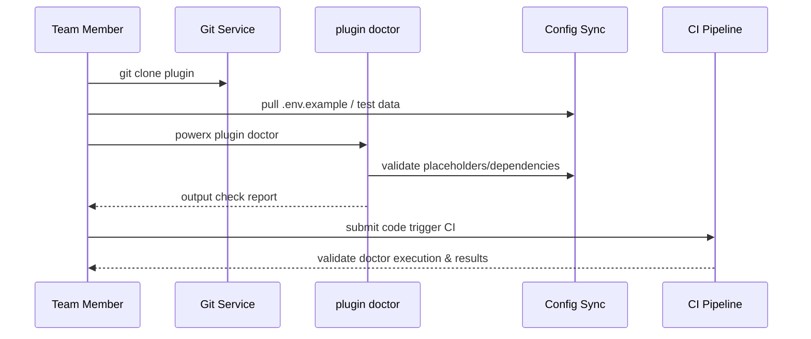

# Usecase Overview

- **Business Goal**: Enable team members to finish dependency installation, environment variable setup, and health checks within 10 minutes after cloning a plugin repository, keeping collaboration standards consistent.
- **Success Metrics**: `plugin doctor` pass rate ≥95%; environment configuration sync success rate ≥98%; first-commit CI pass rate ≥95%; average health report generation time ≤60 seconds.
- **Scenario Association**: Aligns with master scenario `SCN-DEV-PLUGIN-INIT-001` Stage 4, extending the CLI initialization into the collaboration readiness phase and establishing the baseline for ongoing delivery.

> Unified health checks & configuration synchronization ensure cross-member collaboration consistency, reducing defects & rollbacks caused by missing environment configurations.

# Context & Assumptions

- **Prerequisites**
  - `PX_PLUGIN_TEAM_SYNC`, `plugin-doctor-v2` Feature Flags enabled, Git repository registration info queryable.
  - Members have repository read/write and `plugin:doctor` permissions, configured PAT or SSO.
  - Package manager, Secrets management service & test data sources available, supporting tenant isolation.
  - Repository contains `.powerxci/` directory with built-in pre-commit hook templates & test scripts.
- **Input/Output**
  - Input: repository URL, target branch, team role, device runtime info.
  - Output: health check report, dependency installation results, environment variable fill status, pre-commit/CI enablement confirmation.
- **Boundaries**
  - Does not handle CLI initialization or third-party import; does not handle application-layer business configuration (e.g., tenant actual secrets).
  - Does not cover runtime deployment or plugin installation (handled by operational scenarios).
  - If members do not execute `plugin doctor`, CI will block merge, but this use case does not cover mandatory policy implementation.

# Solution Blueprint

## System Decomposition

| Layer | Module | Responsibility | Code Entry Point |
|-------|--------|----------------|------------------|
| Health Check Core | `internal/plugins/bootstrap/service/doctor_runner.go` | aggregate check items, execute dependency/runtime/config checks, generate reports | `services/bootstrap` |
| Config Sync Layer | `internal/plugins/bootstrap/config/env_template_sync.go` | download `.env.example`, validate placeholders, generate diff prompts | `services/bootstrap/config` |
| Git Guard Layer | `internal/plugins/bootstrap/git/pre_commit_guard.go` | distribute pre-commit, branch strategy, commit standard validation | `services/bootstrap/git` |
| Data Preparation | `scripts/dev/export-testdata.mjs` | sync example data & debugging scripts | `scripts/dev` |
| Telemetry & Audit | `internal/plugins/bootstrap/telemetry/doctor_metrics.go` | record execution time, failure reasons, member info | `services/bootstrap/telemetry` |

## Process & Sequence

1. **Step 1 – Repository Clone**: validate member permissions and download repository, copy `.powerxci/` tools & configuration templates.
2. **Step 2 – Dependency Installation**: execute `npm install` scripts, validate lock files & runtime versions.
3. **Step 3 – `plugin doctor` Check**: `doctor_runner` executes runtime, dependency, environment variable, script availability checks, generates report and writes audit.
4. **Step 4 – Guard Enablement**: based on report results, enable pre-commit hooks & CI guards, prompt items needing repair and block pushes.
5. **Step 5 – First Commit**: member fixes issues and commits code, CI validates initialization script execution and archives.

# Contracts & Interfaces

- **Inbound APIs / Events**
  - CLI command: `powerx plugin doctor --output report.json`
  - `GET /internal/plugins/bootstrap/templates/.env` — pull environment templates & placeholder descriptions.
- **Outbound Calls**
  - `POST /internal/plugins/bootstrap/doctor-report` — report check results, time consumed, failed items.
  - `POST /internal/git/hooks/install` — register pre-commit hooks & commit strategies.
  - `POST /internal/secrets/templates/audit` — record sensitive placeholder validation results.
- **Configuration & Scripts**
  - `config/plugins/team/onboarding.yaml` — team roles, required check items, responsible parties.
  - `scripts/workflows/team-onboard-smoke.mjs` — automatically drill down clone & health check process.

# Implementation Checklist

| Item | Description | Status | Owner |
|------|-------------|--------|-------|
| Check Item Extension | support multi-language runtime & dependency validation, pluggable check items | [ ] | Michael Hu |
| Report Template | enhance report readability, output categorization & repair suggestions | [ ] | Matrix Ops |
| Template Sync | automatically detect template updates and prompt member sync | [ ] | Michael Hu |
| Git Guard | pre-commit hooks & CI validation linkage, prevent unchecked pushes | [ ] | Matrix Ops |
| Telemetry Analysis | collect failure reasons, time data and establish dashboards | [ ] | Matrix Ops |

# Testing Strategy

- **Unit**: check item execution, result aggregation, report format, failure prompt coverage.
- **Integration**: Execute `scripts/workflows/team-onboard-smoke.mjs` in the sandbox to validate dependency installation, template synchronization, and hook enablement.
- **End-to-end**: Simulate new-member onboarding, follow meta use cases B-1/B-2, verify audit logging and CI blocking.
- **Non-functional**: Run 20 concurrent `plugin doctor` sessions to verify locking/cache stability; simulate network interruptions to exercise retry logic.

# Observability & Ops

- **Metrics**: `doctor.run.duration_ms`, `doctor.run.failure_total`, `doctor.check.missing_env`, `doctor.check.runtime_mismatch`.
- **Logs**: record member ID, tenant, failed items, runtime info, repair suggestions; sensitive values masked.
- **Alerts**: `doctor` failure rate >10% or template sync failure rate >5 times/hour alert; CI block cumulative >5 times trigger project owner reminder.
- **Dashboards**: Team Onboarding Dashboard, `workflow-metrics.mjs` output, CI first commit success rate panels.

# Rollback & Failure Handling

- **Rollback Steps**: Disable the `plugin-doctor-v2` flag to fall back to the previous checks and restore default pre-commit templates; clean failure caches and remove erroneous audit records.
- **Remediation Measures**: Offer `powerx plugin doctor --skip <check>` as a temporary, approval-gated bypass and publish manual remediation guidance.
- **Data Repair**: Run `scripts/workflows/doctor-reconcile.mjs` to align audit records with Git-hook status.

# Follow-ups & Risks

| Risk/Issue | Impact | Mitigation | Owner | ETA |
|-----------|--------|------------|-------|-----|
| Multi-language repository coverage insufficient causing false positives | multi-stack team collaboration blocked | add language-specific plugins & sample tests | Michael Hu | 2025-12-10 |
| Template updates not synced by members | CI blocking, debugging failures | push reminders & automatic sync hooks | Matrix Ops | 2025-12-18 |

# References & Links

- Scenario Document: `docs/scenarios/plugin-lifecycle/SCN-DEV-PLUGIN-TEAM-CLONE-001.md`
- Master Scenario: `docs/scenarios/plugin-lifecycle/SCN-DEV-PLUGIN-INIT-001.md`
- Background Material: `docs/meta/scenarios/powerx/plugin-ecosystem/plugin-lifecycle/plugin-create-and-init/primary.md`
- Standards Document: `docs/standards/powerx-plugin/integration/08_dev_console_and_ui/Common_Tasks_and_Troubleshooting.md`
