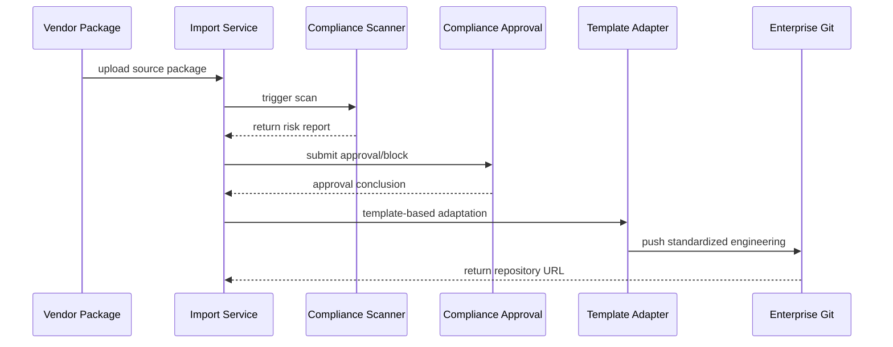

# Usecase Overview

- **Business Goal**: Enable enterprise technical teams to import third-party plugin source packages within 15 minutes while automatically completing compliance scans, risk assessment, template-based adaptation, and Git registration so that external code stays within the governed platform.
- **Success Metrics**: End-to-end import time ≤15 minutes; high-risk block timeliness 100%; compliance approval SLA ≤30 minutes; post-adaptation basic test pass rate ≥95%.
- **Scenario Association**: Aligns with master scenario `SCN-DEV-PLUGIN-INIT-001` Stages 3–4 by bridging the enterprise import workflow and establishing the security baseline for downstream development and operations.

> Automated import capabilities ensure external vendor code receives equal compliance constraints before entering enterprise repositories, reducing license & security risks.

# Context & Assumptions

- **Prerequisites**
  - Feature flags `PX_PLUGIN_IMPORT`, `plugin-import-audit`, and `compliance-workflow-v2` are enabled.
  - The compliance scanning service supports SPDX parsing and maintains up-to-date license and vulnerability databases.
  - The enterprise Git platform exposes import APIs, supports least-privilege PATs, and emits audit hooks.
  - Vendors provide the source package or repository URL plus the basic metadata (language, dependencies, licenses).
- **Input/Output**
  - Input: source package/repository address, vendor info, expected plugin ID, target tenant, approval notes.
  - Output: risk report, approval conclusion, standardized engineering structure, Git repository URL, audit entries.
- **Boundaries**
  - Vendor contracting and Marketplace distribution are handled elsewhere.
  - High-risk blocks require manual follow-up (this use case records the event but does not automatically clear it).
  - Binary-only deliverables without source code are out of scope.

# Solution Blueprint

## System Decomposition

| Layer | Module | Responsibility | Code Entry Point |
|-------|--------|----------------|------------------|
| Import Service | `internal/plugins/import/service/import_handler.go` | upload/unpack, metadata validation, process orchestration, audit writing | `services/import` |
| Compliance Scan | `internal/compliance/scanner/license_scanner.go` | SPDX parsing, license & vulnerability scanning, report generation | `services/compliance/scanner` |
| Approval Flow | `internal/compliance/approval/workflow.go` | risk rating, approval routing, blocking strategy, exemption sync | `services/compliance/approval` |
| Template Adaptation | `packages/template-registry/adapters/import_adapter.ts` | complete manifest/permissions, refactor directory, generate CI scripts | `packages/template-registry/adapters` |
| Git Integration | `internal/plugins/import/service/git_publisher.go` | register repository, push initial commit, sync CI/CD | `services/import` |

## Process & Sequence

1. **Step 1 – Upload & Pre-check**: import service validates file size, source, Hash & signature, generates import task.
2. **Step 2 – Compliance Scan**: Build an SBOM, run license and vulnerability scans, and derive risk level; high-risk findings immediately block the process and trigger notification.
3. **Step 3 – Approval Decision**: route approval according to risk level, support dual review, exemption record, time SLA monitoring.
4. **Step 4 – Template Adaptation**: after approval, call `import_adapter` to complete manifest, permission declarations, CI scripts, output diff suggestions.
5. **Step 5 – Repository Registration**: Create the enterprise Git repository, push the standardized project, generate the `README` and adaptation checklist, and persist audit records.

# Contracts & Interfaces

- **Inbound APIs / Events**
  - `POST /internal/plugins/import` — accept file upload or repository URL, return import task ID.
  - `GET /internal/plugins/import/{taskId}` — query import status, risk report, approval records.
- **Outbound Calls**
  - `POST /internal/compliance/licensescan`, `POST /internal/compliance/vulnscan` — execute license & vulnerability scans.
  - `POST /internal/compliance/approval/submit` — initiate approval, fields include risk rating, scan summary, vendor information.
  - `POST /internal/git/register` — create repository, write Branch/CI templates.
  - `EVENT plugin.import.blocked` — high-risk block notification to security team.
- **Configuration & Scripts**
  - `config/compliance/external_source_policy.yaml` — whitelist, blacklist, risk determination thresholds.
  - `scripts/workflows/import-smoke.mjs` — import process automated regression, generate simulated reports.
  - `docs/standards/powerx-plugin/lifecycle/import-checklist.md` — adaptation specifications.

# Implementation Checklist

| Item | Description | Status | Owner |
|------|-------------|--------|-------|
| Upload Link Hardening | support large file chunking, resume, signature validation | [ ] | Michael Hu |
| SPDX Parsing | extend SPDX support, supplement common vendor formats | [ ] | Grace Lin |
| Approval Automation | establish SLA monitoring, timeout escalation, exemption write-back | [ ] | Grace Lin |
| Template Adaptation Scripts | support multi-language mixed projects, diff report generation | [ ] | Michael Hu |
| Audit Reconciliation | full-chain audit of import tasks, report archiving, query interface | [ ] | Grace Lin |

# Testing Strategy

- **Unit**: import parameter validation, scan result parsing, approval state machine, adaptation script diff calculation.
- **Integration**: execute `scripts/workflows/import-smoke.mjs` in sandbox environment, cover normal & high-risk blocking paths.
- **End-to-end**: reproduce meta document use cases C-1/C-2, verify approval, blocking, audit info.
- **Non-functional**: stress test 2GB package upload, concurrent 10 import tasks; inject malicious dependencies, GPL components to verify blocking & alerting.

# Observability & Ops

- **Metrics**: `import.duration_ms`, `import.scan.blocked_total`, `import.approval.pending_total`, `import.adapter.failure_total`.
- **Logs**: record vendor, package name, risk level, approver, repository URL; sensitive fields like license details encrypted storage.
- **Alerts**: scan not started within 5 minutes triggers P1; approval timeout 30 minutes triggers escalation; blocking events immediately notify `security-oncall`.
- **Dashboards**: Import Compliance Dashboard, approval SLA panels, audit search interface.

# Rollback & Failure Handling

- **Rollback Steps**: disable `PX_PLUGIN_IMPORT`, restore manual import process; clean up incomplete import tasks and temporary files.
- **Remediation Measures**: provide `import resume` command to re-execute failure stage; manually upload scan reports and record exemptions.
- **Data Repair**: run `scripts/workflows/import-reconcile.mjs` to align import tasks, Git repositories & audit records.

# Follow-ups & Risks

| Risk/Issue | Impact | Mitigation | Owner | ETA |
|-----------|--------|------------|-------|-----|
| Vendor refuses to provide an SPDX bill of materials, causing scan delays | import time exceeds target | Pre-configure SPDX templates and allow compliance team to input metadata manually | Grace Lin | 2025-12-06 |
| Template adaptation insufficient for Python+Go mixed projects | adaptation accuracy, test pass rate | Extend adaptation scripts and test samples | Michael Hu | 2025-12-14 |

# References & Links

- Scenario Document: `docs/scenarios/plugin-lifecycle/SCN-DEV-PLUGIN-THIRD-PARTY-IMPORT-001.md`
- Master Scenario: `docs/scenarios/plugin-lifecycle/SCN-DEV-PLUGIN-INIT-001.md`
- Background Material: `docs/meta/scenarios/powerx/plugin-ecosystem/plugin-lifecycle/plugin-create-and-init/primary.md`
- Standards Document: `docs/standards/powerx-plugin/lifecycle/import-checklist.md`
