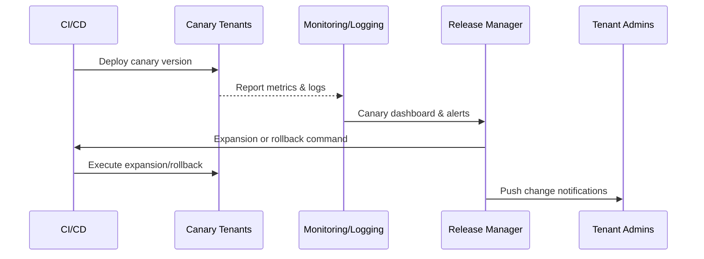

# Executive Summary

This sub-scenario focuses on the automated process of executing canary releases for approved versions in production tenants. After CI/CD completes build and signing according to the release plan, the plugin is pushed to specified canary groups, with real-time collection of performance metrics and error rates. The release manager decides on expansion or rollback based on thresholds. The goal is to complete canary verification and expansion within 30 minutes, with automatic rollback within 5 minutes when anomalies occur, ensuring SLA is not affected and establishing monitoring and alerting standards.

# Scope & Guardrails

- **In Scope**: Canary strategy configuration, deployment execution, metrics collection, rollback & expansion automation, notifications & change log sync.
- **Out of Scope**: Test tenant verification, offline import, Marketplace audit, plugin business configuration & billing processes.
- **Environment & Flags**: `publish-canary-orchestrator`, `plugin-gray-observability`, `rollback-automation`; depends on CI/CD platform, monitoring & logging systems, alert channels, tenant management API.

# Participants & Responsibilities

| Scope | Repository | Layer | Responsibilities & Deliverables | Owners |
|-------|------------|-------|--------------------------------|--------|
| core-platform | powerx | service | Canary orchestration, deployment pipeline, rolling expansion & rollback scripts, release state machine | Matrix Ops (Platform Ops Lead / ops@artisan-cloud.com) |
| ops | powerx | ops | Metrics collection, alert thresholds, runtime reports, rollback decision support | Alex Wei (Release Automation Engineer / automation@artisan-cloud.com) |
| plugin-ecosystem | powerx-plugin | ops | Health check scripts, metrics instrumentation, change logs & tenant notification templates | Michael Hu (Plugin Tech Lead / tech@artisan-cloud.com) |

# End-to-End Flow

1. **Stage 1 – Canary Preparation**: Lock release plan & canary groups, warm up monitoring dashboards & rollback strategies.
2. **Stage 2 – Canary Deployment**: CI/CD deploys plugin to canary tenant groups, performs pre-run checks and syncs metrics.
3. **Stage 3 – Observation & Decision**: Release manager monitors performance, error rates & user feedback, judges expansion or rollback.
4. **Stage 4 – Full Deployment & Archive**: After metrics meet standards, expand to full deployment, generate change logs, notifications & audit records.

# Key Interactions & Contracts

- **APIs / Events**: `powerx publish deploy --strategy canary`, `POST /internal/publish/phase/{canary,full}`, `POST /internal/publish/rollback`, `EVENT publish.gray.alert`, `EVENT publish.gray.completed`.
- **Configs / Schemas**: `config/publish/canary_strategy.yaml`, `config/monitoring/publish_dashboards.json`, `docs/standards/powerx-plugin/integration/08_dev_console_and_ui/Common_Tasks_and_Troubleshooting.md`.
- **Security / Compliance**: Release commands require approval tokens; rollback operations are fully audited; access logs & metrics data must be recorded during canary period, ensuring data retention ≥180 days.

# Usecase Links

- `UC-OPS-PLUGIN-CICD-CANARY-001` — Canary release and automatic rollback.

# Acceptance Criteria

1. Canary phase core metrics deviation <5%, error rate shows no significant increase, monitoring dashboard refreshes in real-time.
2. Rollback strategy drill passes, recovers to old version within 5 minutes of anomaly trigger and notifies relevant teams.
3. After full deployment, automatically update change logs, tenant notifications & audit records, keeping SLA metrics above baseline.

# Telemetry & Ops

- **Metrics**: `publish.gray.duration_minutes`, `publish.gray.error_rate`, `publish.gray.rollback_total`, `publish.full.deployment_minutes`.
- **Alert Thresholds**: Canary error rate >5%, metrics missing >5 minutes, rollback failure, expansion timeout >30 minutes.
- **Observability Sources**: Monitoring platform, log aggregation, CI/CD Telemetry, `workflow-metrics.mjs`.

# Open Issues & Follow-ups

| Risk/Issue | Impact Scope | Owner | ETA |
|-----------|--------------|-------|-----|
| Inconsistent metric naming with third-party monitoring, requiring standardized mapping | Canary observation consistency | Alex Wei | 2025-12-22 |
| Rollback scripts only cover single tenant, need to extend to multi-tenant concurrency | Rollback reliability | Matrix Ops | 2025-12-22 |

# Appendix

- `docs/meta/scenarios/powerx/plugin-ecosystem/plugin-lifecycle/plugin-publish-and-release/primary.md#sub-scenario-c`
- `config/publish/canary_strategy.yaml`
- `config/monitoring/publish_dashboards.json`
