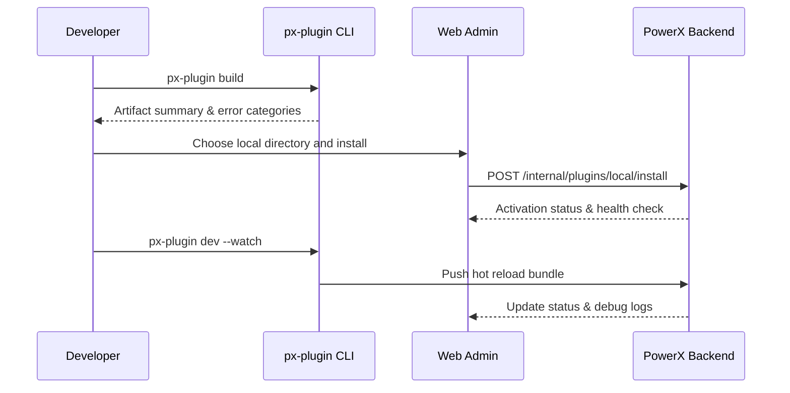

# Executive Summary

This child scenario guarantees that plugin developers can complete build → install → debug cycles within minutes before submitting a release request. Using `px-plugin build/dev` to produce artifacts and the “Install from Local Directory” entry in PowerX Web Admin, PowerX Backend activates the plugin and provides an observable debugging loop. The goal is to keep each iteration ≤15 minutes, maintain ≥97% install success, and ensure every action is auditable so that subsequent test-tenant validation and release approvals start from a stable baseline.

# Scope & Guardrails

- **In Scope**: CLI build/debug commands, local directory installation, plugin activation/reload, debug log aggregation, minimum-permission guidance.
- **Out of Scope**: Remote test-tenant deployment, production canary, Marketplace listing, plugin business logic validation.
- **Environment & Flags**: `px-plugin-local-dev`, `plugin-local-install`; requires local or intranet PowerX environment, developer CLI credentials, and debug logging service.

# Participants & Responsibilities

| Scope | Repository | Layer | Responsibilities | Owners |
|-------|------------|-------|------------------|--------|
| plugin-ecosystem | powerx-plugin | dev | CLI build/debug commands, artifact cache, hot-reload scripts, log export | Michael Hu (Plugin Tech Lead / tech@artisan-cloud.com) |
| core-platform | powerx | ops | Local install & activation APIs, permission validation, audit logging, health checks | Matrix Ops (Platform Ops Lead / ops@artisan-cloud.com) |
| admin-web | powerx-admin | app | Web Admin plugin UI, debug panel, health check visualization | Lily Zhang (Developer Experience Engineer / devexp@artisan-cloud.com) |

# End-to-End Flow

1. **Stage 1 – Build Preparation**: Run `px-plugin build/dev`, validate dependencies, and produce the debug artifact bundle.
2. **Stage 2 – Local Install**: Select the artifact directory in Web Admin; PowerX Backend validates signature & permissions then activates the plugin.
3. **Stage 3 – Debug & Hot Reload**: `px-plugin dev --watch` streams code changes, pushes hot reloads, and surfaces logs/health checks in Web Admin.
4. **Stage 4 – Archive & Submit**: Export debug logs, capture permission template diffs, and prepare assets for test-tenant submission.

# Key Interactions & Contracts

- **APIs / Events**: `px-plugin build`, `px-plugin dev --watch`, `POST /internal/plugins/local/install`, `POST /internal/plugins/local/reload`, `EVENT plugin.local.debug.updated`.
- **Configs / Schemas**: `config/plugin/local_dev.yaml`, `config/plugin/permissions_minimal.json`, `docs/standards/powerx-plugin/dev/Local_Debug_Checklist.md`.
- **Security / Compliance**: Local install requires developer credentials and minimum permission templates; debug logs must be sanitized; all actions write audit trails.

# Usecase Links

- `UC-DEV-PLUGIN-LOCAL-DEBUG-001` — Developer local debug & rapid iteration.

# Acceptance Criteria

1. Build + install iteration ≤15 minutes with actionable error categorization for failures.
2. Install enforces signature & permission template validation; audit logs capture operator, version, and timestamp.
3. Hot reload success ≥95%; debug panel exposes real-time logs, health checks, and permission hints.

# Telemetry & Ops

- Metrics: `plugin.local.iteration_cycle_time`, `plugin.local.install_success_rate`, `plugin.local.hot_reload_success_rate`.
- Alerts: Three consecutive install failures, hot reload success <95%, debug log ingestion failure >5%.
- Observability: CLI telemetry, PowerX Backend debug logs, `workflow-metrics.mjs` local mode uploads.

# Open Issues & Follow-ups

| Risk / Item | Impact | Owner | ETA |
|-------------|--------|-------|-----|
| Path handling differs across Windows/macOS | Cross-platform developer experience | Lily Zhang | 2025-12-18 |
| Permission guidance only in Chinese | International developer experience | Michael Hu | 2025-12-25 |
| Hot-reload log masking incomplete | Security & compliance | Grace Lin | 2025-12-22 |

# Appendix

- Meta design: `docs/meta/scenarios/powerx/plugin-ecosystem/plugin-lifecycle/plugin-publish-and-release/primary.md`
- Config: `config/plugin/local_dev.yaml`
- Checklist: `docs/standards/powerx-plugin/dev/Local_Debug_Checklist.md`
