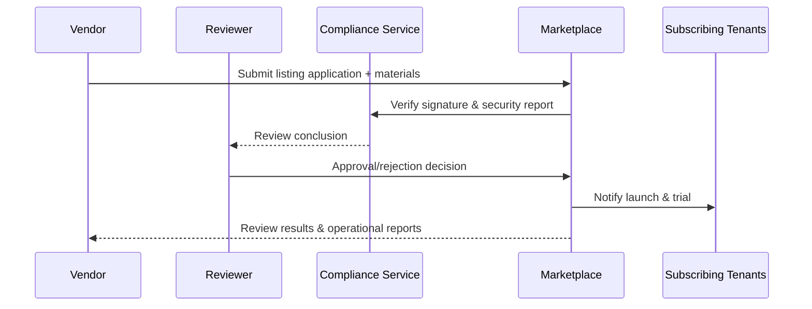

# Executive Summary

This sub-scenario focuses on the entire process of plugin review submission, compliance evaluation, listing publication, and subscription notifications on the Marketplace. The Vendor fills in pricing, feature highlights, screenshots, and support policies in the release console, submitting signatures and security reports; Marketplace reviewers verify materials, signatures, and compliance before approving and listing. The system syncs metadata, generates operational reports, and notifies subscribing tenants. The goal is to complete review within 3 working days, ensuring material consistency, valid signatures, and continuous monitoring of conversion and retention metrics.

# Scope & Guardrails

- **In Scope**: Listing application, material & signature verification, compliance review, list sync, subscription notifications, initial operational reports, audit review.
- **Out of Scope**: Marketplace billing & revenue sharing, plugin runtime configuration, external channel promotion & advertising, contract signing processes.
- **Environment & Flags**: `marketplace-review-v2`, `marketplace-metadata-sync`, `plugin-marketplace-telemetry`; depends on Marketplace management system, signature verification service, release record repository, notification service & operational reporting platform.

# Participants & Responsibilities

| Scope | Repository | Layer | Responsibilities & Deliverables | Owners |
|-------|------------|-------|--------------------------------|--------|
| marketplace | powerx-marketplace | marketplace | Review process, materials management, list display, subscription notifications, operational reports | Ivy Chen (Marketplace Operations Lead / marketplace@artisan-cloud.com) |
| security | powerx | security | Signature & security report verification, compliance checklist, audit & risk control strategies | Grace Lin (Security & Compliance Lead / compliance@artisan-cloud.com) |
| vendor-support | powerx-marketplace | marketplace | Vendor guidance, material templates, review communication & SLA tracking | Leo Wang (Vendor Success Manager / vendor@artisan-cloud.com) |

# End-to-End Flow

1. **Stage 1 – Listing Application Submission**: Vendor fills plugin metadata, pricing, support policies and uploads signatures & security reports.
2. **Stage 2 – Compliance & Signature Review**: Reviewer verifies material completeness, signature validity & security scan results, requests supplementary materials when necessary.
3. **Stage 3 – Listing & Sync**: After approval, sync Marketplace list, set visibility scope, generate notifications & initial operational reports.
4. **Stage 4 – Operations Monitoring & Feedback**: Track downloads, subscription rates & churn rates, monitor compliance risk events and align with release records.

# Key Interactions & Contracts

- **APIs / Events**: `POST /marketplace/listing/apply`, `POST /marketplace/listing/review`, `POST /marketplace/listing/publish`, `EVENT marketplace.listing.approved`, `EVENT marketplace.listing.rejected`.
- **Configs / Schemas**: `config/marketplace/listing_form.yaml`, `config/marketplace/review_checklist.yaml`, `docs/standards/powerx-plugin/integration/04_security_and_compliance/Plugin_Security_Checklist.md`.
- **Security / Compliance**: Materials must pass signature & security report verification; rejections must record reasons & handlers; review logs & operational data must align with release records and retain ≥365 days.

# Usecase Links

- `UC-DEV-PLUGIN-MARKETPLACE-LISTING-001` — Marketplace review & listing sync.

# Acceptance Criteria

1. Review SLA ≤3 working days, approval rate & rejection reasons are traceable; material deficiencies must be fed back to Vendor within 24 hours.
2. After listing, Marketplace list information matches release version, searchable, previewable and supports trial/subscription processes.
3. Review runs stably with valid security & compliance reports; rejection actions automatically record audit and notify relevant teams.

# Telemetry & Ops

- **Metrics**: `marketplace.listing.approval_rate`, `marketplace.listing.sla_hours`, `marketplace.listing.conversion_rate`, `marketplace.listing.rejection_total`.
- **Alert Thresholds**: Review SLA timeout, signature verification failure, abnormally high rejection rate, subscription conversion rate below expected threshold.
- **Observability Sources**: Marketplace review logs, operational reports, notification system, `workflow-metrics.mjs`.

# Open Issues & Follow-ups

| Risk/Issue | Impact Scope | Owner | ETA |
|-----------|--------------|-------|-----|
| Missing multilingual material templates, causing submission difficulties for international tenants | Review efficiency | Leo Wang | 2025-12-06 |
| Inconsistent security report formats, affecting automated verification | Compliance accuracy | Grace Lin | 2025-12-15 |

# Appendix

- `docs/meta/scenarios/powerx/plugin-ecosystem/plugin-lifecycle/plugin-publish-and-release/primary.md#sub-scenario-d`
- `config/marketplace/review_checklist.yaml`
- `config/marketplace/listing_form.yaml`
