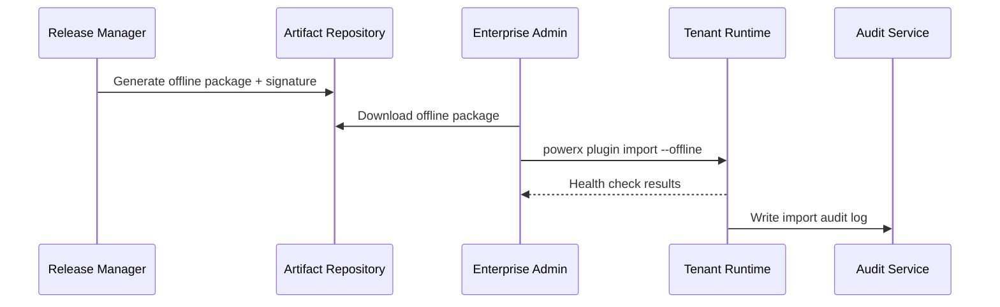

# Executive Summary

This sub-scenario targets enterprise tenants in isolated networks or low-bandwidth environments, describing the complete process from generating signed offline packages, distribution to import, health checks and audit writeback. The release manager generates offline packages containing artifacts, dependencies, and verification files in CI/CD. Enterprise administrators complete import through `powerx plugin import --offline`. The system verifies signatures and compatibility, performing health checks. The goal is to complete import within 10 minutes with success rate ≥98%, with automatic rollback on anomalies and audit log recording.

# Scope & Guardrails

- **In Scope**: Offline package generation & distribution, signature & verification, dependency packaging, import orchestration, health checks, audit & rollback.
- **Out of Scope**: Online channel push, Marketplace listing, tenant-custom deployment scripts, plugin business logic configuration.
- **Environment & Flags**: `plugin-offline-distribution`, `plugin-signature-guard`, `offline-import-healthcheck`; depends on artifact repository, signature service, intranet distribution library, audit platform.

# Participants & Responsibilities

| Scope | Repository | Layer | Responsibilities & Deliverables | Owners |
|-------|------------|-------|--------------------------------|--------|
| core-platform | powerx | ops | Offline package generation process, signature verification, import orchestration, health checks, audit logging | Matrix Ops (Platform Ops Lead / ops@artisan-cloud.com) |
| plugin-ecosystem | powerx-plugin | ops | Dependency清单, import scripts, rollback strategies, pre/post import version comparison | Michael Hu (Plugin Tech Lead / tech@artisan-cloud.com) |
| security | powerx | security | Certificate management, signature verification, license status checks, alert rules | Grace Lin (Security & Compliance Lead / compliance@artisan-cloud.com) |

# End-to-End Flow

1. **Stage 1 – Offline Package Generation & Distribution**: CI/CD generates signed offline packages, verification files & dependency manifests, uploading to intranet distribution library.
2. **Stage 2 – Import Preparation & Verification**: Enterprise administrator downloads package, verifies signature fingerprint, version compatibility & license status.
3. **Stage 3 – Import & Deployment**: Execute offline import command, system unzips, deploys and runs health check scripts.
4. **Stage 4 – Enable & Audit**: Confirm service status, enable new version, record importer/time/fingerprint, automatically rollback on failure.

# Key Interactions & Contracts

- **APIs / Events**: `powerx publish package --offline`, `powerx plugin import --offline`, `POST /internal/offline/signature/verify`, `EVENT plugin.offline.rollback`.
- **Configs / Schemas**: `config/publish/offline_package.json`, `config/plugins/offline/dependencies.yaml`, `scripts/healthcheck/offline-import.mjs`.
- **Security / Compliance**: Offline packages must be signed with certificate fingerprint; imports must record operator & time; automatic rollback & alert on failure; license validity verification cannot be skipped.

# Usecase Links

- `UC-OPS-PLUGIN-OFFLINE-IMPORT-001` — Offline package generation & isolated environment import.

# Acceptance Criteria

1. Offline import success rate ≥98%, total time <10 minutes, all health checks must pass before enable.
2. Process terminates on signature or license verification failure, old version keeps running and sends security alerts.
3. Audit logs contain importer, time, version, certificate fingerprint & rollback results, logs retain ≥180 days.

# Telemetry & Ops

- **Metrics**: `publish.offline.package_generated_total`, `publish.offline.import_success_rate`, `publish.offline.rollback_total`, `publish.offline.healthcheck_duration_ms`.
- **Alert Thresholds**: Signature verification failure, import failure rate >2%, health check timeout >5 minutes, rollback triggered consecutively 2 times.
- **Observability Sources**: CI/CD artifact logs, offline distribution library audit, tenant runtime logs, `workflow-metrics.mjs`.

# Open Issues & Follow-ups

| Risk/Issue | Impact Scope | Owner | ETA |
|-----------|--------------|-------|-----|
| Large package downloads take long, need to support resumable downloads & incremental packages | Isolated environment import efficiency | Matrix Ops | 2025-12-18 |
| Some tenants lack unified health check scripts, need to provide standard templates | Enable acceptance | Erin Xu | 2025-12-08 |

# Appendix

- `docs/meta/scenarios/powerx/plugin-ecosystem/plugin-lifecycle/plugin-publish-and-release/primary.md#sub-scenario-b`
- `config/publish/offline_package.json`
- `scripts/healthcheck/offline-import.mjs`
