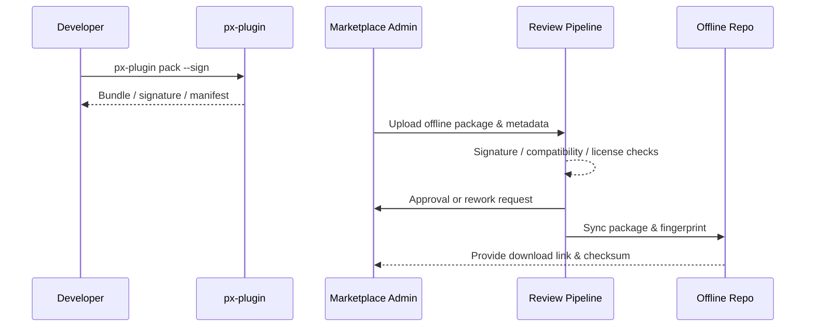

# Executive Summary

This child scenario enables vendors operating in isolated or low-bandwidth environments to submit plugin versions to the Marketplace via offline packages. Developers produce a signed `.pxp` bundle with `px-plugin pack`, Marketplace admins upload it through the offline console, and the review pipeline validates signatures, compatibility matrices, and license status before synchronizing to the offline distribution repository. Targets: ≥99% signature pass rate, <5% rework, review SLA ≤2 business days, keeping offline distribution aligned with online safety and compliance baselines.

# Scope & Guardrails

- **In Scope**: Offline bundle creation, signing and validation, rework workflow, Marketplace registration, offline repository sync, audit & alerts.
- **Out of Scope**: Online publish, production tenant import, billing/settlement.
- **Environment & Flags**: `plugin-offline-package`, `marketplace-offline-upload`; depends on signing service, license service, offline distribution repository, Marketplace review system.

# Participants & Responsibilities

| Scope | Repository | Layer | Responsibilities | Owners |
|-------|------------|-------|------------------|--------|
| plugin-ecosystem | powerx-plugin | ops | Offline packaging scripts, signatures, dependency manifests, metadata | Michael Hu (Plugin Tech Lead / tech@artisan-cloud.com) |
| marketplace | powerx-marketplace | marketplace | Upload UI, review workflow, rework guidance, repository sync | Ivy Chen (Marketplace Operations Lead / marketplace@artisan-cloud.com) |
| security | powerx | security | Signature & license validation, compatibility matrix checks, audit records | Grace Lin (Security & Compliance Lead / compliance@artisan-cloud.com) |

# End-to-End Flow

1. **Stage 1 – Bundle & Sign**: Run `px-plugin pack` to produce `.pxp` package, signature, dependency manifest, and release notes.
2. **Stage 2 – Offline Upload**: Marketplace admin uploads the package via `px-market`, fills metadata, and binds compatibility info.
3. **Stage 3 – Review & Rework**: Review pipeline validates signature, compatibility, license; issues rework tasks where needed.
4. **Stage 4 – Repository Sync**: Upon approval, version records are stored and synced to the offline distribution repository with fingerprints.

# Key Interactions & Contracts

- **APIs / Events**: `px-plugin pack`, `POST /marketplace/offline/upload`, `POST /marketplace/review/offline`, `EVENT marketplace.offline.review.status`.
- **Configs / Schemas**: `config/publish/offline_package.json`, `config/marketplace/offline_upload.yaml`, `docs/standards/powerx-plugin/publish/Offline_Package_Checklist.md`.
- **Security / Compliance**: Mandatory signature & license checks; rework reasons audited; offline repository fingerprints retained ≥180 days.

# Usecase Links

- `UC-DEV-PLUGIN-OFFLINE-MARKETPLACE-001` — Offline package submission & Marketplace intake.

# Acceptance Criteria

1. Signature and license validations succeed ≥99%; compatibility coverage 100%.
2. Rework rate <5% with response within 1 business day; review SLA ≤2 business days.
3. Offline repository sync delay ≤30 minutes with traceable fingerprints and audit logs.

# Telemetry & Ops

- Metrics: `marketplace.offline.upload_success_rate`, `marketplace.offline.review_sla_hours`, `marketplace.offline.rework_rate`.
- Alerts: Signature failure >1%, review SLA breach, rework rate >5%, repository sync failures.
- Observability: Marketplace review logs, signature/license services, offline repo monitoring, `workflow-metrics.mjs`.

# Open Issues & Follow-ups

| Risk / Item | Impact | Owner | ETA |
|-------------|--------|-------|-----|
| Air-gapped clients need offline signature validation | Isolated deployments | Michael Hu | 2025-12-19 |
| Rework emails lack templates, raising ops overhead | Review efficiency | Ivy Chen | 2025-12-16 |
| EU data compliance rules missing from license checks | International rollout | Grace Lin | 2025-12-28 |

# Appendix

- Meta design: `docs/meta/scenarios/powerx/plugin-ecosystem/plugin-lifecycle/plugin-publish-and-release/primary.md`
- Config: `config/publish/offline_package.json`
- Checklist: `docs/standards/powerx-plugin/publish/Offline_Package_Checklist.md`
