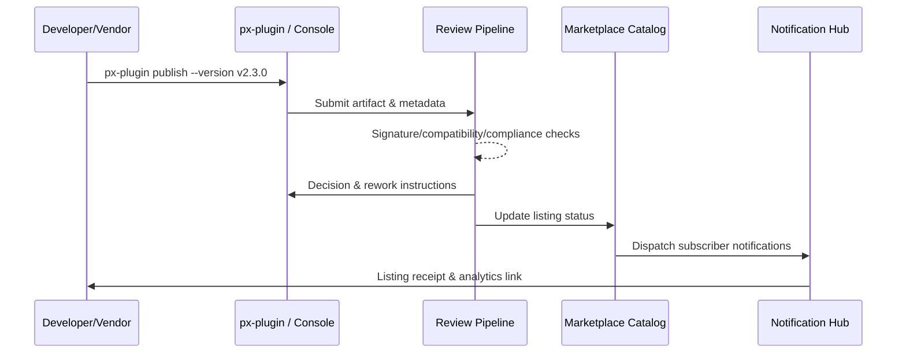

# Executive Summary

This child scenario covers vendors publishing plugins directly via online channels. Developers submit artifacts, pricing, and support policies through `px-plugin publish` or the management console; the Marketplace review pipeline validates signatures, compatibility, security, and compliance. Upon approval, listings go live instantly and notify subscribed tenants. Targets: ≥99% publish success, review SLA ≤2 business days, notification latency ≤5 minutes, with full traceability back to release records.

# Scope & Guardrails

- **In Scope**: Online publish command, metadata collection, automated review, version diffing, notifications, initial analytics.
- **Out of Scope**: Offline upload, production canary rollout, billing/settlement flows.
- **Environment & Flags**: `plugin-online-publish`, `marketplace-review-v2`; relies on Marketplace review system, signing & security scans, notification hub.

# Participants & Responsibilities

| Scope | Repository | Layer | Responsibilities | Owners |
|-------|------------|-------|------------------|--------|
| plugin-ecosystem | powerx-plugin | ops | `px-plugin publish`, metadata template validation, notification triggers | Alex Wei (Release Automation Engineer / automation@artisan-cloud.com) |
| marketplace | powerx-marketplace | marketplace | Review workflow, listing sync, subscriber outreach, analytics | Ivy Chen (Marketplace Operations Lead / marketplace@artisan-cloud.com) |
| ops | powerx | ops | Release record linkage, version diff, audit logging, alerting & rollback | Matrix Ops (Platform Ops Lead / ops@artisan-cloud.com) |

# End-to-End Flow

1. **Stage 1 – Submission**: Developer submits artifact reference, release notes, pricing, and support information via CLI or console.
2. **Stage 2 – Automated Checks**: Review pipeline runs signature, compatibility, security, and compliance validations; generates rework tasks if needed.
3. **Stage 3 – Decision & Receipt**: Reviewer finalizes the decision, system returns the result, and records audit trails.
4. **Stage 4 – Listing & Reach**: Marketplace lists the plugin, notifies subscribers, publishes announcements, and creates initial performance reports.

# Key Interactions & Contracts

- **APIs / Events**: `px-plugin publish`, `POST /marketplace/online/apply`, `POST /marketplace/review/decision`, `EVENT marketplace.listing.status`, `EVENT marketplace.subscription.notify`.
- **Configs / Schemas**: `config/marketplace/online_publish.yaml`, `config/publish/metadata_template.json`, `docs/standards/marketplace/review/Online_Publish_Checklist.md`.
- **Security / Compliance**: Signed artifacts & compliance statements required; review logs & version diffs retained ≥180 days; sensitive metadata encrypted.

# Usecase Links

- `UC-DEV-PLUGIN-ONLINE-PUBLISH-001` — Online publish & Marketplace listing.

# Acceptance Criteria

1. Publish success ≥99%, review SLA ≤2 business days, rework responded within 1 business day.
2. Subscriber notifications cover 100% of opted tenants, latency ≤5 minutes, initial analytics auto-generated.
3. Release records capture submitter, reviewer, signature fingerprint, and version diff; audit retention ≥180 days.

# Telemetry & Ops

- Metrics: `marketplace.online.publish_success_rate`, `marketplace.online.review_sla_hours`, `marketplace.notification.delivery_latency`.
- Alerts: Success rate <99%, review SLA breach, notification latency >5 minutes or failure >2%.
- Observability: Marketplace listing logs, notification hub telemetry, `workflow-metrics.mjs` online publish dashboard.

# Open Issues & Follow-ups

| Risk / Item | Impact | Owner | ETA |
|-------------|--------|-------|-----|
| Regional pricing templates missing | International rollout | Ivy Chen | 2025-12-30 |
| CLI lacks duplicate submission guard | Data consistency | Alex Wei | 2025-12-19 |
| Notification spikes increase latency | Tenant reachability | Matrix Ops | 2025-12-24 |

# Appendix

- Meta design: `docs/meta/scenarios/powerx/plugin-ecosystem/plugin-lifecycle/plugin-publish-and-release/primary.md`
- Config: `config/marketplace/online_publish.yaml`
- Checklist: `docs/standards/marketplace/review/Online_Publish_Checklist.md`
