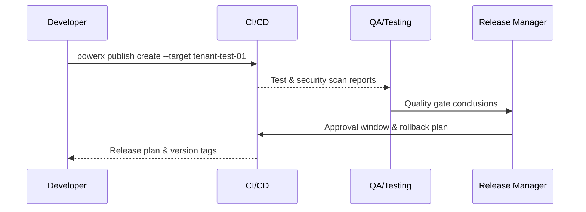

# Executive Summary

This sub-scenario covers the complete process of automated verification and release approval in test tenants after plugin version submission. Developer triggers pipeline through `powerx publish create`, CI/CD deploys to test tenant and executes regression tests, static & security scans, outputting reports. QA & release manager jointly approve launch window and generate production release plan. The goal is to complete verification, approval & rollback plan orchestration within 24 hours, ensuring untested changes cannot enter production.

# Scope & Guardrails

- **In Scope**: Artifact upload, test tenant deployment, automated testing & security scans, approval flow configuration, release plan generation, rollback contact registration, audit logs.
- **Out of Scope**: Production canary & full deployment, offline package generation, Marketplace listing, runtime monitoring strategies.
- **Environment & Flags**: `plugin-release-pipeline`, `publish-approval-guard`, `security-scan-v2`; depends on CI/CD platform, test tenant resource pool, quality gate rules, audit service.

# Participants & Responsibilities

| Scope | Repository | Layer | Responsibilities & Deliverables | Owners |
|-------|------------|-------|--------------------------------|--------|
| core-platform | powerx | service | Pipeline templates, deployment orchestration, report aggregation, approval state machine, rollback plan generation | Matrix Ops (Platform Ops Lead / ops@artisan-cloud.com) |
| plugin-ecosystem | powerx-plugin | ops | Build artifacts & version descriptions, test data preparation, change log maintenance | Michael Hu (Plugin Tech Lead / tech@artisan-cloud.com) |
| qa | powerx | security | Automated test coverage strategies, security scans & license verification, audit trails | Linda Zhou (QA Lead / qa@artisan-cloud.com) |

# End-to-End Flow

1. **Stage 1 – Release Application & Artifact Upload**: Developer uses CLI to upload version artifacts, descriptions & target test tenant.
2. **Stage 2 – Automated Verification**: Pipeline deploys to test tenant and executes regression tests, security scans & coverage statistics.
3. **Stage 3 – Approval & Change Review**: QA reviews reports, release manager confirms changes, approves launch window & rollback contacts.
4. **Stage 4 – Release Plan Implementation**: Generate production release plan, lock version tags, sync audit logs & prepare canary strategies.

# Key Interactions & Contracts

- **APIs / Events**: `powerx publish create`, `POST /internal/publish/test-run`, `POST /internal/publish/approval`, `EVENT publish.pipeline.blocked`.
- **Configs / Schemas**: `pipeline/plugin-release.yml`, `config/publish/quality_gates.yaml`, `config/publish/approval_matrix.yaml`.
- **Security / Compliance**: Uploaded artifacts require signature verification; approvers require MFA; audit logs record submitter, approval chain, test report links and retain ≥180 days.

# Usecase Links

- `UC-OPS-PLUGIN-RELEASE-APPROVAL-001` — Test tenant verification & approval loop.

# Acceptance Criteria

1. Regression test coverage ≥90%, high-risk vulnerabilities = 0, pipeline blocks must notify submitter & QA.
2. Approval completion time ≤24 hours, release plan contains rollback strategy, window, contacts & dependency list.
3. Builds that fail tests or approval cannot lock version tags, audit logs fully record changes & conclusions.

# Telemetry & Ops

- **Metrics**: `publish.test.pass_rate`, `publish.coverage.percent`, `publish.approval.lead_time_hours`, `publish.pipeline.block_total`.
- **Alert Thresholds**: Test failure rate >5% or consecutive blocks, approval timeout >24 hours, missing quality gate configurations.
- **Observability Sources**: CI/CD telemetry, test reports, audit database, `workflow-metrics.mjs`.

# Open Issues & Follow-ups

| Risk/Issue | Impact Scope | Owner | ETA |
|-----------|--------------|-------|-----|
| High maintenance cost for cross-language regression scripts, need unified templates & datasets | Automated test efficiency | Linda Zhou | 2025-12-05 |
| Approval windows not yet integrated with production change calendar, need to connect to change management system | Change coordination | Matrix Ops | 2025-12-12 |

# Appendix

- `docs/meta/scenarios/powerx/plugin-ecosystem/plugin-lifecycle/plugin-publish-and-release/primary.md#sub-scenario-a`
- `pipeline/plugin-release.yml`
- `config/publish/approval_matrix.yaml`
